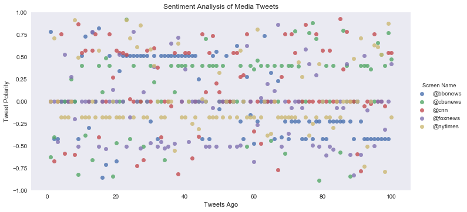
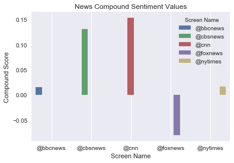

```python
# Dependencies
import tweepy
import json
import numpy as np
import pandas as pd
import seaborn as sns
import matplotlib.pyplot as plt

# Import and Initialize Sentiment Analyzer
from vaderSentiment.vaderSentiment import SentimentIntensityAnalyzer
analyzer = SentimentIntensityAnalyzer()

# Twitter API Keys

consumer_key = "PrGevwVABchoG0o589r9BPTPM"
consumer_secret = "wUJAaOLJdNgE2WIewNPYhhsqazrRCdSplJmwqqAm7Wh6pNejE8"
access_token = "905540398994612227-t60QDxW0jHuOXAlPSTteYE1CyO6CMAZ"
access_token_secret = "BdTYVNH6m2dUtkrFAf6PQyHuh22WD0U0r3onfivP7yjr7"


# Setup Tweepy API Authentication

auth = tweepy.OAuthHandler(consumer_key, consumer_secret)
auth.set_access_token(access_token, access_token_secret)
api = tweepy.API(auth, parser=tweepy.parsers.JSONParser())
```


```python
# Array to hold sentiment
sentiments = []

target_terms = ("@bbcnews", "@cbsnews", "@cnn",
                "@foxnews", "@nytimes")

counter = 1
```


```python
# Loop through all target users
for target in target_terms:

    # Variables for holding sentiments
    compound_list = []
    positive_list = []
    negative_list = []
    neutral_list = []
    
    # Loop through 1 time for total 100 tweets each
    for x in range(1):

        # Get all tweets from home feed
        public_tweets = api.search(target, count = 100, result_type="recent")

        # Loop through tweets
        for tweet in public_tweets["statuses"]:


            # Print Tweets
            print("Tweet %s: %s" % (counter, tweet["text"]))

            # Run Vader Analysis on each tweet
            compound = analyzer.polarity_scores(tweet["text"])["compound"]
            pos = analyzer.polarity_scores(tweet["text"])["pos"]
            neu = analyzer.polarity_scores(tweet["text"])["neu"]
            neg = analyzer.polarity_scores(tweet["text"])["neg"]
            tweets_ago = counter


            # Add sentiments for each tweet into an array
            # append data from each tweet into a sentiments dictionary/array
            sentiments.append({"Screen Name": target,
                             "Date": tweet["created_at"],
                             "Compound": compound,
                             "Positive": pos,
                             "Negative": neg,
                             "Neutral": neu,
                             "Tweets Ago": counter})

            if counter < 100:
                counter += 1
            else:
                counter = 1

sentiments
```

    Tweet 1: @WithoutBollocks @BBCNews Yes Great Britain, America is coming to its senses .
    Tweet 2: RT @BBCNews: Cold weather and loneliness 'lethal in winter' https://t.co/haCjb2owaM
    Tweet 3: RT @BBCNews: Cold weather and loneliness 'lethal in winter' https://t.co/haCjb2owaM
    Tweet 4: @vidhu_vicky @PTI_News @NewsNationTV @FoxNews @ogecebel @BBCWorld @BBCNews @POTUS @BarackObama @UNHumanRights… https://t.co/ppoVgYMDQ4
    Tweet 5: RT @BBCNews: Birstall house explosion: Woman dies in hospital https://t.co/bbm3Kku8up
    Tweet 6: @BBCNorthAmerica @BBCNews And Frasier goes down!
    Tweet 7: RT @BBCNews: Wednesday’s Daily Mirror: "Baby Girl Born With Heart Outside Her Body" #bbcpapers #tomorrowspaperstoday (via @AllieHBNews) htt…
    Tweet 8: RT @BBCNews: York Council refuses Uber licence renewal https://t.co/0pkr03NFtY
    Tweet 9: RT @BBCNews: Cold weather and loneliness 'lethal in winter' https://t.co/haCjb2owaM
    Tweet 10: RT: @bbcnews :Spurs player in global teacher prize shortlist https://t.co/82HEQogyQ3
    Tweet 11: Republicans won and lost tonight - lost a seat but won by not having to deal with the " garbage " of the candidate… https://t.co/5crTGHWkDp
    Tweet 12: RT @ChelseaClinton: Huntington’s breakthrough may stop disease via @BBCNews  https://t.co/gmcqEWBpiM
    Tweet 13: AMERICA MADE GREAT AGAIN TONIGHT!!! @realDonaldTrump @DonaldJTrumpJr #SteveBannon  @SpeakerRyan @SenMajLdr and all… https://t.co/O0v8E4wa7H
    Tweet 14: RT @BBCNews: London Euston to become Christmas Day homeless shelter https://t.co/9JcgyLF1si
    Tweet 15: RT @Greekboy8: RT OH LOOK: As @Skynews @Bbcnews #Bbcdp relentlessly Ridicule @Jeremycorbyn Jeremy wins International Peace Prize @LBC @Bbc5…
    Tweet 16: Alabama saves an American embarrassment by rejecting a alleged child molester! #AlabamaSenate #AlabamaSenateRace… https://t.co/F1MkINcgqP
    Tweet 17: RT @neilburgh: @Greekboy8 @LBC @bbc5live @GMB @SkyNews @BBCNews If found guilty, I expect the Court will pronounce that 'The shame he has b…
    Tweet 18: RT @BBCNews: Spurs player in global teacher prize shortlist https://t.co/6lkFBaQBXZ
    Tweet 19: RT @FurryAndrewUK: @Greekboy8 @LBC @bbc5live @GMB @SkyNews @BBCNews A. Because they're all Tory-run news agencies. If it was a Labour scand…
    Tweet 20: @Greekboy8 @LBC @bbc5live @GMB @SkyNews @BBCNews I thought exactly the same. WTF is happening with the British medi… https://t.co/ECwfKiFOFK
    Tweet 21: RT @Animal_Watch: Hundreds of hedgehogs saved from freezing temperatures https://t.co/JSVlCKA8Af @BBCNews MT @wildliferescuer #wildlife ~ @…
    Tweet 22: RT @BBCNews: Spurs player in global teacher prize shortlist https://t.co/6lkFBaQBXZ
    Tweet 23: RT @BBCNews: Spurs player in global teacher prize shortlist https://t.co/6lkFBaQBXZ
    Tweet 24: RT @BBCNews: Spurs player in global teacher prize shortlist https://t.co/6lkFBaQBXZ
    Tweet 25: RT @BBCNews: Spurs player in global teacher prize shortlist https://t.co/6lkFBaQBXZ
    Tweet 26: RT @BBCNews: Spurs player in global teacher prize shortlist https://t.co/6lkFBaQBXZ
    Tweet 27: RT @BBCNews: Spurs player in global teacher prize shortlist https://t.co/6lkFBaQBXZ
    Tweet 28: RT @BBCNews: Spurs player in global teacher prize shortlist https://t.co/6lkFBaQBXZ
    Tweet 29: RT @BBCNews: Spurs player in global teacher prize shortlist https://t.co/6lkFBaQBXZ
    Tweet 30: RT @BBCNews: 'I was saved from a £10,000 car scam' https://t.co/Q3YZCt2LYO
    Tweet 31: RT @BBCNews: Spurs player in global teacher prize shortlist https://t.co/6lkFBaQBXZ
    Tweet 32: RT @BBCNews: Cold weather and loneliness 'lethal in winter' https://t.co/haCjb2owaM
    Tweet 33: RT @BBCNews: Spurs player in global teacher prize shortlist https://t.co/6lkFBaQBXZ
    Tweet 34: RT @BBCNews: Spurs player in global teacher prize shortlist https://t.co/6lkFBaQBXZ
    Tweet 35: RT @BBCNews: Spurs player in global teacher prize shortlist https://t.co/6lkFBaQBXZ
    Tweet 36: RT @BBCNews: Spurs player in global teacher prize shortlist https://t.co/6lkFBaQBXZ
    Tweet 37: RT @BBCNews: Spurs player in global teacher prize shortlist https://t.co/6lkFBaQBXZ
    Tweet 38: RT @BBCNews: Spurs player in global teacher prize shortlist https://t.co/6lkFBaQBXZ
    Tweet 39: RT @BBCNews: Spurs player in global teacher prize shortlist https://t.co/6lkFBaQBXZ
    Tweet 40: RT @BBCNews: Spurs player in global teacher prize shortlist https://t.co/6lkFBaQBXZ
    Tweet 41: RT @BBCNews: Spurs player in global teacher prize shortlist https://t.co/6lkFBaQBXZ
    Tweet 42: RT @BBCNews: Spurs player in global teacher prize shortlist https://t.co/6lkFBaQBXZ
    Tweet 43: Spurs player in global teacher prize shortlist https://t.co/wfhWf07Wsd via @BBCNews https://t.co/STLfSuDwkS
    Tweet 44: Democrat Doug Jones projected to defeat Roy Moore in Alabama Senate election - yay!! https://t.co/juVASgi9bD… https://t.co/VeGvDqcOga
    Tweet 45: RT @BBCNews: Cold weather and loneliness 'lethal in winter' https://t.co/haCjb2owaM
    Tweet 46: I got to prepare for my @BBCNews interview with an Alabama Moore voter at 4 am.
    Tweet 47: RT @BBCNews: Cold weather and loneliness 'lethal in winter' https://t.co/haCjb2owaM
    Tweet 48: RT @BBCNews: Spurs player in global teacher prize shortlist https://t.co/6lkFBaQBXZ
    Tweet 49: RT @BBCNews: HIV positive man unable to become a commercial pilot https://t.co/bkkPB4y4R3
    Tweet 50: "The law does not currently allow that facility to proceed but we must not let that be the final word on the matter… https://t.co/y3wZVu55Vk
    Tweet 51: RT @Rita_Banerji: @BBCWorld @BBC @BBCWorld @BBCNews @BBCIndia 
    
    So how about a full investigation and report on how Aadhaar is devastating…
    Tweet 52: RT @BBCNews: Spurs player in global teacher prize shortlist https://t.co/6lkFBaQBXZ
    Tweet 53: @paintercrystal @BBCNews 😀🤓😃
    Tweet 54: RT @BBCNews: As world leaders meet in Berlin to talk about climate change - what steps do you think they should take? Less flights, less dr…
    Tweet 55: @BBCNews I’m interrupting to say DOUG JONES JUST WON!!!
    Tweet 56: RT @BBCNews: 'I was saved from a £10,000 car scam' https://t.co/Q3YZCt2LYO
    Tweet 57: RT @BBCNews: Cold weather and loneliness 'lethal in winter' https://t.co/haCjb2owaM
    Tweet 58: @BBCNews If you were think right nobody would go off https://t.co/8tRx8IAuQ4 cash for anything over £50. Well that… https://t.co/rf4sq2FvYT
    Tweet 59: #businessnews @bbcnews how is this effecting your business? Toshiba settles legal disputes with Western Digital - T… https://t.co/FiFj6NUKJL
    Tweet 60: @BBCNews Another fag wants to fly
    Tweet 61: RT @BBCNews: 'I was saved from a £10,000 car scam' https://t.co/Q3YZCt2LYO
    Tweet 62: @BBCNews https://t.co/2C6zYHIldi
    Tweet 63: @rhope06 @BBC @RajGovOfficial @BBCNews Excellent coping strategy. Very similar to the natural tank system of peninsular India. My focus area
    Tweet 64: @BBCNews https://t.co/2C6zYHZW4Q
    Tweet 65: @BBCNews please visit my house
    Tweet 66: RT @BBCNews: Cold weather and loneliness 'lethal in winter' https://t.co/haCjb2owaM
    Tweet 67: RT @BBCNews: If you are stuck in snow, you could always do something creative 🤗https://t.co/rn2TL9bpBM
    Tweet 68: RT @HaberRisale: #CemKüçük ,  shocking things in #Turkey as a #live broadcast said: 
    @BBCNews 
    @StockholmCF 
    @CNN 
    @PurgedNATO 
    @HumaneResc…
    Tweet 69: RT @BBCNews: 'I was saved from a £10,000 car scam' https://t.co/Q3YZCt2LYO
    Tweet 70: RT @BBCNews: Cold weather and loneliness 'lethal in winter' https://t.co/haCjb2owaM
    Tweet 71: RT @BBCNews: 'I was saved from a £10,000 car scam' https://t.co/Q3YZCt2LYO
    Tweet 72: RT @BBCNews: 'I was saved from a £10,000 car scam' https://t.co/Q3YZCt2LYO
    Tweet 73: RT @BBCNews: 'I was saved from a £10,000 car scam' https://t.co/Q3YZCt2LYO
    Tweet 74: RT @BBCNews: Cold weather and loneliness 'lethal in winter' https://t.co/haCjb2owaM
    Tweet 75: RT @BBCNews: Cold weather and loneliness 'lethal in winter' https://t.co/haCjb2owaM
    Tweet 76: RT @BBCNews: 'I was saved from a £10,000 car scam' https://t.co/Q3YZCt2LYO
    Tweet 77: RT @BBCNews: Cold weather and loneliness 'lethal in winter' https://t.co/haCjb2owaM
    Tweet 78: RT @BBCNews: 'I was saved from a £10,000 car scam' https://t.co/Q3YZCt2LYO
    Tweet 79: RT @BBCNews: 'I was saved from a £10,000 car scam' https://t.co/Q3YZCt2LYO
    Tweet 80: RT @BBCNews: Cold weather and loneliness 'lethal in winter' https://t.co/haCjb2owaM
    Tweet 81: RT @BBCNews: Cold weather and loneliness 'lethal in winter' https://t.co/haCjb2owaM
    Tweet 82: RT @BBCNews: 'I was saved from a £10,000 car scam' https://t.co/Q3YZCt2LYO
    Tweet 83: RT @BBCNews: 'I was saved from a £10,000 car scam' https://t.co/Q3YZCt2LYO
    Tweet 84: RT @BBCNews: 'I was saved from a £10,000 car scam' https://t.co/Q3YZCt2LYO
    Tweet 85: RT @BBCNews: 'I was saved from a £10,000 car scam' https://t.co/Q3YZCt2LYO
    Tweet 86: RT @BBCNews: 'I was saved from a £10,000 car scam' https://t.co/Q3YZCt2LYO
    Tweet 87: @LegendOrient @BBCNews Slow news day
    Tweet 88: RT @BBCNews: 'I was saved from a £10,000 car scam' https://t.co/Q3YZCt2LYO
    Tweet 89: RT @BBCNews: Cold weather and loneliness 'lethal in winter' https://t.co/haCjb2owaM
    Tweet 90: RT @BBCNews: London Euston to become Christmas Day homeless shelter https://t.co/9JcgyLF1si
    Tweet 91: RT @BBCNews: 'I was saved from a £10,000 car scam' https://t.co/Q3YZCt2LYO
    Tweet 92: RT @BBCNews: Cold weather and loneliness 'lethal in winter' https://t.co/haCjb2owaM
    Tweet 93: RT @BBCNews: Cold weather and loneliness 'lethal in winter' https://t.co/haCjb2owaM
    Tweet 94: RT @BBCNews: Cold weather and loneliness 'lethal in winter' https://t.co/haCjb2owaM
    Tweet 95: RT @BBCNews: Cold weather and loneliness 'lethal in winter' https://t.co/haCjb2owaM
    Tweet 96: RT @BBCNews: Cold weather and loneliness 'lethal in winter' https://t.co/haCjb2owaM
    Tweet 97: RT @BBCNews: Cold weather and loneliness 'lethal in winter' https://t.co/haCjb2owaM
    Tweet 98: RT @BBCNews: Cold weather and loneliness 'lethal in winter' https://t.co/haCjb2owaM
    Tweet 99: RT @BBCNews: Cold weather and loneliness 'lethal in winter' https://t.co/haCjb2owaM
    Tweet 100: RT @CBSNews: MORE: Democratic candidate Doug Jones tweets "Thank you ALABAMA!!"; Senate race remains too close to call for CBS News project…
    Tweet 1: @notmy45pres @CBSNews Republicans are still in control bitch! https://t.co/QFv0eeqQOp
    Tweet 2: @SonofLiberty357 @CBSNews @PaulaReidCBS ""Jesus. You should read this. And Trump should go f himself."" There's more dirt than texts to come
    Tweet 3: @CNN @CBSNews @realDonaldTrump #AlabamaRestoredFaithInTheUnitedStates
    Tweet 4: RT @BillRehkopf: Note: @CBSNews still characterizing the race as close. Stay tuned... https://t.co/lm2Lcxpxgb
    Tweet 5: RT @CBSNews: Alabama Senate race between Doug Jones and Roy Moore remains too close to call for CBS News projection; live coverage continue…
    Tweet 6: RT @BillRehkopf: Note: @CBSNews still characterizing the race as close. Stay tuned... https://t.co/lm2Lcxpxgb
    Tweet 7: RT @LoreleiKing9: @CBSNews White women love pedophiles and sexual assaulted. Their new religion is white supremacy.
    Tweet 8: RT @BasketofCovfefe: @JackBored @CBSNews @PaulaReidCBS  https://t.co/bSCLdteQig
    Tweet 9: @CBSNews This lady has the worst job in the world. She gets paid shit to have to lie up there everyday. It’s painfu… https://t.co/WVTjhCT00Y
    Tweet 10: RT @CBSNews: @PaulaReidCBS MORE: Timeline of texts from former Special Counsel investigator Peter Strzok may raise concerns about his impar…
    Tweet 11: .@CBSNLive anchors have the uncomfortable job of reporting on all the #ALSen reax while constantly reminding audien… https://t.co/dUjr8BVCSZ
    Tweet 12: RT @BillRehkopf: Note: @CBSNews still characterizing the race as close. Stay tuned... https://t.co/lm2Lcxpxgb
    Tweet 13: RT @CBSNews: @PaulaReidCBS “Would he be a worse president than Cruz?” Text messages critical of then candidate-Trump lead to the dismissal…
    Tweet 14: @CNN @FoxNews @MSNBC @ABC @CBSNews @NBCNews @nytimes @USATODAY 👇 https://t.co/2EHy6V5Wu6
    Tweet 15: RT @CBSNews: @PaulaReidCBS MORE: Timeline of texts from former Special Counsel investigator Peter Strzok may raise concerns about his impar…
    Tweet 16: RT @CBSNews: @PaulaReidCBS "He's awful." A batch of texts critical of then candidate-Trump got Peter Strzok removed from the special counse…
    Tweet 17: @CBSNews @PaulaReidCBS Will likely raise more questions? 😂 It better raise more questions. If there’s really any ju… https://t.co/vMaNjVlrXC
    Tweet 18: RT @CBSNews: @PaulaReidCBS “OMG, he’s an idiot." Here are former Special Counsel investigator Peter Strzok's texts to a senior FBI lawyer a…
    Tweet 19: RT @Robert_Martin72: .@CBSNews 💔 Shocking and heartbreaking.
    .
    Watch Israeli occupation soldiers assaulted 3 Palestinian #children in Aida…
    Tweet 20: RT @LisaAdele7: I'm so upset about us losing @rolandsmartin #NewsOneNow  I hope @SIRIUSXM to give him a slot and @CBSNews @NBCNews @abcnews…
    Tweet 21: @CBSNews You're the ones I listen to most, what do you not see that you're not calling AL yet?
    Tweet 22: RT @BasketofCovfefe: @CBSNews @PaulaReidCBS The 10,000 emails between Strzok and Page are going to be released shortly. 
    
    Stay tuned.... Th…
    Tweet 23: RT @CBSNews: Some are cute, some are wild, but the finalists for the 2017 Comedy Wildlife Photo Photography Awards are always funny. https:…
    Tweet 24: @CBSNews He should of been riding a Jackass.
    Tweet 25: RT @CBSNews: @PaulaReidCBS MORE: Timeline of texts from former Special Counsel investigator Peter Strzok may raise concerns about his impar…
    Tweet 26: RT @BillRehkopf: Note: @CBSNews still characterizing the race as close. Stay tuned... https://t.co/lm2Lcxpxgb
    Tweet 27: RT @CBSNews: Alabama Senate race between Doug Jones and Roy Moore remains too close to call for CBS News projection; live coverage continue…
    Tweet 28: RT @CBSNews: @PaulaReidCBS “Trump is a ******* idiot, is unable to provide a coherent answer.” FBI agent Peter Strzok sent text messages to…
    Tweet 29: RT @BillRehkopf: Note: @CBSNews still characterizing the race as close. Stay tuned... https://t.co/lm2Lcxpxgb
    Tweet 30: RT @CBSNews: NEW: More than half of men voting for Moore (57%); most women voting for Jones (57%), exit polling finds. Jones’ support from…
    Tweet 31: RT @CBSNews: @CBSNews MORE: Fewer than one in 10 Republicans crossed party lines to vote for Doug Jones, but Jones has a slight edge among…
    Tweet 32: RT @CBSNews: @CBSNews MORE: So far, African Americans make up roughly 30% of the electorate, according to latest exit polls; if it holds it…
    Tweet 33: RT @BKIND1964: @Tailgateddie @BilldeBlasio @NYCMayor @NYGovCuomo @rosannascotto @fox5ny @cnnbrk @CBSNews @denisebklyngirl @SAOCOFILMS @fasu…
    Tweet 34: RT @CBSNews: @PaulaReidCBS “Would he be a worse president than Cruz?” Text messages critical of then candidate-Trump lead to the dismissal…
    Tweet 35: Note: @CBSNews still characterizing the race as close. Stay tuned... https://t.co/lm2Lcxpxgb
    Tweet 36: RT @CBSNews: NEW: More than half of men voting for Moore (57%); most women voting for Jones (57%), exit polling finds. Jones’ support from…
    Tweet 37: RT @CBSNews: @PaulaReidCBS "He's awful." A batch of texts critical of then candidate-Trump got Peter Strzok removed from the special counse…
    Tweet 38: RT @CBSNews: @PaulaReidCBS MORE: Timeline of texts from former Special Counsel investigator Peter Strzok may raise concerns about his impar…
    Tweet 39: RT @CBSNews: NEW: More than half of men voting for Moore (57%); most women voting for Jones (57%), exit polling finds. Jones’ support from…
    Tweet 40: RT @CBSNews: @PaulaReidCBS “OMG, he’s an idiot." Here are former Special Counsel investigator Peter Strzok's texts to a senior FBI lawyer a…
    Tweet 41: @jonathaneugster @CBSNews @PaulaReidCBS You cant get more bipartisan than me.
    Tweet 42: RT @CBSNews: @PaulaReidCBS “OMG, he’s an idiot." Here are former Special Counsel investigator Peter Strzok's texts to a senior FBI lawyer a…
    Tweet 43: @CBSNews just read @MeghanMcCain 's tweet. https://t.co/tGu3njE0oI
    Tweet 44: RT @CBSNews: Alabama Senate race between Doug Jones and Roy Moore remains too close to call for CBS News projection; live coverage continue…
    Tweet 45: RT @CBSNews: @PaulaReidCBS MORE: Timeline of texts from former Special Counsel investigator Peter Strzok may raise concerns about his impar…
    Tweet 46: RT @CBSNews: AL election returns show strong Democratic turnout in cities like Hunstville, Birmingham and Montgomery, @SalvantoCBS reports…
    Tweet 47: RT @CBSNews: @PaulaReidCBS MORE: Timeline of texts from former Special Counsel investigator Peter Strzok may raise concerns about his impar…
    Tweet 48: RT @CBSNews: @PaulaReidCBS MORE: Timeline of texts from former Special Counsel investigator Peter Strzok may raise concerns about his impar…
    Tweet 49: RT @CBSNews: NEW: More than half of men voting for Moore (57%); most women voting for Jones (57%), exit polling finds. Jones’ support from…
    Tweet 50: @CBSNews @CBSEveningNews @PaulaReidCBS Why is Strzok &amp; Paige still employed by the FBI?
    Tweet 51: RT @CBSNews: @PaulaReidCBS MORE: Timeline of texts from former Special Counsel investigator Peter Strzok may raise concerns about his impar…
    Tweet 52: RT @sanborn_scott: @AP , @CNN , @politico calling #AlabamaSenateElection for Jones. @CBSNews holding off, says still too close to call.
    Tweet 53: RT @mhking: .@NBCNews @CBSNews @ABC not yet calling Alabama Senate race, each still saying it is “too close to call” with 95% of the vote in
    Tweet 54: @axios @DonaldJTrumpJr @realDonaldTrump @maddow @TuckerCarlson #TrumpRussia @SenBlumenthal @theobserver @ABC… https://t.co/U3JKVDh6W2
    Tweet 55: RT @CBSNews: Alabama Senate race between Doug Jones and Roy Moore remains too close to call for CBS News projection; live coverage continue…
    Tweet 56: RT @CBSNews: @PaulaReidCBS “OMG, he’s an idiot." Here are former Special Counsel investigator Peter Strzok's texts to a senior FBI lawyer a…
    Tweet 57: @LisaAdele7 @rolandsmartin @SIRIUSXM @CBSNews @NBCNews @abcnews Aww. How bout if Roland and Joe Madison did a show… https://t.co/0KWvo4RpD6
    Tweet 58: @ctnballs8299 @WomanUnchained @CBSNews @PaulaReidCBS 60% of America thinks Trump is an idiot.  So I would assume th… https://t.co/MFXTo9tLxt
    Tweet 59: RT @CBSNews: @PaulaReidCBS MORE: Timeline of texts from former Special Counsel investigator Peter Strzok may raise concerns about his impar…
    Tweet 60: @key_lime_tart @CBSNews I like it Extra crispy
    Tweet 61: @ChadRowland3 @CBSNews @PaulaReidCBS Why won't they come to me again with a WPP offer? No cause they love this shit… https://t.co/nb9kwkKHgJ
    Tweet 62: RT @CBSNews: JUST IN: CBS News has obtained text messages that former Special Counsel investigator Peter Strzok sent to a senior FBI lawyer…
    Tweet 63: RT @CBSNews: Alabama Senate race between Doug Jones and Roy Moore remains too close to call for CBS News projection; live coverage continue…
    Tweet 64: RT @CBSNews: NEW: More than half of men voting for Moore (57%); most women voting for Jones (57%), exit polling finds. Jones’ support from…
    Tweet 65: @MurpheyStuart @CBSNews Why didn’t they roar when Clinton did his dirty deeds. Politics I guess.
    Tweet 66: RT @CBSNews: @PaulaReidCBS MORE: Timeline of texts from former Special Counsel investigator Peter Strzok may raise concerns about his impar…
    Tweet 67: RT @RKristapher: @POTUS @PowerNationTV @POTUSPress @RepBrianBabin @SenTedCruz @CNNPolitics @nprpolitics @IndependentLens @CBSNews @abcnews…
    Tweet 68: RT @CBSNews: @PaulaReidCBS MORE: Timeline of texts from former Special Counsel investigator Peter Strzok may raise concerns about his impar…
    Tweet 69: @CBSNews, using the word MAY is obscene even for you 🤡's. If you WERE yourselves impartial you wouldn't even say th… https://t.co/2gkh2g5Veq
    Tweet 70: RT @CBSNews: @PaulaReidCBS MORE: Timeline of texts from former Special Counsel investigator Peter Strzok may raise concerns about his impar…
    Tweet 71: RT @CBSNews: @PaulaReidCBS MORE: Timeline of texts from former Special Counsel investigator Peter Strzok may raise concerns about his impar…
    Tweet 72: doug jones wins
    
        #untrumps triumphantly as
    
    one wind jogs us 
    
    (©2017 #kaplanagram.com)
    
    @realDonaldTrump… https://t.co/EYfQSlKQcr
    Tweet 73: @CBSNews @PaulaReidCBS Crazy how corrupt DC is!! The American people deserve a lot better than the gutter trash DC eliteists we have!! DTS!!
    Tweet 74: @CBSNews Who officially calls an election?
    Tweet 75: @CNN @MSNBC @ABC @CBSNews @NBCNews @FoxNews @nytimes @USATODAY @washingtonpost @TIME @thehill  Hey Look👇 https://t.co/41MS3q06wW
    Tweet 76: @key_lime_tart @CBSNews Hey I like that it is awesome
    Tweet 77: @inmyhood2 @CBSNews @SalvantoCBS Lol!  Yes.  I truly agree.
    Tweet 78: @CBSNews Well abortions are important to those women. They can feel good now they can get pregnant and get rid of i… https://t.co/qdiTE1sHpG
    Tweet 79: RT @CBSNews: "How is my daughter a pervert? ... What about him?" A father who lost his daughter to suicide says he's standing up to GOP Sen…
    Tweet 80: @NelsonGafanha @notmy45pres @CBSNews Trump is 4 years younger and any day away from a stroke so got a real argument… https://t.co/Y1YR4rJZpX
    Tweet 81: RT @CBSNews: @PaulaReidCBS MORE: Timeline of texts from former Special Counsel investigator Peter Strzok may raise concerns about his impar…
    Tweet 82: RT @sanborn_scott: @AP , @CNN , @politico calling #AlabamaSenateElection for Jones. @CBSNews holding off, says still too close to call.
    Tweet 83: RT @CBSNews: @PaulaReidCBS MORE: Timeline of texts from former Special Counsel investigator Peter Strzok may raise concerns about his impar…
    Tweet 84: RT @sanborn_scott: @AP , @CNN , @politico calling #AlabamaSenateElection for Jones. @CBSNews holding off, says still too close to call.
    Tweet 85: @prageru @ABC @CBSNews @NBCNews The US should be a fourth world country by now if things were that negative.
    Tweet 86: @CBSNews Let's pray to god #RoyMoore wins. 
    
    #AlabamaSenateElection
    Tweet 87: RT @CBSNews: NEW: More than half of men voting for Moore (57%); most women voting for Jones (57%), exit polling finds. Jones’ support from…
    Tweet 88: RT @Robert_Martin72: .@CBSNews 💔 Shocking and heartbreaking.
    .
    Watch Israeli occupation soldiers assaulted 3 Palestinian #children in Aida…
    Tweet 89: RT @CBSNews: "So far in all of these red counties, we see lower-than-expected turnout and that could end up being a big part of the story,"…
    Tweet 90: @foxheadlines
    @mooresenate
    @SenJohnMcCain
    @LindseyGrahamSC 
    @SpeakerRyan
    @senatemajldr 
    @realdonaldtrump
    @potus
    @vp… https://t.co/TgwXPJoM9o
    Tweet 91: RT @CBSNews: @PaulaReidCBS MORE: Timeline of texts from former Special Counsel investigator Peter Strzok may raise concerns about his impar…
    Tweet 92: RT @CBSNews: @PaulaReidCBS MORE: Timeline of texts from former Special Counsel investigator Peter Strzok may raise concerns about his impar…
    Tweet 93: RT @CBSNews: @PaulaReidCBS MORE: Timeline of texts from former Special Counsel investigator Peter Strzok may raise concerns about his impar…
    Tweet 94: A state that elected sessions with 97.3% just elected a dem- thank you @SteveBannen 4 butting in &amp; @CNN  @NBCNews… https://t.co/Eq7p1Adugg
    Tweet 95: @SwatiSLimaye @lshaw158 @Wanda_justWanda @AmySD37 @shari630 @CBSNews @DrDebD @AZBernieCat @CGamarsh @dragonmimist… https://t.co/vuWwKmU80S
    Tweet 96: @CBSNews Another Festivus miracle!!
    Tweet 97: @Nextec7 @JoeBiden @AP @CNN @Reuters @nytimes @UniNoticias @CBSNews @NBCNews @adn40mx @ABC how you enjoying that "victory"? hahahaha
    Tweet 98: RT @CBSNews: @PaulaReidCBS MORE: Timeline of texts from former Special Counsel investigator Peter Strzok may raise concerns about his impar…
    Tweet 99: Everyone in the United States says @GDouglasJones is winner except @CBSNews and probably @FoxNews #AlabamaSenate
    Tweet 100: RT @CNN: Democrat Doug Jones will win the Senate special election in Alabama, CNN projects, in a defeat for Republican Roy Moore https://t.…
    Tweet 1: RT @CNN: Bakari Sellers: "The raw emotion of victory on election night is something Democrats have not heard in a long time. ... You just e…
    Tweet 2: @CNN how can you have a piece of shit lying scum like Rick Santorum at your network, it’s one of the reasons I watc… https://t.co/812wFOTiNe
    Tweet 3: @CNN He didn't win...Moore gave it away!
    Tweet 4: RT @CNN: BREAKING: Democrat Doug Jones will win the Senate special election in Alabama, CNN projects https://t.co/BARA8oQvDR https://t.co/V…
    Tweet 5: Wtf is Santorum doing on @CNN
    Tweet 6: RT @CNN: Bakari Sellers: "The raw emotion of victory on election night is something Democrats have not heard in a long time. ... You just e…
    Tweet 7: @pave2914 @NIVIsa4031 @michellemalkin @CNN #ClintonNewsNet
    Tweet 8: @brianstelter @JenGranholm @RickSantorum @Bakari_Sellers @CNN 2 years is all u got bitches
    Tweet 9: @CNN Thank you thank you thank you to all the good people of Alabama! Your decency &amp; high moral compass have come s… https://t.co/DNhuTLloU8
    Tweet 10: RT @CNN: Democrat Doug Jones will win the Senate special election in Alabama, CNN projects, in a defeat for Republican Roy Moore https://t.…
    Tweet 11: RT @CNN: What you need to know about Doug Jones, the Democrat who just won a US Senate seat in deep-red Alabama https://t.co/wdqrPir9vE
    Tweet 12: RT @CNN: Bakari Sellers: "The raw emotion of victory on election night is something Democrats have not heard in a long time. ... You just e…
    Tweet 13: RT @CNN: What you need to know about Doug Jones, the Democrat who just won a US Senate seat in deep-red Alabama https://t.co/wdqrPir9vE
    Tweet 14: RT @CNN: BREAKING: Democrat Doug Jones will win the Senate special election in Alabama, CNN projects https://t.co/BARA8oQvDR https://t.co/V…
    Tweet 15: RT @CNN: Charles Jenkins, a former US Army sergeant who defected to North Korea, dies at 77 https://t.co/7OaCTLThFa https://t.co/wfjFpyoZ5Z
    Tweet 16: RT @marcuspro: @hashtagmxpz @JayScoop @CNN @MSNBC @FoxNews Mobile, Alabama  bar goes wild for Doug Jones! @msnbc
    Tweet 17: @CNN The people of Alabama have spoken...
    Tweet 18: RT @CNN: BREAKING: Democrat Doug Jones will win the Senate special election in Alabama, CNN projects https://t.co/BARA8oQvDR https://t.co/V…
    Tweet 19: @CNN This is so sad 😞, I hope everything gets better soon
    Tweet 20: RT @CNN: What you need to know about Doug Jones, the Democrat who just won a US Senate seat in deep-red Alabama https://t.co/wdqrPir9vE
    Tweet 21: RT @CNN: Democrat Doug Jones will win the Senate special election in Alabama, CNN projects, in a defeat for Republican Roy Moore https://t.…
    Tweet 22: RT @CNN: Democrat Doug Jones will win the Senate special election in Alabama, CNN projects, in a defeat for Republican Roy Moore https://t.…
    Tweet 23: @AP @washingtonpost @CNN @FoxNews @NBCNews @SteveKornacki Woo finally! @NBCNews #ALSen
    Tweet 24: @CNN @AC360 Nothing much ...he is a piece of shit that won on false allegations.....open the borders and convert to Islam.....
    Tweet 25: @NBCNews &amp; @MSNBC - @AP, @CNN, and @FoxNews have called it! What's taking so long?
    Tweet 26: RT @MaverickyLee: @99_Wolves_17 @DexterUnited @CNN Sit your republican losing ass down and shut up
    Tweet 27: RT @CNN: Bakari Sellers: "The raw emotion of victory on election night is something Democrats have not heard in a long time. ... You just e…
    Tweet 28: @CNN He’s pro baby killing for starters.
    Tweet 29: RT @CNN: What you need to know about Doug Jones, the Democrat who just won a US Senate seat in deep-red Alabama https://t.co/wdqrPir9vE
    Tweet 30: RT @CNN: Bakari Sellers: "The raw emotion of victory on election night is something Democrats have not heard in a long time. ... You just e…
    Tweet 31: @CNN Congratulations
    Tweet 32: RT @Turntablez: @CNN Dear @realDonaldTrump and @MooreSenate ... https://t.co/JSfrm0Q8MT
    Tweet 33: @ChrisRBarron @Lone6R @CNN @SenWarren Well I guess she is a real slut. thought so
    Tweet 34: RT @DeezyDiego: My brother just sent me this from a bar in Alabama. @MSNBC @CNN @FoxNews https://t.co/M8VBi5M3Z6
    Tweet 35: RT @CNN: Bakari Sellers: "The raw emotion of victory on election night is something Democrats have not heard in a long time. ... You just e…
    Tweet 36: RT @CNN: Roy Moore’s campaign spokesman says Muslims shouldn’t be in US Congress because they have to swear on the Bible. He responds with…
    Tweet 37: RT @CNN: Democrat Doug Jones will win the Senate special election in Alabama, CNN projects, in a defeat for Republican Roy Moore https://t.…
    Tweet 38: @CNN Republican lost to the insensitivity and arrogance of Steve Bannon and Roy Moore. President Trump is not out of it too
    Tweet 39: @cnn @maddow @JoeNBC https://t.co/vob2OjUcHf
    Tweet 40: RT @CNN: Democrat Doug Jones will win the Senate special election in Alabama, CNN projects, in a defeat for Republican Roy Moore https://t.…
    Tweet 41: RT @CNN: Democrat Doug Jones will win the Senate special election in Alabama, CNN projects, in a defeat for Republican Roy Moore https://t.…
    Tweet 42: @politico The @CNN  Presstitutes jerky boy ENEMY OF THE STATE
    Tweet 43: RT @CNN: Bakari Sellers: "The raw emotion of victory on election night is something Democrats have not heard in a long time. ... You just e…
    Tweet 44: @GodsNWO @CNN Go away! Blocked!
    Tweet 45: RT @CNN: BREAKING: Democrat Doug Jones will win the Senate special election in Alabama, CNN projects https://t.co/BARA8oQvDR https://t.co/V…
    Tweet 46: RT @brianstelter: .@JenGranholm just reached past @RickSantorum to high-five @Bakari_Sellers on the @CNN set.
    Tweet 47: RT @CNN: Democrat Doug Jones will win the Senate special election in Alabama, CNN projects, in a defeat for Republican Roy Moore https://t.…
    Tweet 48: @CNN They act like they won the presidency 😆😆😆😆😆
    Tweet 49: @epidimic @crystalwalls88 @wonderbunny7 @realDonaldTrump @CNN Had to block the idiots...so happy for Alabama right… https://t.co/9xj4yQiqrC
    Tweet 50: RT @brianstelter: .@JenGranholm just reached past @RickSantorum to high-five @Bakari_Sellers on the @CNN set.
    Tweet 51: RT @CNN: Bakari Sellers: "The raw emotion of victory on election night is something Democrats have not heard in a long time. ... You just e…
    Tweet 52: RT @CNN: Bakari Sellers: "The raw emotion of victory on election night is something Democrats have not heard in a long time. ... You just e…
    Tweet 53: RT @CNN: Bakari Sellers: "The raw emotion of victory on election night is something Democrats have not heard in a long time. ... You just e…
    Tweet 54: RT @CNN: Democrat Doug Jones will win the Senate special election in Alabama, CNN projects, in a defeat for Republican Roy Moore https://t.…
    Tweet 55: RT @CNN: Democrat Doug Jones will win the Senate special election in Alabama, CNN projects, in a defeat for Republican Roy Moore https://t.…
    Tweet 56: @CNN Well, Ole Roy can ride out on that horse that he rode in on....😂😂😂😂😂
    Tweet 57: @kellys_022 @matthewthemost @CNN I sooo agree! I am so sorry
    Tweet 58: RT @CNN: BREAKING: Democrat Doug Jones will win the Senate special election in Alabama, CNN projects https://t.co/BARA8oQvDR https://t.co/V…
    Tweet 59: RT @CNN: Bakari Sellers: "The raw emotion of victory on election night is something Democrats have not heard in a long time. ... You just e…
    Tweet 60: In the wake of the decision in Alabama, crazy early morning tweets to come. @realDonaldTrump @CNN @CBCNews @Reuters
    Tweet 61: @CNN @CBSNews @realDonaldTrump #AlabamaRestoredFaithInTheUnitedStates
    Tweet 62: The sad thing about this race in Alabama is that nearly half the state voted for a Pedophile rather then a Democrat… https://t.co/YScwfcqssU
    Tweet 63: @MidloModerate @whirrll @MooreSenate @CNN #Crickets
    Tweet 64: @CNN is lindsey vonn slow or something? she is the one that made a devisive statement about representing America but not the President.
    Tweet 65: RT @CNN: Bakari Sellers: "The raw emotion of victory on election night is something Democrats have not heard in a long time. ... You just e…
    Tweet 66: RT @CNN: Bakari Sellers: "The raw emotion of victory on election night is something Democrats have not heard in a long time. ... You just e…
    Tweet 67: RT @NOW1SOLAR: Nervous as hell while @CNN reports early numbers indicate #DougJones ahead in #AlabamaSenateElection one of the reddest stat…
    Tweet 68: @CNN Rick Santorum's face tho! He looks lk the losing player who stumbled into the winning teams locker room carefu… https://t.co/0Bm08rxXEA
    Tweet 69: RT @CNN: BREAKING: Democrat Doug Jones will win the Senate special election in Alabama, CNN projects https://t.co/BARA8oQvDR https://t.co/V…
    Tweet 70: RT @CNN: Bakari Sellers: "The raw emotion of victory on election night is something Democrats have not heard in a long time. ... You just e…
    Tweet 71: RT @CNN: BREAKING: Democrat Doug Jones will win the Senate special election in Alabama, CNN projects https://t.co/BARA8oQvDR https://t.co/V…
    Tweet 72: RT @CNN: Democrat Doug Jones will win the Senate special election in Alabama, CNN projects, in a defeat for Republican Roy Moore https://t.…
    Tweet 73: .@CNN Rick Santorum is a tool. Why is he on your network?
    Tweet 74: @Bakari_Sellers and @GovGranholm high-fiving in front of @RickSantorum's face made my day. @CNN 😀
    Tweet 75: RT @sbezsylko: @Bakari_Sellers + @JenGranholm  on @cnn is like “You’ve got your peanut butter in my chocolate” . Smart smart smart. Can the…
    Tweet 76: RT @gustavocnn: #LoUltimo @CNN proyecta que el demócrata @GDouglasJones logra histórica victoria venciendo al republicano @MooreSenate @CNN…
    Tweet 77: @CNN Thk u Yahweh!
    Tweet 78: RT @stevenacurtis: Democrat Doug Jones will win the Senate special election in Alabama, CNN projects https://t.co/njQ6zGoVCS Via @CNN✔️#CNN…
    Tweet 79: RT @RVAwonk: Aaaaaaand now @CNN has called it, too! Doug Jones will become the first Democratic senator from Alabama in 25 years!!
    
    #Alabam…
    Tweet 80: RT @CNN: What you need to know about Doug Jones, the Democrat who just won a US Senate seat in deep-red Alabama https://t.co/wdqrPir9vE
    Tweet 81: RT @CNN: Bakari Sellers: "The raw emotion of victory on election night is something Democrats have not heard in a long time. ... You just e…
    Tweet 82: RT @CNN: What you need to know about Doug Jones, the Democrat who just won a US Senate seat in deep-red Alabama https://t.co/wdqrPir9vE
    Tweet 83: RT @CNN: Bakari Sellers: "The raw emotion of victory on election night is something Democrats have not heard in a long time. ... You just e…
    Tweet 84: I don’t know what is sexier @JohnKingCNN or his magic wall 🔥🔥🔥#ALsen #CNN @CNN
    Tweet 85: RT @monicakurvydiva: Hallelujah #AlabamaSenateElection congratulations #DougJones4Senate thank you God!!! Let’s Go #democrats @CNN break ou…
    Tweet 86: Thank you, Alabama. And also, @CNN, get Rick Santorum off my television immediately.
    Tweet 87: @SteveKornacki awesome Alabama election returns analysis. Thank you!
     @MSNBC @CNN @maddow  @Lawrence
    Tweet 88: RT @CNN: Bakari Sellers: "The raw emotion of victory on election night is something Democrats have not heard in a long time. ... You just e…
    Tweet 89: @AliM20698746 @TRUMPSYOURPREZ @lgldeeds @drachman56 @RowdyGeorgeNada @StuartBirdman2 @ddittmar9 @Godisforthepoor… https://t.co/DOBAnHfLBT
    Tweet 90: @CNN He’ll lose the seat in less than a year!  Alabamians are still Ruby RED! It’ll be right again in 11 months!!!
    Tweet 91: You all need to know that Jones is a puppet and a P.O.S. liberal fool!!  @CNN keep up with your fake news A*"HOLES!… https://t.co/BWD2piz3Q4
    Tweet 92: @CNN I said it. I predicted. I said Roy Paedo Moore was gonna loose tonight. I said God was going to show… https://t.co/ordFJzIhMy
    Tweet 93: RT @CNN: Bakari Sellers: "The raw emotion of victory on election night is something Democrats have not heard in a long time. ... You just e…
    Tweet 94: RT @newsbusters: Things got heated on @CNN after @amandacarpenter points out Democratic Party weakness on Abortion #TTT - As the results we…
    Tweet 95: RT @CNN: BREAKING: Democrat Doug Jones will win the Senate special election in Alabama, CNN projects https://t.co/BARA8oQvDR https://t.co/V…
    Tweet 96: So now it is being reported @CNN that @SenateMajLdr will not seat @GDouglasJones in the Senate until after the tax… https://t.co/R7VL8VR9P9
    Tweet 97: RT @CNN: Bakari Sellers: "The raw emotion of victory on election night is something Democrats have not heard in a long time. ... You just e…
    Tweet 98: RT @CNN: Roy Moore’s campaign spokesman says Muslims shouldn’t be in US Congress because they have to swear on the Bible. He responds with…
    Tweet 99: RT @CNN: Democrat Doug Jones will win the Senate special election in Alabama, CNN projects, in a defeat for Republican Roy Moore https://t.…
    Tweet 100: I am thoroughly enjoying the salty tears of @FoxNews right now https://t.co/0bWSPpqyud
    Tweet 1: RT @ShannonBream: Our @FoxNews producer @JakeBGibson has obtained 10K texts between Peter Strzok and Lisa Page
    Tweet 2: RT @ShannonBream: Our @FoxNews producer @JakeBGibson has obtained 10K texts between Peter Strzok and Lisa Page
    Tweet 3: RT @BretBaier: .@FoxNews can now project that #DougJones will defeat Republican #RoyMoore to become the first Alabama Democrat in a quarter…
    Tweet 4: @GNothem @ShannonBream @FoxNews @foxnewsnight High.ground?  You just ran a pedophile.
    Tweet 5: @Modmom1953 @ShannonBream @FoxNews @foxnewsnight And here come the conspiracies!!  Lol
    Tweet 6: @hardbrew @Spaniard8888 @Alan_Anguish68 @Mechanoid1990 @nellienola @FoxNews The people have spoken and your version… https://t.co/cvxOHdgmlz
    Tweet 7: 10:47pm, @MSNBC finally calls the race, well after @FoxNews &amp; @AP
    Tweet 8: RT @CharlieSpeers13: @Ducky661 @DFH1067 @VP @POTUS @FoxNews @OOIDA @JaySekulow can you help with #ELDMandate violating millions of truck dr…
    Tweet 9: RT @AIIAmericanGirI: 'F TRUMP': Texts between ex-Mueller team members emerge, calling Trump 'loathsome human,' 'an idiot' @FoxNews
    https://…
    Tweet 10: @4Given777 @Proud4Naija @FoxNews It’s called pro-choice, not pro-death.
    Tweet 11: RT @FoxNews: Rep. Matt Gaetz: “There’s a heck of a lot of evidence of collusion between the Democrats and Russia.” #SpecialReport https://t…
    Tweet 12: @Ron917 @FoxNews 👍🇺🇸🌏👊✌😂🎅🎁
    Tweet 13: @FoxNews Come on @FoxNews CALL it for what it is and a WIN for the truth and bring everyone an early Christmas present and wake up to Trump.
    Tweet 14: @FoxNews Give it s rest F&amp;$k News! Jones just punched you in your Nazi face! More to come
    Tweet 15: RT @FoxNews: 'F TRUMP': Texts between ex-Mueller team members emerge, calling #Trump 'loathsome human,' 'an idiot' https://t.co/YnPXxF2jgT
    Tweet 16: RT @marcuspro: @hashtagmxpz @JayScoop @CNN @MSNBC @FoxNews Mobile, Alabama  bar goes wild for Doug Jones! @msnbc
    Tweet 17: RT @krystalball: Has anyone looked? How sad is @FoxNews right now?
    Tweet 18: RT @FoxNews: Rep. Matt Gaetz: “There’s a heck of a lot of evidence of collusion between the Democrats and Russia.” #SpecialReport https://t…
    Tweet 19: @FoxNews why are you not covering the election atm ? you feeling salty
    Tweet 20: RT @Circle_R185: @FOXNEWS @foxandfriends. RT @WhoWolfe: UPDATE: Van Full Of Illegals Caught Voting At Multiple Alabama Polling Locations  h…
    Tweet 21: @AP @washingtonpost @CNN @FoxNews @NBCNews @SteveKornacki Woo finally! @NBCNews #ALSen
    Tweet 22: RT @ShannonBream: Our @FoxNews producer @JakeBGibson has obtained 10K texts between Peter Strzok and Lisa Page
    Tweet 23: RT @FoxNews: 'F TRUMP': Texts between ex-Mueller team members emerge, calling #Trump 'loathsome human,' 'an idiot' https://t.co/YnPXxF2jgT
    Tweet 24: @ImaTrumpBuster @ShannonBream @FoxNews @foxnewsnight They are crying foul play
    Tweet 25: @mrosenbaum711 @MSNBC @FoxNews @nbcsnl I am SO RELIEVED about the outcome of this election today. I feel like I jus… https://t.co/oi637VoeSz
    Tweet 26: RT @FoxNews: Rep. Matt Gaetz: “There’s a heck of a lot of evidence of collusion between the Democrats and Russia.” #SpecialReport https://t…
    Tweet 27: RT @Gilliganstweets: #Breaking @FoxNews has declared #HillaryClinton the loser in #Alabama. #ALSen
    Tweet 28: @baseballcrank @FoxNews just said Jones is a lame duck with no chance of winning in 2020
    Tweet 29: @NBCNews &amp; @MSNBC - @AP, @CNN, and @FoxNews have called it! What's taking so long?
    Tweet 30: @ToddNadon @FoxNews @USAmbIsrael @foxandfriends And, with all that screaming, a Christian does not really want to s… https://t.co/ySDtAqU7Mw
    Tweet 31: They could hardly contain their excitements @foxnews. This he https://t.co/xZiL0Nz1tK
    Tweet 32: RT @FoxNews: BREAKING: Texts between ex-Mueller team members emerge, calling #Trump 'loathsome human,' 'an idiot' https://t.co/s26DMsUVkz
    Tweet 33: RT @BretBaier: .@FoxNews can now project that #DougJones will defeat Republican #RoyMoore to become the first Alabama Democrat in a quarter…
    Tweet 34: @TCWAntitrust @Mechanoid1990 @FoxNews You live in america, learn to speak english, loser
    Tweet 35: RT @FoxNews: 'F TRUMP': Texts between ex-Mueller team members emerge, calling #Trump 'loathsome human,' 'an idiot' https://t.co/YnPXxF2jgT
    Tweet 36: RT @johnrobertsFox: .@WhiteHouse attorney Ty Cobb tells @FoxNews that Special Counsel Robert Mueller has completed the interviews of all WH…
    Tweet 37: @realDonaldTrump Sitting in the @WhiteHouse in his gross robe watching @FoxNews drowning in cases of @DietCoke 😂😂😂😂… https://t.co/SYHb8RG85v
    Tweet 38: @Love_The_Donald @FoxNews @MooreSenate Thanks for the encouragement! 🇺🇸 🚂🎄🎁🎶🦌❄️⛄️
    Tweet 39: RT @DeezyDiego: My brother just sent me this from a bar in Alabama. @MSNBC @CNN @FoxNews https://t.co/M8VBi5M3Z6
    Tweet 40: Ever ask yourself why media outlets like @FoxNews choose to frequently report these kinds of “stories” about our ch… https://t.co/vJhxjTRpXE
    Tweet 41: RT @BretBaier: .@FoxNews can now project that #DougJones will defeat Republican #RoyMoore to become the first Alabama Democrat in a quarter…
    Tweet 42: RT @mrosenbaum711: @MSNBC @FoxNews This is an @nbcsnl sketch in the making. @MSNBC still figuring it out. #theraceisover #hahahaha
    Tweet 43: RT @ShannonBream: Our @FoxNews producer @JakeBGibson has obtained 10K texts between Peter Strzok and Lisa Page
    Tweet 44: @MelodyLayne68 @FoxNews Take the L go on now
    Tweet 45: @FoxNews Is Mueller team correct?
    Tweet 46: @FoxNews 
    Repubs must realize Dems don't play fair! They'll now dig deep n d background of every Repub 4 evry race… https://t.co/kN5oOC8vdR
    Tweet 47: RT @FoxNews: BREAKING: Texts between ex-Mueller team members emerge, calling #Trump 'loathsome human,' 'an idiot' https://t.co/s26DMsUVkz
    Tweet 48: RT @FoxNews: BREAKING NEWS: Fox News projects Democrat Doug Jones will defeat Republican Roy Moore in Alabama’s special election race for t…
    Tweet 49: RT @FoxNews: 'F TRUMP': Texts between ex-Mueller team members emerge, calling #Trump 'loathsome human,' 'an idiot' https://t.co/YnPXxF2jgT
    Tweet 50: @FoxNews #NoMoore womp womp
    Tweet 51: RT @FoxNews: "Of all the lawyers in town, you hire someone who represented the @ClintonFdn for an investigation into #DonaldTrump. Are you…
    Tweet 52: @TRUTH_USA_2016 @FoxNews Really???
    Tweet 53: RT @FoxNews: 'F TRUMP': Texts between ex-Mueller team members emerge, calling #Trump 'loathsome human,' 'an idiot' https://t.co/YnPXxF2jgT
    Tweet 54: RT @ShannonBream: Our @FoxNews producer @JakeBGibson has obtained 10K texts between Peter Strzok and Lisa Page
    Tweet 55: RT @FoxNews: 'F TRUMP': Texts between ex-Mueller team members emerge, calling #Trump 'loathsome human,' 'an idiot' https://t.co/YnPXxF2jgT
    Tweet 56: @FoxNews He is the one that’s ok with killing babies, right?
    Tweet 57: RT @AngelitaTerre14: @eugenegu Yesss.. #WE ARE COMING.. TOGETHER WE STAND AND WE WILL NOT BE DIVIDED @realDonaldTrump @FoxNews #RUSSIA
    Tweet 58: @FoxNewsResearch @FoxNews Wow!
    Tweet 59: @FoxNews He IS loathsome.
    Tweet 60: RT @FoxNews: .@POTUS: "Today's terror suspect entered our country through extended-family chain migration, which is incompatible with natio…
    Tweet 61: Nice try @IngrahamAngle but the REAL STORY is Trumpism lost tonight @FoxNews
    Tweet 62: @krystalball @FoxNews They are barely covering the win. They are disgusting.
    Tweet 63: @johncardillo @FoxNews Really?  The same Fox News that is trying to take out Trump?
    Tweet 64: RT @HeatherWhaley: Thank you ALABAMA!! All the sad trombones playing for @FoxNews 
    
    #FUBannon
    #FUTrump https://t.co/mwJzzoJ8vm
    Tweet 65: @FoxNews You know what?? F that guy!!
    Tweet 66: @DJOutlandish @AmandiOnAir @FoxNews @GDouglasJones Don't miss his #StrangeDaysPodcast with Fernand Amandi every Thu… https://t.co/bCK9J4b0Mt
    Tweet 67: @MSNBC thanks for calling it 21 mins after @FoxNews 
    
    Now let's celebrate. Show me the kid flexing again. Good lord
    Tweet 68: RT @FoxNews: 'F TRUMP': Texts between ex-Mueller team members emerge, calling #Trump 'loathsome human,' 'an idiot' https://t.co/YnPXxF2jgT
    Tweet 69: @FoxNews @BJLeiderman It came down to this. https://t.co/5jiJuA3mFT
    Tweet 70: @GridAssassin @realDonaldTrump @FoxNews  what’s the O/U Trump tweets that the vote was rigged 12a?
    Tweet 71: RT @FoxNews: BREAKING NEWS: Fox News projects Democrat Doug Jones will defeat Republican Roy Moore in Alabama’s special election race for t…
    Tweet 72: @FoxNews @jstines3 @PressSec @WattersWorld It is a preposterous idea that Obama had anything to do with all the eco… https://t.co/W0MO9TehjZ
    Tweet 73: @FoxNews Waiting for Trump to tweet
    Tweet 74: RT @FoxNews: BREAKING NEWS: Fox News projects Democrat Doug Jones will defeat Republican Roy Moore in Alabama’s special election race for t…
    Tweet 75: RT @mflynnJR: Be interesting to see if any of those texts ALSO mention a certain SOMEONE 🤔🤔🤔@FoxNews https://t.co/w7lII0wil9
    Tweet 76: @JackHOW1TZ3R @FoxNews Nope! A sexual deviant pedophile lost the election, which means the American people win. If… https://t.co/AdlMcGgvjS
    Tweet 77: @zach_viana @TheDubleD4937 @TuckerCarlson @brithume @FoxNews You mean because he has enemies. The CIA was panicking… https://t.co/fFlMHNKw74
    Tweet 78: Ok, @FoxNews called it. Phew. #waytogoalabama #NoMoorePredators #MeToo https://t.co/FaQXA1ANeI
    Tweet 79: RT @FoxNews: 'F TRUMP': Texts between ex-Mueller team members emerge, calling #Trump 'loathsome human,' 'an idiot' https://t.co/YnPXxF2jgT
    Tweet 80: @FoxNews What about that Alabama race?
    Tweet 81: @FoxNews I, Donald J. Trump, can't win my way out of a paper bag! My endorsement is a bigly pile of crap! I'm a big… https://t.co/bzkyZwhzKQ
    Tweet 82: RT @FoxNews: 'F TRUMP': Texts between ex-Mueller team members emerge, calling #Trump 'loathsome human,' 'an idiot' https://t.co/YnPXxF2jgT
    Tweet 83: RT @mrosenbaum711: Can someone tell @MSNBC that the race is over. Geez. Get head out of ass. Even @FoxNews declared it. #goodlord
    Tweet 84: RT @FoxNews: BREAKING NEWS: Fox News projects Democrat Doug Jones will defeat Republican Roy Moore in Alabama’s special election race for t…
    Tweet 85: @realDonaldTrump @GOP @FoxNews @BreitbartNews HAHAHAHAHAHAHAHAHAHAHAHAHAHAHAHAHAHAHAHAHAHAH
    Tweet 86: RT @FoxNews: BREAKING NEWS: Fox News projects Democrat Doug Jones will defeat Republican Roy Moore in Alabama’s special election race for t…
    Tweet 87: @RWPUSA Ok @FoxNews just threw @MooreSenate under the bus by saying 'it's good he lost cuz he doesn't represent GOP… https://t.co/8hyde7RDka
    Tweet 88: RT @johncardillo: .@FoxNews has the 10k Strzok e mails. 
    
    This will be disastrous for the FBI and Mueller.
    Tweet 89: Now @FoxNews blaming good paying jobs in Alabama and @SenateMajLdr for #RoyMoore loss. WTF!?!
    Tweet 90: RT @FoxNews: "Of all the lawyers in town, you hire someone who represented the @ClintonFdn for an investigation into #DonaldTrump. Are you…
    Tweet 91: RT @johncardillo: .@FoxNews has the 10k Strzok e mails. 
    
    This will be disastrous for the FBI and Mueller.
    Tweet 92: My family is literally watching @FoxNews just to make fun of them
    Tweet 93: @FoxNews But not for Al Green, Meeks or anyone else who on the Sush fund for pay offs for sexual harrasement paid f… https://t.co/vt9w6aILBE
    Tweet 94: Golly, @FoxNews is switching to Hillary email story now - wonder what happened in Alabama?
    Tweet 95: How many hours before #MSM stops covering Moore's "sexual molestation" allegations? I'm sure #Dems will demand Truth! No? @FoxNews @POTUS
    Tweet 96: @FoxNews Lol. @FoxNews already calling Doug Jones a lame duck and assuming he’s going to “do the right thing” and vote w/ Republicans
    Tweet 97: @johnrobertsFox @lillys_news @WhiteHouse @FoxNews What investigation??
    Tweet 98: @DczDarryl @MelJorg @LuhanskRepublic @mike_Zollo @VicLovesAnimals @FoxNews How's that loss taste?
    Tweet 99: @FoxNews Ken Starr? Who?
    Tweet 100: RT @nytimes: Breaking News: The Democrat Doug Jones won in Alabama. The upset trims the GOP Senate majority to 1 and is a snub of President…
    Tweet 1: RT @nytimes: Alabama election live results https://t.co/vWLwD7wtYl
    Tweet 2: RT @pwcdanica: As @nytimes calls AL-SEN for @GDouglasJones, I'm sure Doug would happily acknowledge the work of his staff &amp; thousands of vo…
    Tweet 3: RT @stevensantos: Maybe the @nytimes should send their reporters to interview working class Black voters in Alabama diners.
    Tweet 4: RT @nytimes: Breaking News: The Democrat Doug Jones won in Alabama. The upset trims the GOP Senate majority to 1 and is a snub of President…
    Tweet 5: RT @nytimes: Breaking News: The Democrat Doug Jones won in Alabama. The upset trims the GOP Senate majority to 1 and is a snub of President…
    Tweet 6: RT @nytimes: Breaking News: The Democrat Doug Jones won in Alabama. The upset trims the GOP Senate majority to 1 and is a snub of President…
    Tweet 7: RT @stevensantos: Maybe the @nytimes should send their reporters to interview working class Black voters in Alabama diners.
    Tweet 8: RT @dr_b3: YES!!!  There is SOME justice!  Once a Long Shot, Democrat Doug Jones Wins Alabama Senate Race via @NYTimes https://t.co/iMQbfAY…
    Tweet 9: @vivek_m67 @nytimes `
    How many hundreds have you seen on Twitter that are convinced the accusations are true even w… https://t.co/cePVOzJvfH
    Tweet 10: RT @nytimes: Breaking News: The Democrat Doug Jones won in Alabama. The upset trims the GOP Senate majority to 1 and is a snub of President…
    Tweet 11: RT @nytimes: Breaking News: The Democrat Doug Jones won in Alabama. The upset trims the GOP Senate majority to 1 and is a snub of President…
    Tweet 12: RT @nytimes: Breaking News: The Democrat Doug Jones won in Alabama. The upset trims the GOP Senate majority to 1 and is a snub of President…
    Tweet 13: RT @stevensantos: Maybe the @nytimes should send their reporters to interview working class Black voters in Alabama diners.
    Tweet 14: RT @nytimes: Breaking News: The Democrat Doug Jones won in Alabama. The upset trims the GOP Senate majority to 1 and is a snub of President…
    Tweet 15: Once a Long Shot, Democrat Doug Jones Wins Alabama Senate Race via @NYTimes https://t.co/b7nSTT2pjs
    Tweet 16: RT @nytimes: Breaking News: The Democrat Doug Jones won in Alabama. The upset trims the GOP Senate majority to 1 and is a snub of President…
    Tweet 17: RT @nytimes: Breaking News: The Democrat Doug Jones won in Alabama. The upset trims the GOP Senate majority to 1 and is a snub of President…
    Tweet 18: RT @nytimes: Breaking News: The Democrat Doug Jones won in Alabama. The upset trims the GOP Senate majority to 1 and is a snub of President…
    Tweet 19: RT @nytimes: Globally, we throw out about 1.3 billion tons of food a year, or a third of all the food that we grow https://t.co/xTLwvtnLrU
    Tweet 20: RT @nytimes: Breaking News: The Democrat Doug Jones won in Alabama. The upset trims the GOP Senate majority to 1 and is a snub of President…
    Tweet 21: RT @nytimes: Breaking News: The Democrat Doug Jones won in Alabama. The upset trims the GOP Senate majority to 1 and is a snub of President…
    Tweet 22: RT @nytimes: Breaking News: The Democrat Doug Jones won in Alabama. The upset trims the GOP Senate majority to 1 and is a snub of President…
    Tweet 23: RT @dr_b3: YES!!!  There is SOME justice!  Once a Long Shot, Democrat Doug Jones Wins Alabama Senate Race via @NYTimes https://t.co/iMQbfAY…
    Tweet 24: @MsPackyetti @nytimes @NBCNews DEMs need to respect the Black vote with greater investment in minorities initiatives. I'm a DEM!
    Tweet 25: RT @nytimes: Breaking News: The Democrat Doug Jones won in Alabama. The upset trims the GOP Senate majority to 1 and is a snub of President…
    Tweet 26: Tool Tide! Once a Long Shot, Democrat Doug Jones Wins Alabama Senate Race via @NYTimes https://t.co/CpVUXakRcL
    Tweet 27: #AlabamaSenateElection and by the way THANK YOU @NYTIMES FOR YOUR GREAT ELECTION COVERAGE! 
    
    p.s Up yours Trump and… https://t.co/Xmrp3WHRJ9
    Tweet 28: RT @nytimes: Breaking News: The Democrat Doug Jones won in Alabama. The upset trims the GOP Senate majority to 1 and is a snub of President…
    Tweet 29: RT @nytimes: Breaking News: The Democrat Doug Jones won in Alabama. The upset trims the GOP Senate majority to 1 and is a snub of President…
    Tweet 30: @realDonaldTrump @nytimes Charming.
    Tweet 31: RT @alyshiagalvez: @nytimes @mrichtel Interesting ratio of men:women cited in obesity series in NYT, especially considering several female…
    Tweet 32: RT @abracadabraNY: @nytimes and @nbc call the race for @GDouglasJones
    Tweet 33: RT @nytimes: Breaking News: The Democrat Doug Jones won in Alabama. The upset trims the GOP Senate majority to 1 and is a snub of President…
    Tweet 34: RT @nytimes: Breaking News: The Democrat Doug Jones won in Alabama. The upset trims the GOP Senate majority to 1 and is a snub of President…
    Tweet 35: My face when @nytimes finally called it https://t.co/5OSgeG2L3S
    Tweet 36: @drewsof @nytimes In this house, we don’t watch the needle anymore
    Tweet 37: @realDonaldTrump @nytimes You are a liar!
    Tweet 38: Finally! Something went right!   Once a Long Shot, Democrat Doug Jones Wins Alabama Senate Race via @NYTimes https://t.co/wGM0UrYTVC
    Tweet 39: RT @nytimes: Breaking News: The Democrat Doug Jones won in Alabama. The upset trims the GOP Senate majority to 1 and is a snub of President…
    Tweet 40: RT @nytimes: Breaking News: The Democrat Doug Jones won in Alabama. The upset trims the GOP Senate majority to 1 and is a snub of President…
    Tweet 41: Are you watching this!!! 
    The Moore campaign is using @nytimes for the results. It's up on the projector but they h… https://t.co/JqSH78oaVb
    Tweet 42: RT @syeddoha: COMOSVAMOS NYC #NYT @nytimes people in protest of Steve Bannon #BoycottSirius Srius XM that is. I don't know how I will do wi…
    Tweet 43: RT @nytimes: Breaking News: The Democrat Doug Jones won in Alabama. The upset trims the GOP Senate majority to 1 and is a snub of President…
    Tweet 44: @tribelaw @nytimes I've never been convinced Franken should quit. Personally, I think he was set up. There must be… https://t.co/GejC4dKapn
    Tweet 45: @nytimes He backed Luther Strange....
    Tweet 46: RT @nytimes: One longtime server at the Spotted Pig said Ken Friedman ran his hands over her buttocks and then her groin in a room crowded…
    Tweet 47: RT @nytimes: Breaking News: The Democrat Doug Jones won in Alabama. The upset trims the GOP Senate majority to 1 and is a snub of President…
    Tweet 48: RT @nytimes: Breaking News: The Democrat Doug Jones won in Alabama. The upset trims the GOP Senate majority to 1 and is a snub of President…
    Tweet 49: RT @nytimes: Breaking News: The Democrat Doug Jones won in Alabama. The upset trims the GOP Senate majority to 1 and is a snub of President…
    Tweet 50: RT @Commonsenseb0t: @MaryCar52186774 @NikiBrooks76 @1VoodooKitty1 @realObushma @nytimes He's predicted to win across the board. Sore rapey…
    Tweet 51: RT @nytimes: Breaking News: The Democrat Doug Jones won in Alabama. The upset trims the GOP Senate majority to 1 and is a snub of President…
    Tweet 52: RT @nytimes: Alabama election live results https://t.co/vWLwD7wtYl
    Tweet 53: RT @nytimes: Breaking News: The Democrat Doug Jones won in Alabama. The upset trims the GOP Senate majority to 1 and is a snub of President…
    Tweet 54: @Tokyo_Tom @craigthomler @kmpetersson @3GHtweets @Mark_Fraser_ @LeonardCohen2 @MightyApollo @1_TMF_ @Vivarn8… https://t.co/ZTMmwjNVod
    Tweet 55: RT @nytimes: Breaking News: The Democrat Doug Jones won in Alabama. The upset trims the GOP Senate majority to 1 and is a snub of President…
    Tweet 56: RT @donlemon: Once a Long Shot, Democrat Doug Jones Wins Alabama Senate Race via @NYTimes https://t.co/05WGV2x1rc
    Tweet 57: So Mr #FakeNews #RoyMoore campaign headquarters is projecting @nytimes live vote counter on the screen. Don't even… https://t.co/yv8mxWOrPd
    Tweet 58: RT @nytimes: Breaking News: The Democrat Doug Jones won in Alabama. The upset trims the GOP Senate majority to 1 and is a snub of President…
    Tweet 59: RT @nytimes: Breaking News: The Democrat Doug Jones won in Alabama. The upset trims the GOP Senate majority to 1 and is a snub of President…
    Tweet 60: RT @nytimes: Breaking News: The Democrat Doug Jones won in Alabama. The upset trims the GOP Senate majority to 1 and is a snub of President…
    Tweet 61: @trilllmom @nytimes As a Virginian gotta say our Nov elections were pretty awesome
    Tweet 62: RT @nytimes: Breaking News: The Democrat Doug Jones won in Alabama. The upset trims the GOP Senate majority to 1 and is a snub of President…
    Tweet 63: @suprgt82 @egavactip @nytimes @kevinroose Sayeth the seer with the cartoon frog avi...
    Tweet 64: RT @ToBeSafeNSound: Democrat Pulls Off an Upset in Alabama via @NYTimes https://t.co/6wT9it8f0I
    Tweet 65: @domhq__ @realDonaldTrump @nytimes That is ridiculous.
    Tweet 66: RT @nytimes: The list of nominees for the 2018 Golden Globes https://t.co/v51HY4h7Fe
    Tweet 67: RT @nytimes: Breaking News: The Democrat Doug Jones won in Alabama. The upset trims the GOP Senate majority to 1 and is a snub of President…
    Tweet 68: RT @nytimes: Breaking News: The Democrat Doug Jones won in Alabama. The upset trims the GOP Senate majority to 1 and is a snub of President…
    Tweet 69: RT @nytimes: Breaking News: The Democrat Doug Jones won in Alabama. The upset trims the GOP Senate majority to 1 and is a snub of President…
    Tweet 70: RT @nytimes: Breaking News: The Democrat Doug Jones won in Alabama. The upset trims the GOP Senate majority to 1 and is a snub of President…
    Tweet 71: RT @nytimes: Breaking News: The Democrat Doug Jones won in Alabama. The upset trims the GOP Senate majority to 1 and is a snub of President…
    Tweet 72: RT @nytimes: Breaking News: The Democrat Doug Jones won in Alabama. The upset trims the GOP Senate majority to 1 and is a snub of President…
    Tweet 73: @nytimes Alabama DOES have a soul after all.  
    This is good news.
    Tweet 74: @rickwtyler @nytimes It's called being on the right side of history. There are Ds I'd vote for as well as Rs...but… https://t.co/9ndiKt942L
    Tweet 75: RT @nytimes: Breaking News: The Democrat Doug Jones won in Alabama. The upset trims the GOP Senate majority to 1 and is a snub of President…
    Tweet 76: @AP @realDonaldTrump @nytimes The upset delivered an unimagined victory for Democrats and shaved Republicans’ unsta… https://t.co/hf6glizR4s
    Tweet 77: RT @syeddoha: COMOSVAMOS NYC #NYT @nytimes people in protest of Steve Bannon #BoycottSirius Srius XM that is. I don't know how I will do wi…
    Tweet 78: RT @nytimes: Breaking News: The Democrat Doug Jones won in Alabama. The upset trims the GOP Senate majority to 1 and is a snub of President…
    Tweet 79: @nytimes Republicans lol
    Tweet 80: RT @stevensantos: Maybe the @nytimes should send their reporters to interview working class Black voters in Alabama diners.
    Tweet 81: RT @nytimes: Breaking News: The Democrat Doug Jones won in Alabama. The upset trims the GOP Senate majority to 1 and is a snub of President…
    Tweet 82: RT @nytimes: Breaking News: The Democrat Doug Jones won in Alabama. The upset trims the GOP Senate majority to 1 and is a snub of President…
    Tweet 83: @Roguesteg1 @CHSommers @nytimes Oh... you’re a Paul Nehlen bot. Makes sense now. Do you live in WI01? I do. No Nehl… https://t.co/4VXIhtNWdq
    Tweet 84: @nytimes and @nbc call the race for @GDouglasJones
    Tweet 85: RT @nytimes: Breaking News: The Democrat Doug Jones won in Alabama. The upset trims the GOP Senate majority to 1 and is a snub of President…
    Tweet 86: RT @stevensantos: Maybe the @nytimes should send their reporters to interview working class Black voters in Alabama diners.
    Tweet 87: RT @MsPackyetti: The @NYtimes has called it 🙏🏾 https://t.co/RXnEIn6aJf
    Tweet 88: Republicans, Closing In on Final Tax Bill, Aim for a Vote Next Week via @NYTimes #DontBetrayAmerica @SenJohnMcCain… https://t.co/EF5Zr5BTpC
    Tweet 89: And this needs to be the message for Dems. This is your base, and they should be the focus for 2018. Energize them… https://t.co/88p8KQ1hJI
    Tweet 90: RT @stevensantos: Maybe the @nytimes should send their reporters to interview working class Black voters in Alabama diners.
    Tweet 91: RT @childdevprof: 👏👏👌🎄🕺#MAGA!!!!! Once a Long Shot, Democrat Doug Jones Wins Alabama Senate Race via @NYTimes https://t.co/u056oTBIqa
    Tweet 92: @Roguesteg1 @CHSommers @nytimes Hmm, you seem to be a complete racist shitbag. I suspect iy’s because you are one.
    Tweet 93: @realDonaldTrump @nytimes You're the dumbest man in the White House
    Tweet 94: @CNN @FoxNews @MSNBC @ABC @CBSNews @NBCNews @nytimes @USATODAY 👇 https://t.co/2EHy6V5Wu6
    Tweet 95: We didn't talk for a year but @nytimes needle and i are friends again &lt;3
    Tweet 96: @nytimes had it right the whole time.   Doug Jones wins!
    Tweet 97: @LunaLuvgood2017 @nytimes #everyvotecounts #voteeverytime 
    #november72018 So proud of Alabama turning out
    Tweet 98: @Roguesteg1 @CHSommers @nytimes You’re a bad person and you should feel bad.
    Tweet 99: @dr_b3 @nytimes Hi, Bhavna! Such a great night! Love &amp; miss you guys!! 😍👍👊😘🙏
    


    [{'Compound': 0.7783,
      'Date': 'Wed Dec 13 03:48:10 +0000 2017',
      'Negative': 0.0,
      'Neutral': 0.57,
      'Positive': 0.43,
      'Screen Name': '@bbcnews',
      'Tweets Ago': 1},
     {'Compound': -0.4215,
      'Date': 'Wed Dec 13 03:48:04 +0000 2017',
      'Negative': 0.237,
      'Neutral': 0.763,
      'Positive': 0.0,
      'Screen Name': '@bbcnews',
      'Tweets Ago': 2},
     {'Compound': -0.4215,
      'Date': 'Wed Dec 13 03:47:49 +0000 2017',
      'Negative': 0.237,
      'Neutral': 0.763,
      'Positive': 0.0,
      'Screen Name': '@bbcnews',
      'Tweets Ago': 3},
     {'Compound': 0.0,
      'Date': 'Wed Dec 13 03:47:48 +0000 2017',
      'Negative': 0.0,
      'Neutral': 1.0,
      'Positive': 0.0,
      'Screen Name': '@bbcnews',
      'Tweets Ago': 4},
     {'Compound': 0.0,
      'Date': 'Wed Dec 13 03:47:19 +0000 2017',
      'Negative': 0.0,
      'Neutral': 1.0,
      'Positive': 0.0,
      'Screen Name': '@bbcnews',
      'Tweets Ago': 5},
     {'Compound': 0.0,
      'Date': 'Wed Dec 13 03:47:11 +0000 2017',
      'Negative': 0.0,
      'Neutral': 1.0,
      'Positive': 0.0,
      'Screen Name': '@bbcnews',
      'Tweets Ago': 6},
     {'Compound': 0.0,
      'Date': 'Wed Dec 13 03:46:42 +0000 2017',
      'Negative': 0.0,
      'Neutral': 1.0,
      'Positive': 0.0,
      'Screen Name': '@bbcnews',
      'Tweets Ago': 7},
     {'Compound': 0.0,
      'Date': 'Wed Dec 13 03:46:40 +0000 2017',
      'Negative': 0.0,
      'Neutral': 1.0,
      'Positive': 0.0,
      'Screen Name': '@bbcnews',
      'Tweets Ago': 8},
     {'Compound': -0.4215,
      'Date': 'Wed Dec 13 03:46:33 +0000 2017',
      'Negative': 0.237,
      'Neutral': 0.763,
      'Positive': 0.0,
      'Screen Name': '@bbcnews',
      'Tweets Ago': 9},
     {'Compound': 0.5106,
      'Date': 'Wed Dec 13 03:45:11 +0000 2017',
      'Negative': 0.0,
      'Neutral': 0.732,
      'Positive': 0.268,
      'Screen Name': '@bbcnews',
      'Tweets Ago': 10},
     {'Compound': 0.7269,
      'Date': 'Wed Dec 13 03:44:22 +0000 2017',
      'Negative': 0.119,
      'Neutral': 0.614,
      'Positive': 0.267,
      'Screen Name': '@bbcnews',
      'Tweets Ago': 11},
     {'Compound': -0.296,
      'Date': 'Wed Dec 13 03:43:35 +0000 2017',
      'Negative': 0.196,
      'Neutral': 0.804,
      'Positive': 0.0,
      'Screen Name': '@bbcnews',
      'Tweets Ago': 12},
     {'Compound': 0.7723,
      'Date': 'Wed Dec 13 03:43:27 +0000 2017',
      'Negative': 0.0,
      'Neutral': 0.678,
      'Positive': 0.322,
      'Screen Name': '@bbcnews',
      'Tweets Ago': 13},
     {'Compound': 0.0,
      'Date': 'Wed Dec 13 03:42:48 +0000 2017',
      'Negative': 0.0,
      'Neutral': 1.0,
      'Positive': 0.0,
      'Screen Name': '@bbcnews',
      'Tweets Ago': 14},
     {'Compound': 0.8176,
      'Date': 'Wed Dec 13 03:42:43 +0000 2017',
      'Negative': 0.105,
      'Neutral': 0.526,
      'Positive': 0.368,
      'Screen Name': '@bbcnews',
      'Tweets Ago': 15},
     {'Compound': -0.8588,
      'Date': 'Wed Dec 13 03:42:33 +0000 2017',
      'Negative': 0.487,
      'Neutral': 0.513,
      'Positive': 0.0,
      'Screen Name': '@bbcnews',
      'Tweets Ago': 16},
     {'Compound': -0.7096,
      'Date': 'Wed Dec 13 03:40:34 +0000 2017',
      'Negative': 0.228,
      'Neutral': 0.772,
      'Positive': 0.0,
      'Screen Name': '@bbcnews',
      'Tweets Ago': 17},
     {'Compound': 0.5106,
      'Date': 'Wed Dec 13 03:40:28 +0000 2017',
      'Negative': 0.0,
      'Neutral': 0.732,
      'Positive': 0.268,
      'Screen Name': '@bbcnews',
      'Tweets Ago': 18},
     {'Compound': 0.0,
      'Date': 'Wed Dec 13 03:40:25 +0000 2017',
      'Negative': 0.0,
      'Neutral': 1.0,
      'Positive': 0.0,
      'Screen Name': '@bbcnews',
      'Tweets Ago': 19},
     {'Compound': -0.6739,
      'Date': 'Wed Dec 13 03:40:07 +0000 2017',
      'Negative': 0.211,
      'Neutral': 0.789,
      'Positive': 0.0,
      'Screen Name': '@bbcnews',
      'Tweets Ago': 20},
     {'Compound': 0.34,
      'Date': 'Wed Dec 13 03:39:55 +0000 2017',
      'Negative': 0.081,
      'Neutral': 0.756,
      'Positive': 0.163,
      'Screen Name': '@bbcnews',
      'Tweets Ago': 21},
     {'Compound': 0.5106,
      'Date': 'Wed Dec 13 03:38:37 +0000 2017',
      'Negative': 0.0,
      'Neutral': 0.732,
      'Positive': 0.268,
      'Screen Name': '@bbcnews',
      'Tweets Ago': 22},
     {'Compound': 0.5106,
      'Date': 'Wed Dec 13 03:38:35 +0000 2017',
      'Negative': 0.0,
      'Neutral': 0.732,
      'Positive': 0.268,
      'Screen Name': '@bbcnews',
      'Tweets Ago': 23},
     {'Compound': 0.5106,
      'Date': 'Wed Dec 13 03:38:30 +0000 2017',
      'Negative': 0.0,
      'Neutral': 0.732,
      'Positive': 0.268,
      'Screen Name': '@bbcnews',
      'Tweets Ago': 24},
     {'Compound': 0.5106,
      'Date': 'Wed Dec 13 03:38:27 +0000 2017',
      'Negative': 0.0,
      'Neutral': 0.732,
      'Positive': 0.268,
      'Screen Name': '@bbcnews',
      'Tweets Ago': 25},
     {'Compound': 0.5106,
      'Date': 'Wed Dec 13 03:38:24 +0000 2017',
      'Negative': 0.0,
      'Neutral': 0.732,
      'Positive': 0.268,
      'Screen Name': '@bbcnews',
      'Tweets Ago': 26},
     {'Compound': 0.5106,
      'Date': 'Wed Dec 13 03:38:20 +0000 2017',
      'Negative': 0.0,
      'Neutral': 0.732,
      'Positive': 0.268,
      'Screen Name': '@bbcnews',
      'Tweets Ago': 27},
     {'Compound': 0.5106,
      'Date': 'Wed Dec 13 03:38:17 +0000 2017',
      'Negative': 0.0,
      'Neutral': 0.732,
      'Positive': 0.268,
      'Screen Name': '@bbcnews',
      'Tweets Ago': 28},
     {'Compound': 0.5106,
      'Date': 'Wed Dec 13 03:38:10 +0000 2017',
      'Negative': 0.0,
      'Neutral': 0.732,
      'Positive': 0.268,
      'Screen Name': '@bbcnews',
      'Tweets Ago': 29},
     {'Compound': -0.2263,
      'Date': 'Wed Dec 13 03:38:09 +0000 2017',
      'Negative': 0.255,
      'Neutral': 0.552,
      'Positive': 0.193,
      'Screen Name': '@bbcnews',
      'Tweets Ago': 30},
     {'Compound': 0.5106,
      'Date': 'Wed Dec 13 03:38:07 +0000 2017',
      'Negative': 0.0,
      'Neutral': 0.732,
      'Positive': 0.268,
      'Screen Name': '@bbcnews',
      'Tweets Ago': 31},
     {'Compound': -0.4215,
      'Date': 'Wed Dec 13 03:38:05 +0000 2017',
      'Negative': 0.237,
      'Neutral': 0.763,
      'Positive': 0.0,
      'Screen Name': '@bbcnews',
      'Tweets Ago': 32},
     {'Compound': 0.5106,
      'Date': 'Wed Dec 13 03:38:03 +0000 2017',
      'Negative': 0.0,
      'Neutral': 0.732,
      'Positive': 0.268,
      'Screen Name': '@bbcnews',
      'Tweets Ago': 33},
     {'Compound': 0.5106,
      'Date': 'Wed Dec 13 03:37:58 +0000 2017',
      'Negative': 0.0,
      'Neutral': 0.732,
      'Positive': 0.268,
      'Screen Name': '@bbcnews',
      'Tweets Ago': 34},
     {'Compound': 0.5106,
      'Date': 'Wed Dec 13 03:37:58 +0000 2017',
      'Negative': 0.0,
      'Neutral': 0.732,
      'Positive': 0.268,
      'Screen Name': '@bbcnews',
      'Tweets Ago': 35},
     {'Compound': 0.5106,
      'Date': 'Wed Dec 13 03:37:57 +0000 2017',
      'Negative': 0.0,
      'Neutral': 0.732,
      'Positive': 0.268,
      'Screen Name': '@bbcnews',
      'Tweets Ago': 36},
     {'Compound': 0.5106,
      'Date': 'Wed Dec 13 03:37:56 +0000 2017',
      'Negative': 0.0,
      'Neutral': 0.732,
      'Positive': 0.268,
      'Screen Name': '@bbcnews',
      'Tweets Ago': 37},
     {'Compound': 0.5106,
      'Date': 'Wed Dec 13 03:37:55 +0000 2017',
      'Negative': 0.0,
      'Neutral': 0.732,
      'Positive': 0.268,
      'Screen Name': '@bbcnews',
      'Tweets Ago': 38},
     {'Compound': 0.5106,
      'Date': 'Wed Dec 13 03:37:49 +0000 2017',
      'Negative': 0.0,
      'Neutral': 0.732,
      'Positive': 0.268,
      'Screen Name': '@bbcnews',
      'Tweets Ago': 39},
     {'Compound': 0.5106,
      'Date': 'Wed Dec 13 03:37:49 +0000 2017',
      'Negative': 0.0,
      'Neutral': 0.732,
      'Positive': 0.268,
      'Screen Name': '@bbcnews',
      'Tweets Ago': 40},
     {'Compound': 0.5106,
      'Date': 'Wed Dec 13 03:37:49 +0000 2017',
      'Negative': 0.0,
      'Neutral': 0.732,
      'Positive': 0.268,
      'Screen Name': '@bbcnews',
      'Tweets Ago': 41},
     {'Compound': 0.5106,
      'Date': 'Wed Dec 13 03:37:44 +0000 2017',
      'Negative': 0.0,
      'Neutral': 0.732,
      'Positive': 0.268,
      'Screen Name': '@bbcnews',
      'Tweets Ago': 42},
     {'Compound': 0.5106,
      'Date': 'Wed Dec 13 03:37:06 +0000 2017',
      'Negative': 0.0,
      'Neutral': 0.752,
      'Positive': 0.248,
      'Screen Name': '@bbcnews',
      'Tweets Ago': 43},
     {'Compound': 0.2462,
      'Date': 'Wed Dec 13 03:36:43 +0000 2017',
      'Negative': 0.15,
      'Neutral': 0.651,
      'Positive': 0.199,
      'Screen Name': '@bbcnews',
      'Tweets Ago': 44},
     {'Compound': -0.4215,
      'Date': 'Wed Dec 13 03:36:16 +0000 2017',
      'Negative': 0.237,
      'Neutral': 0.763,
      'Positive': 0.0,
      'Screen Name': '@bbcnews',
      'Tweets Ago': 45},
     {'Compound': 0.0,
      'Date': 'Wed Dec 13 03:35:55 +0000 2017',
      'Negative': 0.0,
      'Neutral': 1.0,
      'Positive': 0.0,
      'Screen Name': '@bbcnews',
      'Tweets Ago': 46},
     {'Compound': -0.4215,
      'Date': 'Wed Dec 13 03:35:54 +0000 2017',
      'Negative': 0.237,
      'Neutral': 0.763,
      'Positive': 0.0,
      'Screen Name': '@bbcnews',
      'Tweets Ago': 47},
     {'Compound': 0.5106,
      'Date': 'Wed Dec 13 03:35:48 +0000 2017',
      'Negative': 0.0,
      'Neutral': 0.732,
      'Positive': 0.268,
      'Screen Name': '@bbcnews',
      'Tweets Ago': 48},
     {'Compound': 0.5574,
      'Date': 'Wed Dec 13 03:35:31 +0000 2017',
      'Negative': 0.0,
      'Neutral': 0.735,
      'Positive': 0.265,
      'Screen Name': '@bbcnews',
      'Tweets Ago': 49},
     {'Compound': -0.0857,
      'Date': 'Wed Dec 13 03:34:00 +0000 2017',
      'Negative': 0.055,
      'Neutral': 0.945,
      'Positive': 0.0,
      'Screen Name': '@bbcnews',
      'Tweets Ago': 50},
     {'Compound': 0.0,
      'Date': 'Wed Dec 13 03:33:33 +0000 2017',
      'Negative': 0.0,
      'Neutral': 1.0,
      'Positive': 0.0,
      'Screen Name': '@bbcnews',
      'Tweets Ago': 51},
     {'Compound': 0.5106,
      'Date': 'Wed Dec 13 03:33:02 +0000 2017',
      'Negative': 0.0,
      'Neutral': 0.732,
      'Positive': 0.268,
      'Screen Name': '@bbcnews',
      'Tweets Ago': 52},
     {'Compound': 0.0,
      'Date': 'Wed Dec 13 03:32:50 +0000 2017',
      'Negative': 0.0,
      'Neutral': 1.0,
      'Positive': 0.0,
      'Screen Name': '@bbcnews',
      'Tweets Ago': 53},
     {'Compound': 0.0,
      'Date': 'Wed Dec 13 03:32:39 +0000 2017',
      'Negative': 0.0,
      'Neutral': 1.0,
      'Positive': 0.0,
      'Screen Name': '@bbcnews',
      'Tweets Ago': 54},
     {'Compound': 0.626,
      'Date': 'Wed Dec 13 03:31:50 +0000 2017',
      'Negative': 0.152,
      'Neutral': 0.482,
      'Positive': 0.366,
      'Screen Name': '@bbcnews',
      'Tweets Ago': 55},
     {'Compound': -0.2263,
      'Date': 'Wed Dec 13 03:31:21 +0000 2017',
      'Negative': 0.255,
      'Neutral': 0.552,
      'Positive': 0.193,
      'Screen Name': '@bbcnews',
      'Tweets Ago': 56},
     {'Compound': -0.4215,
      'Date': 'Wed Dec 13 03:31:17 +0000 2017',
      'Negative': 0.237,
      'Neutral': 0.763,
      'Positive': 0.0,
      'Screen Name': '@bbcnews',
      'Tweets Ago': 57},
     {'Compound': 0.2732,
      'Date': 'Wed Dec 13 03:30:51 +0000 2017',
      'Negative': 0.0,
      'Neutral': 0.896,
      'Positive': 0.104,
      'Screen Name': '@bbcnews',
      'Tweets Ago': 58},
     {'Compound': -0.1531,
      'Date': 'Wed Dec 13 03:30:46 +0000 2017',
      'Negative': 0.113,
      'Neutral': 0.806,
      'Positive': 0.081,
      'Screen Name': '@bbcnews',
      'Tweets Ago': 59},
     {'Compound': -0.4767,
      'Date': 'Wed Dec 13 03:30:45 +0000 2017',
      'Negative': 0.383,
      'Neutral': 0.617,
      'Positive': 0.0,
      'Screen Name': '@bbcnews',
      'Tweets Ago': 60},
     {'Compound': -0.2263,
      'Date': 'Wed Dec 13 03:28:53 +0000 2017',
      'Negative': 0.255,
      'Neutral': 0.552,
      'Positive': 0.193,
      'Screen Name': '@bbcnews',
      'Tweets Ago': 61},
     {'Compound': 0.0,
      'Date': 'Wed Dec 13 03:28:49 +0000 2017',
      'Negative': 0.0,
      'Neutral': 1.0,
      'Positive': 0.0,
      'Screen Name': '@bbcnews',
      'Tweets Ago': 62},
     {'Compound': 0.7351,
      'Date': 'Wed Dec 13 03:28:40 +0000 2017',
      'Negative': 0.0,
      'Neutral': 0.744,
      'Positive': 0.256,
      'Screen Name': '@bbcnews',
      'Tweets Ago': 63},
     {'Compound': 0.0,
      'Date': 'Wed Dec 13 03:28:33 +0000 2017',
      'Negative': 0.0,
      'Neutral': 1.0,
      'Positive': 0.0,
      'Screen Name': '@bbcnews',
      'Tweets Ago': 64},
     {'Compound': 0.3182,
      'Date': 'Wed Dec 13 03:27:58 +0000 2017',
      'Negative': 0.0,
      'Neutral': 0.635,
      'Positive': 0.365,
      'Screen Name': '@bbcnews',
      'Tweets Ago': 65},
     {'Compound': -0.4215,
      'Date': 'Wed Dec 13 03:27:22 +0000 2017',
      'Negative': 0.237,
      'Neutral': 0.763,
      'Positive': 0.0,
      'Screen Name': '@bbcnews',
      'Tweets Ago': 66},
     {'Compound': 0.2263,
      'Date': 'Wed Dec 13 03:27:15 +0000 2017',
      'Negative': 0.112,
      'Neutral': 0.726,
      'Positive': 0.162,
      'Screen Name': '@bbcnews',
      'Tweets Ago': 67},
     {'Compound': -0.4019,
      'Date': 'Wed Dec 13 03:24:55 +0000 2017',
      'Negative': 0.153,
      'Neutral': 0.847,
      'Positive': 0.0,
      'Screen Name': '@bbcnews',
      'Tweets Ago': 68},
     {'Compound': -0.2263,
      'Date': 'Wed Dec 13 03:23:31 +0000 2017',
      'Negative': 0.255,
      'Neutral': 0.552,
      'Positive': 0.193,
      'Screen Name': '@bbcnews',
      'Tweets Ago': 69},
     {'Compound': -0.4215,
      'Date': 'Wed Dec 13 03:23:26 +0000 2017',
      'Negative': 0.237,
      'Neutral': 0.763,
      'Positive': 0.0,
      'Screen Name': '@bbcnews',
      'Tweets Ago': 70},
     {'Compound': -0.2263,
      'Date': 'Wed Dec 13 03:23:26 +0000 2017',
      'Negative': 0.255,
      'Neutral': 0.552,
      'Positive': 0.193,
      'Screen Name': '@bbcnews',
      'Tweets Ago': 71},
     {'Compound': -0.2263,
      'Date': 'Wed Dec 13 03:23:25 +0000 2017',
      'Negative': 0.255,
      'Neutral': 0.552,
      'Positive': 0.193,
      'Screen Name': '@bbcnews',
      'Tweets Ago': 72},
     {'Compound': -0.2263,
      'Date': 'Wed Dec 13 03:23:21 +0000 2017',
      'Negative': 0.255,
      'Neutral': 0.552,
      'Positive': 0.193,
      'Screen Name': '@bbcnews',
      'Tweets Ago': 73},
     {'Compound': -0.4215,
      'Date': 'Wed Dec 13 03:23:20 +0000 2017',
      'Negative': 0.237,
      'Neutral': 0.763,
      'Positive': 0.0,
      'Screen Name': '@bbcnews',
      'Tweets Ago': 74},
     {'Compound': -0.4215,
      'Date': 'Wed Dec 13 03:23:18 +0000 2017',
      'Negative': 0.237,
      'Neutral': 0.763,
      'Positive': 0.0,
      'Screen Name': '@bbcnews',
      'Tweets Ago': 75},
     {'Compound': -0.2263,
      'Date': 'Wed Dec 13 03:23:18 +0000 2017',
      'Negative': 0.255,
      'Neutral': 0.552,
      'Positive': 0.193,
      'Screen Name': '@bbcnews',
      'Tweets Ago': 76},
     {'Compound': -0.4215,
      'Date': 'Wed Dec 13 03:23:17 +0000 2017',
      'Negative': 0.237,
      'Neutral': 0.763,
      'Positive': 0.0,
      'Screen Name': '@bbcnews',
      'Tweets Ago': 77},
     {'Compound': -0.2263,
      'Date': 'Wed Dec 13 03:23:16 +0000 2017',
      'Negative': 0.255,
      'Neutral': 0.552,
      'Positive': 0.193,
      'Screen Name': '@bbcnews',
      'Tweets Ago': 78},
     {'Compound': -0.2263,
      'Date': 'Wed Dec 13 03:23:14 +0000 2017',
      'Negative': 0.255,
      'Neutral': 0.552,
      'Positive': 0.193,
      'Screen Name': '@bbcnews',
      'Tweets Ago': 79},
     {'Compound': -0.4215,
      'Date': 'Wed Dec 13 03:23:12 +0000 2017',
      'Negative': 0.237,
      'Neutral': 0.763,
      'Positive': 0.0,
      'Screen Name': '@bbcnews',
      'Tweets Ago': 80},
     {'Compound': -0.4215,
      'Date': 'Wed Dec 13 03:23:12 +0000 2017',
      'Negative': 0.237,
      'Neutral': 0.763,
      'Positive': 0.0,
      'Screen Name': '@bbcnews',
      'Tweets Ago': 81},
     {'Compound': -0.2263,
      'Date': 'Wed Dec 13 03:23:09 +0000 2017',
      'Negative': 0.255,
      'Neutral': 0.552,
      'Positive': 0.193,
      'Screen Name': '@bbcnews',
      'Tweets Ago': 82},
     {'Compound': -0.2263,
      'Date': 'Wed Dec 13 03:23:08 +0000 2017',
      'Negative': 0.255,
      'Neutral': 0.552,
      'Positive': 0.193,
      'Screen Name': '@bbcnews',
      'Tweets Ago': 83},
     {'Compound': -0.2263,
      'Date': 'Wed Dec 13 03:23:07 +0000 2017',
      'Negative': 0.255,
      'Neutral': 0.552,
      'Positive': 0.193,
      'Screen Name': '@bbcnews',
      'Tweets Ago': 84},
     {'Compound': -0.2263,
      'Date': 'Wed Dec 13 03:23:05 +0000 2017',
      'Negative': 0.255,
      'Neutral': 0.552,
      'Positive': 0.193,
      'Screen Name': '@bbcnews',
      'Tweets Ago': 85},
     {'Compound': -0.2263,
      'Date': 'Wed Dec 13 03:23:05 +0000 2017',
      'Negative': 0.255,
      'Neutral': 0.552,
      'Positive': 0.193,
      'Screen Name': '@bbcnews',
      'Tweets Ago': 86},
     {'Compound': 0.0,
      'Date': 'Wed Dec 13 03:22:49 +0000 2017',
      'Negative': 0.0,
      'Neutral': 1.0,
      'Positive': 0.0,
      'Screen Name': '@bbcnews',
      'Tweets Ago': 87},
     {'Compound': -0.2263,
      'Date': 'Wed Dec 13 03:22:43 +0000 2017',
      'Negative': 0.255,
      'Neutral': 0.552,
      'Positive': 0.193,
      'Screen Name': '@bbcnews',
      'Tweets Ago': 88},
     {'Compound': -0.4215,
      'Date': 'Wed Dec 13 03:21:12 +0000 2017',
      'Negative': 0.237,
      'Neutral': 0.763,
      'Positive': 0.0,
      'Screen Name': '@bbcnews',
      'Tweets Ago': 89},
     {'Compound': 0.0,
      'Date': 'Wed Dec 13 03:21:09 +0000 2017',
      'Negative': 0.0,
      'Neutral': 1.0,
      'Positive': 0.0,
      'Screen Name': '@bbcnews',
      'Tweets Ago': 90},
     {'Compound': -0.2263,
      'Date': 'Wed Dec 13 03:20:35 +0000 2017',
      'Negative': 0.255,
      'Neutral': 0.552,
      'Positive': 0.193,
      'Screen Name': '@bbcnews',
      'Tweets Ago': 91},
     {'Compound': -0.4215,
      'Date': 'Wed Dec 13 03:20:35 +0000 2017',
      'Negative': 0.237,
      'Neutral': 0.763,
      'Positive': 0.0,
      'Screen Name': '@bbcnews',
      'Tweets Ago': 92},
     {'Compound': -0.4215,
      'Date': 'Wed Dec 13 03:20:29 +0000 2017',
      'Negative': 0.237,
      'Neutral': 0.763,
      'Positive': 0.0,
      'Screen Name': '@bbcnews',
      'Tweets Ago': 93},
     {'Compound': -0.4215,
      'Date': 'Wed Dec 13 03:20:18 +0000 2017',
      'Negative': 0.237,
      'Neutral': 0.763,
      'Positive': 0.0,
      'Screen Name': '@bbcnews',
      'Tweets Ago': 94},
     {'Compound': -0.4215,
      'Date': 'Wed Dec 13 03:19:44 +0000 2017',
      'Negative': 0.237,
      'Neutral': 0.763,
      'Positive': 0.0,
      'Screen Name': '@bbcnews',
      'Tweets Ago': 95},
     {'Compound': -0.4215,
      'Date': 'Wed Dec 13 03:19:16 +0000 2017',
      'Negative': 0.237,
      'Neutral': 0.763,
      'Positive': 0.0,
      'Screen Name': '@bbcnews',
      'Tweets Ago': 96},
     {'Compound': -0.4215,
      'Date': 'Wed Dec 13 03:19:01 +0000 2017',
      'Negative': 0.237,
      'Neutral': 0.763,
      'Positive': 0.0,
      'Screen Name': '@bbcnews',
      'Tweets Ago': 97},
     {'Compound': -0.4215,
      'Date': 'Wed Dec 13 03:18:58 +0000 2017',
      'Negative': 0.237,
      'Neutral': 0.763,
      'Positive': 0.0,
      'Screen Name': '@bbcnews',
      'Tweets Ago': 98},
     {'Compound': -0.4215,
      'Date': 'Wed Dec 13 03:18:52 +0000 2017',
      'Negative': 0.237,
      'Neutral': 0.763,
      'Positive': 0.0,
      'Screen Name': '@bbcnews',
      'Tweets Ago': 99},
     {'Compound': 0.4738,
      'Date': 'Wed Dec 13 03:48:47 +0000 2017',
      'Negative': 0.0,
      'Neutral': 0.872,
      'Positive': 0.128,
      'Screen Name': '@cbsnews',
      'Tweets Ago': 100},
     {'Compound': -0.6239,
      'Date': 'Wed Dec 13 03:48:45 +0000 2017',
      'Negative': 0.338,
      'Neutral': 0.662,
      'Positive': 0.0,
      'Screen Name': '@cbsnews',
      'Tweets Ago': 1},
     {'Compound': -0.4005,
      'Date': 'Wed Dec 13 03:48:41 +0000 2017',
      'Negative': 0.124,
      'Neutral': 0.876,
      'Positive': 0.0,
      'Screen Name': '@cbsnews',
      'Tweets Ago': 2},
     {'Compound': 0.0,
      'Date': 'Wed Dec 13 03:48:41 +0000 2017',
      'Negative': 0.0,
      'Neutral': 1.0,
      'Positive': 0.0,
      'Screen Name': '@cbsnews',
      'Tweets Ago': 3},
     {'Compound': 0.0,
      'Date': 'Wed Dec 13 03:48:38 +0000 2017',
      'Negative': 0.0,
      'Neutral': 1.0,
      'Positive': 0.0,
      'Screen Name': '@cbsnews',
      'Tweets Ago': 4},
     {'Compound': 0.0,
      'Date': 'Wed Dec 13 03:48:33 +0000 2017',
      'Negative': 0.0,
      'Neutral': 1.0,
      'Positive': 0.0,
      'Screen Name': '@cbsnews',
      'Tweets Ago': 5},
     {'Compound': 0.0,
      'Date': 'Wed Dec 13 03:48:33 +0000 2017',
      'Negative': 0.0,
      'Neutral': 1.0,
      'Positive': 0.0,
      'Screen Name': '@cbsnews',
      'Tweets Ago': 6},
     {'Compound': 0.25,
      'Date': 'Wed Dec 13 03:48:29 +0000 2017',
      'Negative': 0.156,
      'Neutral': 0.596,
      'Positive': 0.248,
      'Screen Name': '@cbsnews',
      'Tweets Ago': 7},
     {'Compound': 0.0,
      'Date': 'Wed Dec 13 03:48:28 +0000 2017',
      'Negative': 0.0,
      'Neutral': 1.0,
      'Positive': 0.0,
      'Screen Name': '@cbsnews',
      'Tweets Ago': 8},
     {'Compound': -0.8271,
      'Date': 'Wed Dec 13 03:48:28 +0000 2017',
      'Negative': 0.259,
      'Neutral': 0.741,
      'Positive': 0.0,
      'Screen Name': '@cbsnews',
      'Tweets Ago': 9},
     {'Compound': 0.4019,
      'Date': 'Wed Dec 13 03:48:26 +0000 2017',
      'Negative': 0.0,
      'Neutral': 0.876,
      'Positive': 0.124,
      'Screen Name': '@cbsnews',
      'Tweets Ago': 10},
     {'Compound': -0.3818,
      'Date': 'Wed Dec 13 03:48:25 +0000 2017',
      'Negative': 0.133,
      'Neutral': 0.867,
      'Positive': 0.0,
      'Screen Name': '@cbsnews',
      'Tweets Ago': 11},
     {'Compound': 0.0,
      'Date': 'Wed Dec 13 03:48:21 +0000 2017',
      'Negative': 0.0,
      'Neutral': 1.0,
      'Positive': 0.0,
      'Screen Name': '@cbsnews',
      'Tweets Ago': 12},
     {'Compound': -0.6597,
      'Date': 'Wed Dec 13 03:48:20 +0000 2017',
      'Negative': 0.231,
      'Neutral': 0.769,
      'Positive': 0.0,
      'Screen Name': '@cbsnews',
      'Tweets Ago': 13},
     {'Compound': 0.0,
      'Date': 'Wed Dec 13 03:48:19 +0000 2017',
      'Negative': 0.0,
      'Neutral': 1.0,
      'Positive': 0.0,
      'Screen Name': '@cbsnews',
      'Tweets Ago': 14},
     {'Compound': 0.4019,
      'Date': 'Wed Dec 13 03:48:16 +0000 2017',
      'Negative': 0.0,
      'Neutral': 0.876,
      'Positive': 0.124,
      'Screen Name': '@cbsnews',
      'Tweets Ago': 15},
     {'Compound': 0.1027,
      'Date': 'Wed Dec 13 03:48:16 +0000 2017',
      'Negative': 0.1,
      'Neutral': 0.783,
      'Positive': 0.117,
      'Screen Name': '@cbsnews',
      'Tweets Ago': 16},
     {'Compound': 0.4877,
      'Date': 'Wed Dec 13 03:48:12 +0000 2017',
      'Negative': 0.0,
      'Neutral': 0.843,
      'Positive': 0.157,
      'Screen Name': '@cbsnews',
      'Tweets Ago': 17},
     {'Compound': 0.4019,
      'Date': 'Wed Dec 13 03:48:10 +0000 2017',
      'Negative': 0.0,
      'Neutral': 0.881,
      'Positive': 0.119,
      'Screen Name': '@cbsnews',
      'Tweets Ago': 18},
     {'Compound': -0.8442,
      'Date': 'Wed Dec 13 03:48:08 +0000 2017',
      'Negative': 0.431,
      'Neutral': 0.569,
      'Positive': 0.0,
      'Screen Name': '@cbsnews',
      'Tweets Ago': 19},
     {'Compound': -0.4707,
      'Date': 'Wed Dec 13 03:48:08 +0000 2017',
      'Negative': 0.231,
      'Neutral': 0.657,
      'Positive': 0.112,
      'Screen Name': '@cbsnews',
      'Tweets Ago': 20},
     {'Compound': 0.0,
      'Date': 'Wed Dec 13 03:48:07 +0000 2017',
      'Negative': 0.0,
      'Neutral': 1.0,
      'Positive': 0.0,
      'Screen Name': '@cbsnews',
      'Tweets Ago': 21},
     {'Compound': 0.0,
      'Date': 'Wed Dec 13 03:48:03 +0000 2017',
      'Negative': 0.0,
      'Neutral': 1.0,
      'Positive': 0.0,
      'Screen Name': '@cbsnews',
      'Tweets Ago': 22},
     {'Compound': 0.9201,
      'Date': 'Wed Dec 13 03:48:03 +0000 2017',
      'Negative': 0.0,
      'Neutral': 0.592,
      'Positive': 0.408,
      'Screen Name': '@cbsnews',
      'Tweets Ago': 23},
     {'Compound': -0.4215,
      'Date': 'Wed Dec 13 03:48:02 +0000 2017',
      'Negative': 0.318,
      'Neutral': 0.682,
      'Positive': 0.0,
      'Screen Name': '@cbsnews',
      'Tweets Ago': 24},
     {'Compound': 0.4019,
      'Date': 'Wed Dec 13 03:48:02 +0000 2017',
      'Negative': 0.0,
      'Neutral': 0.876,
      'Positive': 0.124,
      'Screen Name': '@cbsnews',
      'Tweets Ago': 25},
     {'Compound': 0.0,
      'Date': 'Wed Dec 13 03:48:01 +0000 2017',
      'Negative': 0.0,
      'Neutral': 1.0,
      'Positive': 0.0,
      'Screen Name': '@cbsnews',
      'Tweets Ago': 26},
     {'Compound': 0.0,
      'Date': 'Wed Dec 13 03:47:59 +0000 2017',
      'Negative': 0.0,
      'Neutral': 1.0,
      'Positive': 0.0,
      'Screen Name': '@cbsnews',
      'Tweets Ago': 27},
     {'Compound': -0.5106,
      'Date': 'Wed Dec 13 03:47:55 +0000 2017',
      'Negative': 0.142,
      'Neutral': 0.858,
      'Positive': 0.0,
      'Screen Name': '@cbsnews',
      'Tweets Ago': 28},
     {'Compound': 0.0,
      'Date': 'Wed Dec 13 03:47:54 +0000 2017',
      'Negative': 0.0,
      'Neutral': 1.0,
      'Positive': 0.0,
      'Screen Name': '@cbsnews',
      'Tweets Ago': 29},
     {'Compound': 0.4019,
      'Date': 'Wed Dec 13 03:47:53 +0000 2017',
      'Negative': 0.0,
      'Neutral': 0.895,
      'Positive': 0.105,
      'Screen Name': '@cbsnews',
      'Tweets Ago': 30},
     {'Compound': 0.2144,
      'Date': 'Wed Dec 13 03:47:51 +0000 2017',
      'Negative': 0.0,
      'Neutral': 0.926,
      'Positive': 0.074,
      'Screen Name': '@cbsnews',
      'Tweets Ago': 31},
     {'Compound': 0.0,
      'Date': 'Wed Dec 13 03:47:43 +0000 2017',
      'Negative': 0.0,
      'Neutral': 1.0,
      'Positive': 0.0,
      'Screen Name': '@cbsnews',
      'Tweets Ago': 32},
     {'Compound': 0.0,
      'Date': 'Wed Dec 13 03:47:38 +0000 2017',
      'Negative': 0.0,
      'Neutral': 1.0,
      'Positive': 0.0,
      'Screen Name': '@cbsnews',
      'Tweets Ago': 33},
     {'Compound': -0.6597,
      'Date': 'Wed Dec 13 03:47:37 +0000 2017',
      'Negative': 0.231,
      'Neutral': 0.769,
      'Positive': 0.0,
      'Screen Name': '@cbsnews',
      'Tweets Ago': 34},
     {'Compound': 0.0,
      'Date': 'Wed Dec 13 03:47:37 +0000 2017',
      'Negative': 0.0,
      'Neutral': 1.0,
      'Positive': 0.0,
      'Screen Name': '@cbsnews',
      'Tweets Ago': 35},
     {'Compound': 0.4019,
      'Date': 'Wed Dec 13 03:47:34 +0000 2017',
      'Negative': 0.0,
      'Neutral': 0.895,
      'Positive': 0.105,
      'Screen Name': '@cbsnews',
      'Tweets Ago': 36},
     {'Compound': 0.1027,
      'Date': 'Wed Dec 13 03:47:28 +0000 2017',
      'Negative': 0.1,
      'Neutral': 0.783,
      'Positive': 0.117,
      'Screen Name': '@cbsnews',
      'Tweets Ago': 37},
     {'Compound': 0.4019,
      'Date': 'Wed Dec 13 03:47:17 +0000 2017',
      'Negative': 0.0,
      'Neutral': 0.876,
      'Positive': 0.124,
      'Screen Name': '@cbsnews',
      'Tweets Ago': 38},
     {'Compound': 0.4019,
      'Date': 'Wed Dec 13 03:47:15 +0000 2017',
      'Negative': 0.0,
      'Neutral': 0.895,
      'Positive': 0.105,
      'Screen Name': '@cbsnews',
      'Tweets Ago': 39},
     {'Compound': 0.4019,
      'Date': 'Wed Dec 13 03:47:10 +0000 2017',
      'Negative': 0.0,
      'Neutral': 0.881,
      'Positive': 0.119,
      'Screen Name': '@cbsnews',
      'Tweets Ago': 40},
     {'Compound': 0.0,
      'Date': 'Wed Dec 13 03:46:58 +0000 2017',
      'Negative': 0.0,
      'Neutral': 1.0,
      'Positive': 0.0,
      'Screen Name': '@cbsnews',
      'Tweets Ago': 41},
     {'Compound': 0.4019,
      'Date': 'Wed Dec 13 03:46:58 +0000 2017',
      'Negative': 0.0,
      'Neutral': 0.881,
      'Positive': 0.119,
      'Screen Name': '@cbsnews',
      'Tweets Ago': 42},
     {'Compound': 0.0,
      'Date': 'Wed Dec 13 03:46:56 +0000 2017',
      'Negative': 0.0,
      'Neutral': 1.0,
      'Positive': 0.0,
      'Screen Name': '@cbsnews',
      'Tweets Ago': 43},
     {'Compound': 0.0,
      'Date': 'Wed Dec 13 03:46:48 +0000 2017',
      'Negative': 0.0,
      'Neutral': 1.0,
      'Positive': 0.0,
      'Screen Name': '@cbsnews',
      'Tweets Ago': 44},
     {'Compound': 0.4019,
      'Date': 'Wed Dec 13 03:46:46 +0000 2017',
      'Negative': 0.0,
      'Neutral': 0.876,
      'Positive': 0.124,
      'Screen Name': '@cbsnews',
      'Tweets Ago': 45},
     {'Compound': 0.7003,
      'Date': 'Wed Dec 13 03:46:37 +0000 2017',
      'Negative': 0.0,
      'Neutral': 0.734,
      'Positive': 0.266,
      'Screen Name': '@cbsnews',
      'Tweets Ago': 46},
     {'Compound': 0.4019,
      'Date': 'Wed Dec 13 03:46:36 +0000 2017',
      'Negative': 0.0,
      'Neutral': 0.876,
      'Positive': 0.124,
      'Screen Name': '@cbsnews',
      'Tweets Ago': 47},
     {'Compound': 0.4019,
      'Date': 'Wed Dec 13 03:46:34 +0000 2017',
      'Negative': 0.0,
      'Neutral': 0.876,
      'Positive': 0.124,
      'Screen Name': '@cbsnews',
      'Tweets Ago': 48},
     {'Compound': 0.4019,
      'Date': 'Wed Dec 13 03:46:33 +0000 2017',
      'Negative': 0.0,
      'Neutral': 0.895,
      'Positive': 0.105,
      'Screen Name': '@cbsnews',
      'Tweets Ago': 49},
     {'Compound': 0.0,
      'Date': 'Wed Dec 13 03:46:30 +0000 2017',
      'Negative': 0.0,
      'Neutral': 1.0,
      'Positive': 0.0,
      'Screen Name': '@cbsnews',
      'Tweets Ago': 50},
     {'Compound': 0.4019,
      'Date': 'Wed Dec 13 03:46:30 +0000 2017',
      'Negative': 0.0,
      'Neutral': 0.876,
      'Positive': 0.124,
      'Screen Name': '@cbsnews',
      'Tweets Ago': 51},
     {'Compound': 0.0,
      'Date': 'Wed Dec 13 03:46:28 +0000 2017',
      'Negative': 0.0,
      'Neutral': 1.0,
      'Positive': 0.0,
      'Screen Name': '@cbsnews',
      'Tweets Ago': 52},
     {'Compound': 0.0,
      'Date': 'Wed Dec 13 03:46:25 +0000 2017',
      'Negative': 0.0,
      'Neutral': 1.0,
      'Positive': 0.0,
      'Screen Name': '@cbsnews',
      'Tweets Ago': 53},
     {'Compound': 0.0,
      'Date': 'Wed Dec 13 03:46:25 +0000 2017',
      'Negative': 0.0,
      'Neutral': 1.0,
      'Positive': 0.0,
      'Screen Name': '@cbsnews',
      'Tweets Ago': 54},
     {'Compound': 0.0,
      'Date': 'Wed Dec 13 03:46:22 +0000 2017',
      'Negative': 0.0,
      'Neutral': 1.0,
      'Positive': 0.0,
      'Screen Name': '@cbsnews',
      'Tweets Ago': 55},
     {'Compound': 0.4019,
      'Date': 'Wed Dec 13 03:46:21 +0000 2017',
      'Negative': 0.0,
      'Neutral': 0.881,
      'Positive': 0.119,
      'Screen Name': '@cbsnews',
      'Tweets Ago': 56},
     {'Compound': 0.0,
      'Date': 'Wed Dec 13 03:46:20 +0000 2017',
      'Negative': 0.0,
      'Neutral': 1.0,
      'Positive': 0.0,
      'Screen Name': '@cbsnews',
      'Tweets Ago': 57},
     {'Compound': -0.5106,
      'Date': 'Wed Dec 13 03:46:17 +0000 2017',
      'Negative': 0.171,
      'Neutral': 0.829,
      'Positive': 0.0,
      'Screen Name': '@cbsnews',
      'Tweets Ago': 58},
     {'Compound': 0.4019,
      'Date': 'Wed Dec 13 03:46:17 +0000 2017',
      'Negative': 0.0,
      'Neutral': 0.876,
      'Positive': 0.124,
      'Screen Name': '@cbsnews',
      'Tweets Ago': 59},
     {'Compound': 0.3612,
      'Date': 'Wed Dec 13 03:46:16 +0000 2017',
      'Negative': 0.0,
      'Neutral': 0.667,
      'Positive': 0.333,
      'Screen Name': '@cbsnews',
      'Tweets Ago': 60},
     {'Compound': 0.4588,
      'Date': 'Wed Dec 13 03:46:16 +0000 2017',
      'Negative': 0.09,
      'Neutral': 0.738,
      'Positive': 0.172,
      'Screen Name': '@cbsnews',
      'Tweets Ago': 61},
     {'Compound': 0.4019,
      'Date': 'Wed Dec 13 03:46:06 +0000 2017',
      'Negative': 0.0,
      'Neutral': 0.886,
      'Positive': 0.114,
      'Screen Name': '@cbsnews',
      'Tweets Ago': 62},
     {'Compound': 0.0,
      'Date': 'Wed Dec 13 03:46:05 +0000 2017',
      'Negative': 0.0,
      'Neutral': 1.0,
      'Positive': 0.0,
      'Screen Name': '@cbsnews',
      'Tweets Ago': 63},
     {'Compound': 0.4019,
      'Date': 'Wed Dec 13 03:46:04 +0000 2017',
      'Negative': 0.0,
      'Neutral': 0.895,
      'Positive': 0.105,
      'Screen Name': '@cbsnews',
      'Tweets Ago': 64},
     {'Compound': -0.4404,
      'Date': 'Wed Dec 13 03:46:03 +0000 2017',
      'Negative': 0.182,
      'Neutral': 0.818,
      'Positive': 0.0,
      'Screen Name': '@cbsnews',
      'Tweets Ago': 65},
     {'Compound': 0.4019,
      'Date': 'Wed Dec 13 03:46:00 +0000 2017',
      'Negative': 0.0,
      'Neutral': 0.876,
      'Positive': 0.124,
      'Screen Name': '@cbsnews',
      'Tweets Ago': 66},
     {'Compound': 0.0,
      'Date': 'Wed Dec 13 03:45:59 +0000 2017',
      'Negative': 0.0,
      'Neutral': 1.0,
      'Positive': 0.0,
      'Screen Name': '@cbsnews',
      'Tweets Ago': 67},
     {'Compound': 0.4019,
      'Date': 'Wed Dec 13 03:45:55 +0000 2017',
      'Negative': 0.0,
      'Neutral': 0.876,
      'Positive': 0.124,
      'Screen Name': '@cbsnews',
      'Tweets Ago': 68},
     {'Compound': -0.5859,
      'Date': 'Wed Dec 13 03:45:54 +0000 2017',
      'Negative': 0.153,
      'Neutral': 0.847,
      'Positive': 0.0,
      'Screen Name': '@cbsnews',
      'Tweets Ago': 69},
     {'Compound': 0.4019,
      'Date': 'Wed Dec 13 03:45:53 +0000 2017',
      'Negative': 0.0,
      'Neutral': 0.876,
      'Positive': 0.124,
      'Screen Name': '@cbsnews',
      'Tweets Ago': 70},
     {'Compound': 0.4019,
      'Date': 'Wed Dec 13 03:45:52 +0000 2017',
      'Negative': 0.0,
      'Neutral': 0.876,
      'Positive': 0.124,
      'Screen Name': '@cbsnews',
      'Tweets Ago': 71},
     {'Compound': 0.7906,
      'Date': 'Wed Dec 13 03:45:46 +0000 2017',
      'Negative': 0.0,
      'Neutral': 0.632,
      'Positive': 0.368,
      'Screen Name': '@cbsnews',
      'Tweets Ago': 72},
     {'Compound': 0.3956,
      'Date': 'Wed Dec 13 03:45:45 +0000 2017',
      'Negative': 0.091,
      'Neutral': 0.756,
      'Positive': 0.154,
      'Screen Name': '@cbsnews',
      'Tweets Ago': 73},
     {'Compound': 0.0,
      'Date': 'Wed Dec 13 03:45:44 +0000 2017',
      'Negative': 0.0,
      'Neutral': 1.0,
      'Positive': 0.0,
      'Screen Name': '@cbsnews',
      'Tweets Ago': 74},
     {'Compound': 0.0,
      'Date': 'Wed Dec 13 03:45:43 +0000 2017',
      'Negative': 0.0,
      'Neutral': 1.0,
      'Positive': 0.0,
      'Screen Name': '@cbsnews',
      'Tweets Ago': 75},
     {'Compound': 0.765,
      'Date': 'Wed Dec 13 03:45:37 +0000 2017',
      'Negative': 0.0,
      'Neutral': 0.476,
      'Positive': 0.524,
      'Screen Name': '@cbsnews',
      'Tweets Ago': 76},
     {'Compound': 0.8805,
      'Date': 'Wed Dec 13 03:45:36 +0000 2017',
      'Negative': 0.0,
      'Neutral': 0.211,
      'Positive': 0.789,
      'Screen Name': '@cbsnews',
      'Tweets Ago': 77},
     {'Compound': 0.7003,
      'Date': 'Wed Dec 13 03:45:34 +0000 2017',
      'Negative': 0.0,
      'Neutral': 0.746,
      'Positive': 0.254,
      'Screen Name': '@cbsnews',
      'Tweets Ago': 78},
     {'Compound': -0.8875,
      'Date': 'Wed Dec 13 03:45:34 +0000 2017',
      'Negative': 0.322,
      'Neutral': 0.678,
      'Positive': 0.0,
      'Screen Name': '@cbsnews',
      'Tweets Ago': 79},
     {'Compound': 0.0,
      'Date': 'Wed Dec 13 03:45:33 +0000 2017',
      'Negative': 0.0,
      'Neutral': 1.0,
      'Positive': 0.0,
      'Screen Name': '@cbsnews',
      'Tweets Ago': 80},
     {'Compound': 0.4019,
      'Date': 'Wed Dec 13 03:45:31 +0000 2017',
      'Negative': 0.0,
      'Neutral': 0.876,
      'Positive': 0.124,
      'Screen Name': '@cbsnews',
      'Tweets Ago': 81},
     {'Compound': 0.0,
      'Date': 'Wed Dec 13 03:45:26 +0000 2017',
      'Negative': 0.0,
      'Neutral': 1.0,
      'Positive': 0.0,
      'Screen Name': '@cbsnews',
      'Tweets Ago': 82},
     {'Compound': 0.4019,
      'Date': 'Wed Dec 13 03:45:26 +0000 2017',
      'Negative': 0.0,
      'Neutral': 0.876,
      'Positive': 0.124,
      'Screen Name': '@cbsnews',
      'Tweets Ago': 83},
     {'Compound': 0.0,
      'Date': 'Wed Dec 13 03:45:26 +0000 2017',
      'Negative': 0.0,
      'Neutral': 1.0,
      'Positive': 0.0,
      'Screen Name': '@cbsnews',
      'Tweets Ago': 84},
     {'Compound': -0.5719,
      'Date': 'Wed Dec 13 03:45:21 +0000 2017',
      'Negative': 0.179,
      'Neutral': 0.821,
      'Positive': 0.0,
      'Screen Name': '@cbsnews',
      'Tweets Ago': 85},
     {'Compound': 0.7964,
      'Date': 'Wed Dec 13 03:45:19 +0000 2017',
      'Negative': 0.0,
      'Neutral': 0.382,
      'Positive': 0.618,
      'Screen Name': '@cbsnews',
      'Tweets Ago': 86},
     {'Compound': 0.4019,
      'Date': 'Wed Dec 13 03:45:13 +0000 2017',
      'Negative': 0.0,
      'Neutral': 0.895,
      'Positive': 0.105,
      'Screen Name': '@cbsnews',
      'Tweets Ago': 87},
     {'Compound': -0.8442,
      'Date': 'Wed Dec 13 03:45:11 +0000 2017',
      'Negative': 0.431,
      'Neutral': 0.569,
      'Positive': 0.0,
      'Screen Name': '@cbsnews',
      'Tweets Ago': 88},
     {'Compound': 0.0,
      'Date': 'Wed Dec 13 03:45:06 +0000 2017',
      'Negative': 0.0,
      'Neutral': 1.0,
      'Positive': 0.0,
      'Screen Name': '@cbsnews',
      'Tweets Ago': 89},
     {'Compound': 0.0,
      'Date': 'Wed Dec 13 03:45:05 +0000 2017',
      'Negative': 0.0,
      'Neutral': 1.0,
      'Positive': 0.0,
      'Screen Name': '@cbsnews',
      'Tweets Ago': 90},
     {'Compound': 0.4019,
      'Date': 'Wed Dec 13 03:45:01 +0000 2017',
      'Negative': 0.0,
      'Neutral': 0.876,
      'Positive': 0.124,
      'Screen Name': '@cbsnews',
      'Tweets Ago': 91},
     {'Compound': 0.4019,
      'Date': 'Wed Dec 13 03:44:57 +0000 2017',
      'Negative': 0.0,
      'Neutral': 0.876,
      'Positive': 0.124,
      'Screen Name': '@cbsnews',
      'Tweets Ago': 92},
     {'Compound': 0.4019,
      'Date': 'Wed Dec 13 03:44:54 +0000 2017',
      'Negative': 0.0,
      'Neutral': 0.876,
      'Positive': 0.124,
      'Screen Name': '@cbsnews',
      'Tweets Ago': 93},
     {'Compound': 0.3612,
      'Date': 'Wed Dec 13 03:44:51 +0000 2017',
      'Negative': 0.0,
      'Neutral': 0.872,
      'Positive': 0.128,
      'Screen Name': '@cbsnews',
      'Tweets Ago': 94},
     {'Compound': 0.0,
      'Date': 'Wed Dec 13 03:44:50 +0000 2017',
      'Negative': 0.0,
      'Neutral': 1.0,
      'Positive': 0.0,
      'Screen Name': '@cbsnews',
      'Tweets Ago': 95},
     {'Compound': 0.658,
      'Date': 'Wed Dec 13 03:44:48 +0000 2017',
      'Negative': 0.0,
      'Neutral': 0.406,
      'Positive': 0.594,
      'Screen Name': '@cbsnews',
      'Tweets Ago': 96},
     {'Compound': 0.5267,
      'Date': 'Wed Dec 13 03:44:48 +0000 2017',
      'Negative': 0.0,
      'Neutral': 0.825,
      'Positive': 0.175,
      'Screen Name': '@cbsnews',
      'Tweets Ago': 97},
     {'Compound': 0.4019,
      'Date': 'Wed Dec 13 03:44:46 +0000 2017',
      'Negative': 0.0,
      'Neutral': 0.876,
      'Positive': 0.124,
      'Screen Name': '@cbsnews',
      'Tweets Ago': 98},
     {'Compound': 0.765,
      'Date': 'Wed Dec 13 03:44:45 +0000 2017',
      'Negative': 0.0,
      'Neutral': 0.663,
      'Positive': 0.337,
      'Screen Name': '@cbsnews',
      'Tweets Ago': 99},
     {'Compound': 0.5423,
      'Date': 'Wed Dec 13 03:48:50 +0000 2017',
      'Negative': 0.105,
      'Neutral': 0.667,
      'Positive': 0.228,
      'Screen Name': '@cnn',
      'Tweets Ago': 100},
     {'Compound': 0.0,
      'Date': 'Wed Dec 13 03:48:50 +0000 2017',
      'Negative': 0.0,
      'Neutral': 1.0,
      'Positive': 0.0,
      'Screen Name': '@cnn',
      'Tweets Ago': 1},
     {'Compound': -0.6705,
      'Date': 'Wed Dec 13 03:48:50 +0000 2017',
      'Negative': 0.237,
      'Neutral': 0.678,
      'Positive': 0.085,
      'Screen Name': '@cnn',
      'Tweets Ago': 2},
     {'Compound': 0.0,
      'Date': 'Wed Dec 13 03:48:49 +0000 2017',
      'Negative': 0.0,
      'Neutral': 1.0,
      'Positive': 0.0,
      'Screen Name': '@cnn',
      'Tweets Ago': 3},
     {'Compound': 0.7579,
      'Date': 'Wed Dec 13 03:48:49 +0000 2017',
      'Negative': 0.0,
      'Neutral': 0.711,
      'Positive': 0.289,
      'Screen Name': '@cnn',
      'Tweets Ago': 4},
     {'Compound': -0.5859,
      'Date': 'Wed Dec 13 03:48:49 +0000 2017',
      'Negative': 0.432,
      'Neutral': 0.568,
      'Positive': 0.0,
      'Screen Name': '@cnn',
      'Tweets Ago': 5},
     {'Compound': 0.0,
      'Date': 'Wed Dec 13 03:48:49 +0000 2017',
      'Negative': 0.0,
      'Neutral': 1.0,
      'Positive': 0.0,
      'Screen Name': '@cnn',
      'Tweets Ago': 6},
     {'Compound': 0.0,
      'Date': 'Wed Dec 13 03:48:49 +0000 2017',
      'Negative': 0.0,
      'Neutral': 1.0,
      'Positive': 0.0,
      'Screen Name': '@cnn',
      'Tweets Ago': 7},
     {'Compound': -0.5994,
      'Date': 'Wed Dec 13 03:48:49 +0000 2017',
      'Negative': 0.302,
      'Neutral': 0.698,
      'Positive': 0.0,
      'Screen Name': '@cnn',
      'Tweets Ago': 8},
     {'Compound': 0.8655,
      'Date': 'Wed Dec 13 03:48:49 +0000 2017',
      'Negative': 0.0,
      'Neutral': 0.652,
      'Positive': 0.348,
      'Screen Name': '@cnn',
      'Tweets Ago': 9},
     {'Compound': 0.5423,
      'Date': 'Wed Dec 13 03:48:49 +0000 2017',
      'Negative': 0.105,
      'Neutral': 0.667,
      'Positive': 0.228,
      'Screen Name': '@cnn',
      'Tweets Ago': 10},
     {'Compound': 0.5719,
      'Date': 'Wed Dec 13 03:48:48 +0000 2017',
      'Negative': 0.0,
      'Neutral': 0.85,
      'Positive': 0.15,
      'Screen Name': '@cnn',
      'Tweets Ago': 11},
     {'Compound': 0.0,
      'Date': 'Wed Dec 13 03:48:48 +0000 2017',
      'Negative': 0.0,
      'Neutral': 1.0,
      'Positive': 0.0,
      'Screen Name': '@cnn',
      'Tweets Ago': 12},
     {'Compound': 0.5719,
      'Date': 'Wed Dec 13 03:48:48 +0000 2017',
      'Negative': 0.0,
      'Neutral': 0.85,
      'Positive': 0.15,
      'Screen Name': '@cnn',
      'Tweets Ago': 13},
     {'Compound': 0.7579,
      'Date': 'Wed Dec 13 03:48:48 +0000 2017',
      'Negative': 0.0,
      'Neutral': 0.711,
      'Positive': 0.289,
      'Screen Name': '@cnn',
      'Tweets Ago': 14},
     {'Compound': -0.4019,
      'Date': 'Wed Dec 13 03:48:48 +0000 2017',
      'Negative': 0.137,
      'Neutral': 0.863,
      'Positive': 0.0,
      'Screen Name': '@cnn',
      'Tweets Ago': 15},
     {'Compound': 0.0,
      'Date': 'Wed Dec 13 03:48:48 +0000 2017',
      'Negative': 0.0,
      'Neutral': 1.0,
      'Positive': 0.0,
      'Screen Name': '@cnn',
      'Tweets Ago': 16},
     {'Compound': 0.0,
      'Date': 'Wed Dec 13 03:48:47 +0000 2017',
      'Negative': 0.0,
      'Neutral': 1.0,
      'Positive': 0.0,
      'Screen Name': '@cnn',
      'Tweets Ago': 17},
     {'Compound': 0.7579,
      'Date': 'Wed Dec 13 03:48:47 +0000 2017',
      'Negative': 0.0,
      'Neutral': 0.711,
      'Positive': 0.289,
      'Screen Name': '@cnn',
      'Tweets Ago': 18},
     {'Compound': 0.2669,
      'Date': 'Wed Dec 13 03:48:47 +0000 2017',
      'Negative': 0.221,
      'Neutral': 0.443,
      'Positive': 0.336,
      'Screen Name': '@cnn',
      'Tweets Ago': 19},
     {'Compound': 0.5719,
      'Date': 'Wed Dec 13 03:48:47 +0000 2017',
      'Negative': 0.0,
      'Neutral': 0.85,
      'Positive': 0.15,
      'Screen Name': '@cnn',
      'Tweets Ago': 20},
     {'Compound': 0.5423,
      'Date': 'Wed Dec 13 03:48:47 +0000 2017',
      'Negative': 0.105,
      'Neutral': 0.667,
      'Positive': 0.228,
      'Screen Name': '@cnn',
      'Tweets Ago': 21},
     {'Compound': 0.5423,
      'Date': 'Wed Dec 13 03:48:47 +0000 2017',
      'Negative': 0.105,
      'Neutral': 0.667,
      'Positive': 0.228,
      'Screen Name': '@cnn',
      'Tweets Ago': 22},
     {'Compound': 0.5255,
      'Date': 'Wed Dec 13 03:48:47 +0000 2017',
      'Negative': 0.0,
      'Neutral': 0.726,
      'Positive': 0.274,
      'Screen Name': '@cnn',
      'Tweets Ago': 23},
     {'Compound': 0.0258,
      'Date': 'Wed Dec 13 03:48:46 +0000 2017',
      'Negative': 0.142,
      'Neutral': 0.711,
      'Positive': 0.146,
      'Screen Name': '@cnn',
      'Tweets Ago': 24},
     {'Compound': 0.0,
      'Date': 'Wed Dec 13 03:48:46 +0000 2017',
      'Negative': 0.0,
      'Neutral': 1.0,
      'Positive': 0.0,
      'Screen Name': '@cnn',
      'Tweets Ago': 25},
     {'Compound': -0.7269,
      'Date': 'Wed Dec 13 03:48:46 +0000 2017',
      'Negative': 0.337,
      'Neutral': 0.663,
      'Positive': 0.0,
      'Screen Name': '@cnn',
      'Tweets Ago': 26},
     {'Compound': 0.0,
      'Date': 'Wed Dec 13 03:48:45 +0000 2017',
      'Negative': 0.0,
      'Neutral': 1.0,
      'Positive': 0.0,
      'Screen Name': '@cnn',
      'Tweets Ago': 27},
     {'Compound': -0.6597,
      'Date': 'Wed Dec 13 03:48:45 +0000 2017',
      'Negative': 0.423,
      'Neutral': 0.577,
      'Positive': 0.0,
      'Screen Name': '@cnn',
      'Tweets Ago': 28},
     {'Compound': 0.5719,
      'Date': 'Wed Dec 13 03:48:45 +0000 2017',
      'Negative': 0.0,
      'Neutral': 0.85,
      'Positive': 0.15,
      'Screen Name': '@cnn',
      'Tweets Ago': 29},
     {'Compound': 0.0,
      'Date': 'Wed Dec 13 03:48:45 +0000 2017',
      'Negative': 0.0,
      'Neutral': 1.0,
      'Positive': 0.0,
      'Screen Name': '@cnn',
      'Tweets Ago': 30},
     {'Compound': 0.5994,
      'Date': 'Wed Dec 13 03:48:45 +0000 2017',
      'Negative': 0.0,
      'Neutral': 0.204,
      'Positive': 0.796,
      'Screen Name': '@cnn',
      'Tweets Ago': 31},
     {'Compound': 0.3818,
      'Date': 'Wed Dec 13 03:48:45 +0000 2017',
      'Negative': 0.0,
      'Neutral': 0.755,
      'Positive': 0.245,
      'Screen Name': '@cnn',
      'Tweets Ago': 32},
     {'Compound': -0.4019,
      'Date': 'Wed Dec 13 03:48:45 +0000 2017',
      'Negative': 0.239,
      'Neutral': 0.629,
      'Positive': 0.132,
      'Screen Name': '@cnn',
      'Tweets Ago': 33},
     {'Compound': 0.0,
      'Date': 'Wed Dec 13 03:48:44 +0000 2017',
      'Negative': 0.0,
      'Neutral': 1.0,
      'Positive': 0.0,
      'Screen Name': '@cnn',
      'Tweets Ago': 34},
     {'Compound': 0.0,
      'Date': 'Wed Dec 13 03:48:44 +0000 2017',
      'Negative': 0.0,
      'Neutral': 1.0,
      'Positive': 0.0,
      'Screen Name': '@cnn',
      'Tweets Ago': 35},
     {'Compound': -0.0516,
      'Date': 'Wed Dec 13 03:48:44 +0000 2017',
      'Negative': 0.05,
      'Neutral': 0.95,
      'Positive': 0.0,
      'Screen Name': '@cnn',
      'Tweets Ago': 36},
     {'Compound': 0.5423,
      'Date': 'Wed Dec 13 03:48:44 +0000 2017',
      'Negative': 0.105,
      'Neutral': 0.667,
      'Positive': 0.228,
      'Screen Name': '@cnn',
      'Tweets Ago': 37},
     {'Compound': -0.8176,
      'Date': 'Wed Dec 13 03:48:43 +0000 2017',
      'Negative': 0.309,
      'Neutral': 0.691,
      'Positive': 0.0,
      'Screen Name': '@cnn',
      'Tweets Ago': 38},
     {'Compound': 0.0,
      'Date': 'Wed Dec 13 03:48:43 +0000 2017',
      'Negative': 0.0,
      'Neutral': 1.0,
      'Positive': 0.0,
      'Screen Name': '@cnn',
      'Tweets Ago': 39},
     {'Compound': 0.5423,
      'Date': 'Wed Dec 13 03:48:43 +0000 2017',
      'Negative': 0.105,
      'Neutral': 0.667,
      'Positive': 0.228,
      'Screen Name': '@cnn',
      'Tweets Ago': 40},
     {'Compound': 0.5423,
      'Date': 'Wed Dec 13 03:48:43 +0000 2017',
      'Negative': 0.105,
      'Neutral': 0.667,
      'Positive': 0.228,
      'Screen Name': '@cnn',
      'Tweets Ago': 41},
     {'Compound': -0.6408,
      'Date': 'Wed Dec 13 03:48:43 +0000 2017',
      'Negative': 0.32,
      'Neutral': 0.68,
      'Positive': 0.0,
      'Screen Name': '@cnn',
      'Tweets Ago': 42},
     {'Compound': 0.0,
      'Date': 'Wed Dec 13 03:48:43 +0000 2017',
      'Negative': 0.0,
      'Neutral': 1.0,
      'Positive': 0.0,
      'Screen Name': '@cnn',
      'Tweets Ago': 43},
     {'Compound': -0.3987,
      'Date': 'Wed Dec 13 03:48:43 +0000 2017',
      'Negative': 0.402,
      'Neutral': 0.598,
      'Positive': 0.0,
      'Screen Name': '@cnn',
      'Tweets Ago': 44},
     {'Compound': 0.7579,
      'Date': 'Wed Dec 13 03:48:43 +0000 2017',
      'Negative': 0.0,
      'Neutral': 0.711,
      'Positive': 0.289,
      'Screen Name': '@cnn',
      'Tweets Ago': 45},
     {'Compound': 0.1027,
      'Date': 'Wed Dec 13 03:48:43 +0000 2017',
      'Negative': 0.0,
      'Neutral': 0.903,
      'Positive': 0.097,
      'Screen Name': '@cnn',
      'Tweets Ago': 46},
     {'Compound': 0.5423,
      'Date': 'Wed Dec 13 03:48:43 +0000 2017',
      'Negative': 0.105,
      'Neutral': 0.667,
      'Positive': 0.228,
      'Screen Name': '@cnn',
      'Tweets Ago': 47},
     {'Compound': 0.7351,
      'Date': 'Wed Dec 13 03:48:43 +0000 2017',
      'Negative': 0.0,
      'Neutral': 0.53,
      'Positive': 0.47,
      'Screen Name': '@cnn',
      'Tweets Ago': 48},
     {'Compound': 0.2023,
      'Date': 'Wed Dec 13 03:48:42 +0000 2017',
      'Negative': 0.148,
      'Neutral': 0.663,
      'Positive': 0.189,
      'Screen Name': '@cnn',
      'Tweets Ago': 49},
     {'Compound': 0.1027,
      'Date': 'Wed Dec 13 03:48:42 +0000 2017',
      'Negative': 0.0,
      'Neutral': 0.903,
      'Positive': 0.097,
      'Screen Name': '@cnn',
      'Tweets Ago': 50},
     {'Compound': 0.0,
      'Date': 'Wed Dec 13 03:48:42 +0000 2017',
      'Negative': 0.0,
      'Neutral': 1.0,
      'Positive': 0.0,
      'Screen Name': '@cnn',
      'Tweets Ago': 51},
     {'Compound': 0.0,
      'Date': 'Wed Dec 13 03:48:42 +0000 2017',
      'Negative': 0.0,
      'Neutral': 1.0,
      'Positive': 0.0,
      'Screen Name': '@cnn',
      'Tweets Ago': 52},
     {'Compound': 0.0,
      'Date': 'Wed Dec 13 03:48:42 +0000 2017',
      'Negative': 0.0,
      'Neutral': 1.0,
      'Positive': 0.0,
      'Screen Name': '@cnn',
      'Tweets Ago': 53},
     {'Compound': 0.5423,
      'Date': 'Wed Dec 13 03:48:41 +0000 2017',
      'Negative': 0.105,
      'Neutral': 0.667,
      'Positive': 0.228,
      'Screen Name': '@cnn',
      'Tweets Ago': 54},
     {'Compound': 0.5423,
      'Date': 'Wed Dec 13 03:48:41 +0000 2017',
      'Negative': 0.105,
      'Neutral': 0.667,
      'Positive': 0.228,
      'Screen Name': '@cnn',
      'Tweets Ago': 55},
     {'Compound': 0.2732,
      'Date': 'Wed Dec 13 03:48:41 +0000 2017',
      'Negative': 0.0,
      'Neutral': 0.87,
      'Positive': 0.13,
      'Screen Name': '@cnn',
      'Tweets Ago': 56},
     {'Compound': 0.2957,
      'Date': 'Wed Dec 13 03:48:41 +0000 2017',
      'Negative': 0.153,
      'Neutral': 0.578,
      'Positive': 0.269,
      'Screen Name': '@cnn',
      'Tweets Ago': 57},
     {'Compound': 0.7579,
      'Date': 'Wed Dec 13 03:48:41 +0000 2017',
      'Negative': 0.0,
      'Neutral': 0.711,
      'Positive': 0.289,
      'Screen Name': '@cnn',
      'Tweets Ago': 58},
     {'Compound': 0.0,
      'Date': 'Wed Dec 13 03:48:41 +0000 2017',
      'Negative': 0.0,
      'Neutral': 1.0,
      'Positive': 0.0,
      'Screen Name': '@cnn',
      'Tweets Ago': 59},
     {'Compound': -0.34,
      'Date': 'Wed Dec 13 03:48:41 +0000 2017',
      'Negative': 0.124,
      'Neutral': 0.876,
      'Positive': 0.0,
      'Screen Name': '@cnn',
      'Tweets Ago': 60},
     {'Compound': 0.0,
      'Date': 'Wed Dec 13 03:48:41 +0000 2017',
      'Negative': 0.0,
      'Neutral': 1.0,
      'Positive': 0.0,
      'Screen Name': '@cnn',
      'Tweets Ago': 61},
     {'Compound': -0.4767,
      'Date': 'Wed Dec 13 03:48:41 +0000 2017',
      'Negative': 0.134,
      'Neutral': 0.866,
      'Positive': 0.0,
      'Screen Name': '@cnn',
      'Tweets Ago': 62},
     {'Compound': 0.0,
      'Date': 'Wed Dec 13 03:48:40 +0000 2017',
      'Negative': 0.0,
      'Neutral': 1.0,
      'Positive': 0.0,
      'Screen Name': '@cnn',
      'Tweets Ago': 63},
     {'Compound': 0.0,
      'Date': 'Wed Dec 13 03:48:40 +0000 2017',
      'Negative': 0.0,
      'Neutral': 1.0,
      'Positive': 0.0,
      'Screen Name': '@cnn',
      'Tweets Ago': 64},
     {'Compound': 0.0,
      'Date': 'Wed Dec 13 03:48:40 +0000 2017',
      'Negative': 0.0,
      'Neutral': 1.0,
      'Positive': 0.0,
      'Screen Name': '@cnn',
      'Tweets Ago': 65},
     {'Compound': 0.0,
      'Date': 'Wed Dec 13 03:48:40 +0000 2017',
      'Negative': 0.0,
      'Neutral': 1.0,
      'Positive': 0.0,
      'Screen Name': '@cnn',
      'Tweets Ago': 66},
     {'Compound': -0.7717,
      'Date': 'Wed Dec 13 03:48:40 +0000 2017',
      'Negative': 0.271,
      'Neutral': 0.729,
      'Positive': 0.0,
      'Screen Name': '@cnn',
      'Tweets Ago': 67},
     {'Compound': 0.2714,
      'Date': 'Wed Dec 13 03:48:40 +0000 2017',
      'Negative': 0.103,
      'Neutral': 0.751,
      'Positive': 0.146,
      'Screen Name': '@cnn',
      'Tweets Ago': 68},
     {'Compound': 0.7579,
      'Date': 'Wed Dec 13 03:48:40 +0000 2017',
      'Negative': 0.0,
      'Neutral': 0.711,
      'Positive': 0.289,
      'Screen Name': '@cnn',
      'Tweets Ago': 69},
     {'Compound': 0.0,
      'Date': 'Wed Dec 13 03:48:39 +0000 2017',
      'Negative': 0.0,
      'Neutral': 1.0,
      'Positive': 0.0,
      'Screen Name': '@cnn',
      'Tweets Ago': 70},
     {'Compound': 0.7579,
      'Date': 'Wed Dec 13 03:48:39 +0000 2017',
      'Negative': 0.0,
      'Neutral': 0.711,
      'Positive': 0.289,
      'Screen Name': '@cnn',
      'Tweets Ago': 71},
     {'Compound': 0.5423,
      'Date': 'Wed Dec 13 03:48:39 +0000 2017',
      'Negative': 0.105,
      'Neutral': 0.667,
      'Positive': 0.228,
      'Screen Name': '@cnn',
      'Tweets Ago': 72},
     {'Compound': 0.0,
      'Date': 'Wed Dec 13 03:48:39 +0000 2017',
      'Negative': 0.0,
      'Neutral': 1.0,
      'Positive': 0.0,
      'Screen Name': '@cnn',
      'Tweets Ago': 73},
     {'Compound': 0.0,
      'Date': 'Wed Dec 13 03:48:39 +0000 2017',
      'Negative': 0.0,
      'Neutral': 1.0,
      'Positive': 0.0,
      'Screen Name': '@cnn',
      'Tweets Ago': 74},
     {'Compound': 0.8625,
      'Date': 'Wed Dec 13 03:48:39 +0000 2017',
      'Negative': 0.0,
      'Neutral': 0.616,
      'Positive': 0.384,
      'Screen Name': '@cnn',
      'Tweets Ago': 75},
     {'Compound': 0.0,
      'Date': 'Wed Dec 13 03:48:39 +0000 2017',
      'Negative': 0.0,
      'Neutral': 1.0,
      'Positive': 0.0,
      'Screen Name': '@cnn',
      'Tweets Ago': 76},
     {'Compound': 0.0,
      'Date': 'Wed Dec 13 03:48:39 +0000 2017',
      'Negative': 0.0,
      'Neutral': 1.0,
      'Positive': 0.0,
      'Screen Name': '@cnn',
      'Tweets Ago': 77},
     {'Compound': 0.7579,
      'Date': 'Wed Dec 13 03:48:39 +0000 2017',
      'Negative': 0.0,
      'Neutral': 0.711,
      'Positive': 0.289,
      'Screen Name': '@cnn',
      'Tweets Ago': 78},
     {'Compound': 0.0,
      'Date': 'Wed Dec 13 03:48:39 +0000 2017',
      'Negative': 0.0,
      'Neutral': 1.0,
      'Positive': 0.0,
      'Screen Name': '@cnn',
      'Tweets Ago': 79},
     {'Compound': 0.5719,
      'Date': 'Wed Dec 13 03:48:39 +0000 2017',
      'Negative': 0.0,
      'Neutral': 0.85,
      'Positive': 0.15,
      'Screen Name': '@cnn',
      'Tweets Ago': 80},
     {'Compound': 0.0,
      'Date': 'Wed Dec 13 03:48:39 +0000 2017',
      'Negative': 0.0,
      'Neutral': 1.0,
      'Positive': 0.0,
      'Screen Name': '@cnn',
      'Tweets Ago': 81},
     {'Compound': 0.5719,
      'Date': 'Wed Dec 13 03:48:39 +0000 2017',
      'Negative': 0.0,
      'Neutral': 0.85,
      'Positive': 0.15,
      'Screen Name': '@cnn',
      'Tweets Ago': 82},
     {'Compound': 0.0,
      'Date': 'Wed Dec 13 03:48:38 +0000 2017',
      'Negative': 0.0,
      'Neutral': 1.0,
      'Positive': 0.0,
      'Screen Name': '@cnn',
      'Tweets Ago': 83},
     {'Compound': 0.0,
      'Date': 'Wed Dec 13 03:48:38 +0000 2017',
      'Negative': 0.0,
      'Neutral': 1.0,
      'Positive': 0.0,
      'Screen Name': '@cnn',
      'Tweets Ago': 84},
     {'Compound': 0.9243,
      'Date': 'Wed Dec 13 03:48:38 +0000 2017',
      'Negative': 0.0,
      'Neutral': 0.451,
      'Positive': 0.549,
      'Screen Name': '@cnn',
      'Tweets Ago': 85},
     {'Compound': 0.3612,
      'Date': 'Wed Dec 13 03:48:38 +0000 2017',
      'Negative': 0.0,
      'Neutral': 0.828,
      'Positive': 0.172,
      'Screen Name': '@cnn',
      'Tweets Ago': 86},
     {'Compound': 0.784,
      'Date': 'Wed Dec 13 03:48:38 +0000 2017',
      'Negative': 0.0,
      'Neutral': 0.592,
      'Positive': 0.408,
      'Screen Name': '@cnn',
      'Tweets Ago': 87},
     {'Compound': 0.0,
      'Date': 'Wed Dec 13 03:48:38 +0000 2017',
      'Negative': 0.0,
      'Neutral': 1.0,
      'Positive': 0.0,
      'Screen Name': '@cnn',
      'Tweets Ago': 88},
     {'Compound': 0.0,
      'Date': 'Wed Dec 13 03:48:37 +0000 2017',
      'Negative': 0.0,
      'Neutral': 1.0,
      'Positive': 0.0,
      'Screen Name': '@cnn',
      'Tweets Ago': 89},
     {'Compound': -0.5951,
      'Date': 'Wed Dec 13 03:48:37 +0000 2017',
      'Negative': 0.162,
      'Neutral': 0.838,
      'Positive': 0.0,
      'Screen Name': '@cnn',
      'Tweets Ago': 90},
     {'Compound': -0.783,
      'Date': 'Wed Dec 13 03:48:37 +0000 2017',
      'Negative': 0.256,
      'Neutral': 0.744,
      'Positive': 0.0,
      'Screen Name': '@cnn',
      'Tweets Ago': 91},
     {'Compound': -0.0516,
      'Date': 'Wed Dec 13 03:48:37 +0000 2017',
      'Negative': 0.107,
      'Neutral': 0.794,
      'Positive': 0.098,
      'Screen Name': '@cnn',
      'Tweets Ago': 92},
     {'Compound': 0.0,
      'Date': 'Wed Dec 13 03:48:37 +0000 2017',
      'Negative': 0.0,
      'Neutral': 1.0,
      'Positive': 0.0,
      'Screen Name': '@cnn',
      'Tweets Ago': 93},
     {'Compound': -0.0258,
      'Date': 'Wed Dec 13 03:48:36 +0000 2017',
      'Negative': 0.114,
      'Neutral': 0.776,
      'Positive': 0.11,
      'Screen Name': '@cnn',
      'Tweets Ago': 94},
     {'Compound': 0.7579,
      'Date': 'Wed Dec 13 03:48:36 +0000 2017',
      'Negative': 0.0,
      'Neutral': 0.711,
      'Positive': 0.289,
      'Screen Name': '@cnn',
      'Tweets Ago': 95},
     {'Compound': 0.0,
      'Date': 'Wed Dec 13 03:48:36 +0000 2017',
      'Negative': 0.0,
      'Neutral': 1.0,
      'Positive': 0.0,
      'Screen Name': '@cnn',
      'Tweets Ago': 96},
     {'Compound': 0.0,
      'Date': 'Wed Dec 13 03:48:36 +0000 2017',
      'Negative': 0.0,
      'Neutral': 1.0,
      'Positive': 0.0,
      'Screen Name': '@cnn',
      'Tweets Ago': 97},
     {'Compound': -0.0516,
      'Date': 'Wed Dec 13 03:48:36 +0000 2017',
      'Negative': 0.05,
      'Neutral': 0.95,
      'Positive': 0.0,
      'Screen Name': '@cnn',
      'Tweets Ago': 98},
     {'Compound': 0.5423,
      'Date': 'Wed Dec 13 03:48:35 +0000 2017',
      'Negative': 0.105,
      'Neutral': 0.667,
      'Positive': 0.228,
      'Screen Name': '@cnn',
      'Tweets Ago': 99},
     {'Compound': 0.4201,
      'Date': 'Wed Dec 13 03:48:50 +0000 2017',
      'Negative': 0.13,
      'Neutral': 0.617,
      'Positive': 0.253,
      'Screen Name': '@foxnews',
      'Tweets Ago': 100},
     {'Compound': 0.0,
      'Date': 'Wed Dec 13 03:48:50 +0000 2017',
      'Negative': 0.0,
      'Neutral': 1.0,
      'Positive': 0.0,
      'Screen Name': '@foxnews',
      'Tweets Ago': 1},
     {'Compound': 0.0,
      'Date': 'Wed Dec 13 03:48:50 +0000 2017',
      'Negative': 0.0,
      'Neutral': 1.0,
      'Positive': 0.0,
      'Screen Name': '@foxnews',
      'Tweets Ago': 2},
     {'Compound': -0.4588,
      'Date': 'Wed Dec 13 03:48:50 +0000 2017',
      'Negative': 0.136,
      'Neutral': 0.864,
      'Positive': 0.0,
      'Screen Name': '@foxnews',
      'Tweets Ago': 3},
     {'Compound': 0.0,
      'Date': 'Wed Dec 13 03:48:50 +0000 2017',
      'Negative': 0.0,
      'Neutral': 1.0,
      'Positive': 0.0,
      'Screen Name': '@foxnews',
      'Tweets Ago': 4},
     {'Compound': 0.5242,
      'Date': 'Wed Dec 13 03:48:50 +0000 2017',
      'Negative': 0.0,
      'Neutral': 0.727,
      'Positive': 0.273,
      'Screen Name': '@foxnews',
      'Tweets Ago': 5},
     {'Compound': 0.0,
      'Date': 'Wed Dec 13 03:48:50 +0000 2017',
      'Negative': 0.0,
      'Neutral': 1.0,
      'Positive': 0.0,
      'Screen Name': '@foxnews',
      'Tweets Ago': 6},
     {'Compound': 0.2732,
      'Date': 'Wed Dec 13 03:48:49 +0000 2017',
      'Negative': 0.0,
      'Neutral': 0.826,
      'Positive': 0.174,
      'Screen Name': '@foxnews',
      'Tweets Ago': 7},
     {'Compound': -0.2023,
      'Date': 'Wed Dec 13 03:48:49 +0000 2017',
      'Negative': 0.151,
      'Neutral': 0.733,
      'Positive': 0.116,
      'Screen Name': '@foxnews',
      'Tweets Ago': 8},
     {'Compound': -0.5106,
      'Date': 'Wed Dec 13 03:48:49 +0000 2017',
      'Negative': 0.163,
      'Neutral': 0.837,
      'Positive': 0.0,
      'Screen Name': '@foxnews',
      'Tweets Ago': 9},
     {'Compound': 0.0,
      'Date': 'Wed Dec 13 03:48:49 +0000 2017',
      'Negative': 0.0,
      'Neutral': 1.0,
      'Positive': 0.0,
      'Screen Name': '@foxnews',
      'Tweets Ago': 10},
     {'Compound': 0.0,
      'Date': 'Wed Dec 13 03:48:49 +0000 2017',
      'Negative': 0.0,
      'Neutral': 1.0,
      'Positive': 0.0,
      'Screen Name': '@foxnews',
      'Tweets Ago': 11},
     {'Compound': 0.0,
      'Date': 'Wed Dec 13 03:48:49 +0000 2017',
      'Negative': 0.0,
      'Neutral': 1.0,
      'Positive': 0.0,
      'Screen Name': '@foxnews',
      'Tweets Ago': 12},
     {'Compound': 0.7804,
      'Date': 'Wed Dec 13 03:48:49 +0000 2017',
      'Negative': 0.0,
      'Neutral': 0.785,
      'Positive': 0.215,
      'Screen Name': '@foxnews',
      'Tweets Ago': 13},
     {'Compound': 0.0,
      'Date': 'Wed Dec 13 03:48:48 +0000 2017',
      'Negative': 0.0,
      'Neutral': 1.0,
      'Positive': 0.0,
      'Screen Name': '@foxnews',
      'Tweets Ago': 14},
     {'Compound': -0.5106,
      'Date': 'Wed Dec 13 03:48:48 +0000 2017',
      'Negative': 0.171,
      'Neutral': 0.829,
      'Positive': 0.0,
      'Screen Name': '@foxnews',
      'Tweets Ago': 15},
     {'Compound': 0.0,
      'Date': 'Wed Dec 13 03:48:48 +0000 2017',
      'Negative': 0.0,
      'Neutral': 1.0,
      'Positive': 0.0,
      'Screen Name': '@foxnews',
      'Tweets Ago': 16},
     {'Compound': -0.5362,
      'Date': 'Wed Dec 13 03:48:47 +0000 2017',
      'Negative': 0.257,
      'Neutral': 0.743,
      'Positive': 0.0,
      'Screen Name': '@foxnews',
      'Tweets Ago': 17},
     {'Compound': 0.0,
      'Date': 'Wed Dec 13 03:48:47 +0000 2017',
      'Negative': 0.0,
      'Neutral': 1.0,
      'Positive': 0.0,
      'Screen Name': '@foxnews',
      'Tweets Ago': 18},
     {'Compound': 0.128,
      'Date': 'Wed Dec 13 03:48:47 +0000 2017',
      'Negative': 0.0,
      'Neutral': 0.88,
      'Positive': 0.12,
      'Screen Name': '@foxnews',
      'Tweets Ago': 19},
     {'Compound': 0.0,
      'Date': 'Wed Dec 13 03:48:47 +0000 2017',
      'Negative': 0.0,
      'Neutral': 1.0,
      'Positive': 0.0,
      'Screen Name': '@foxnews',
      'Tweets Ago': 20},
     {'Compound': 0.5255,
      'Date': 'Wed Dec 13 03:48:47 +0000 2017',
      'Negative': 0.0,
      'Neutral': 0.726,
      'Positive': 0.274,
      'Screen Name': '@foxnews',
      'Tweets Ago': 21},
     {'Compound': 0.0,
      'Date': 'Wed Dec 13 03:48:47 +0000 2017',
      'Negative': 0.0,
      'Neutral': 1.0,
      'Positive': 0.0,
      'Screen Name': '@foxnews',
      'Tweets Ago': 22},
     {'Compound': -0.5106,
      'Date': 'Wed Dec 13 03:48:46 +0000 2017',
      'Negative': 0.171,
      'Neutral': 0.829,
      'Positive': 0.0,
      'Screen Name': '@foxnews',
      'Tweets Ago': 23},
     {'Compound': -0.1779,
      'Date': 'Wed Dec 13 03:48:46 +0000 2017',
      'Negative': 0.248,
      'Neutral': 0.56,
      'Positive': 0.192,
      'Screen Name': '@foxnews',
      'Tweets Ago': 24},
     {'Compound': 0.782,
      'Date': 'Wed Dec 13 03:48:46 +0000 2017',
      'Negative': 0.0,
      'Neutral': 0.7,
      'Positive': 0.3,
      'Screen Name': '@foxnews',
      'Tweets Ago': 25},
     {'Compound': 0.0,
      'Date': 'Wed Dec 13 03:48:46 +0000 2017',
      'Negative': 0.0,
      'Neutral': 1.0,
      'Positive': 0.0,
      'Screen Name': '@foxnews',
      'Tweets Ago': 26},
     {'Compound': -0.5267,
      'Date': 'Wed Dec 13 03:48:46 +0000 2017',
      'Negative': 0.236,
      'Neutral': 0.764,
      'Positive': 0.0,
      'Screen Name': '@foxnews',
      'Tweets Ago': 27},
     {'Compound': 0.1027,
      'Date': 'Wed Dec 13 03:48:46 +0000 2017',
      'Negative': 0.234,
      'Neutral': 0.514,
      'Positive': 0.252,
      'Screen Name': '@foxnews',
      'Tweets Ago': 28},
     {'Compound': 0.0,
      'Date': 'Wed Dec 13 03:48:46 +0000 2017',
      'Negative': 0.0,
      'Neutral': 1.0,
      'Positive': 0.0,
      'Screen Name': '@foxnews',
      'Tweets Ago': 29},
     {'Compound': -0.4658,
      'Date': 'Wed Dec 13 03:48:46 +0000 2017',
      'Negative': 0.212,
      'Neutral': 0.788,
      'Positive': 0.0,
      'Screen Name': '@foxnews',
      'Tweets Ago': 30},
     {'Compound': 0.3892,
      'Date': 'Wed Dec 13 03:48:45 +0000 2017',
      'Negative': 0.0,
      'Neutral': 0.773,
      'Positive': 0.227,
      'Screen Name': '@foxnews',
      'Tweets Ago': 31},
     {'Compound': -0.5106,
      'Date': 'Wed Dec 13 03:48:45 +0000 2017',
      'Negative': 0.18,
      'Neutral': 0.82,
      'Positive': 0.0,
      'Screen Name': '@foxnews',
      'Tweets Ago': 32},
     {'Compound': -0.4588,
      'Date': 'Wed Dec 13 03:48:45 +0000 2017',
      'Negative': 0.136,
      'Neutral': 0.864,
      'Positive': 0.0,
      'Screen Name': '@foxnews',
      'Tweets Ago': 33},
     {'Compound': -0.5267,
      'Date': 'Wed Dec 13 03:48:45 +0000 2017',
      'Negative': 0.236,
      'Neutral': 0.764,
      'Positive': 0.0,
      'Screen Name': '@foxnews',
      'Tweets Ago': 34},
     {'Compound': -0.5106,
      'Date': 'Wed Dec 13 03:48:45 +0000 2017',
      'Negative': 0.171,
      'Neutral': 0.829,
      'Positive': 0.0,
      'Screen Name': '@foxnews',
      'Tweets Ago': 35},
     {'Compound': 0.6486,
      'Date': 'Wed Dec 13 03:48:45 +0000 2017',
      'Negative': 0.0,
      'Neutral': 0.773,
      'Positive': 0.227,
      'Screen Name': '@foxnews',
      'Tweets Ago': 36},
     {'Compound': -0.4767,
      'Date': 'Wed Dec 13 03:48:45 +0000 2017',
      'Negative': 0.154,
      'Neutral': 0.846,
      'Positive': 0.0,
      'Screen Name': '@foxnews',
      'Tweets Ago': 37},
     {'Compound': 0.7177,
      'Date': 'Wed Dec 13 03:48:45 +0000 2017',
      'Negative': 0.0,
      'Neutral': 0.539,
      'Positive': 0.461,
      'Screen Name': '@foxnews',
      'Tweets Ago': 38},
     {'Compound': 0.0,
      'Date': 'Wed Dec 13 03:48:44 +0000 2017',
      'Negative': 0.0,
      'Neutral': 1.0,
      'Positive': 0.0,
      'Screen Name': '@foxnews',
      'Tweets Ago': 39},
     {'Compound': 0.3612,
      'Date': 'Wed Dec 13 03:48:44 +0000 2017',
      'Negative': 0.0,
      'Neutral': 0.884,
      'Positive': 0.116,
      'Screen Name': '@foxnews',
      'Tweets Ago': 40},
     {'Compound': -0.4588,
      'Date': 'Wed Dec 13 03:48:44 +0000 2017',
      'Negative': 0.136,
      'Neutral': 0.864,
      'Positive': 0.0,
      'Screen Name': '@foxnews',
      'Tweets Ago': 41},
     {'Compound': 0.0,
      'Date': 'Wed Dec 13 03:48:44 +0000 2017',
      'Negative': 0.0,
      'Neutral': 1.0,
      'Positive': 0.0,
      'Screen Name': '@foxnews',
      'Tweets Ago': 42},
     {'Compound': 0.0,
      'Date': 'Wed Dec 13 03:48:44 +0000 2017',
      'Negative': 0.0,
      'Neutral': 1.0,
      'Positive': 0.0,
      'Screen Name': '@foxnews',
      'Tweets Ago': 43},
     {'Compound': 0.0,
      'Date': 'Wed Dec 13 03:48:44 +0000 2017',
      'Negative': 0.0,
      'Neutral': 1.0,
      'Positive': 0.0,
      'Screen Name': '@foxnews',
      'Tweets Ago': 44},
     {'Compound': 0.0,
      'Date': 'Wed Dec 13 03:48:44 +0000 2017',
      'Negative': 0.0,
      'Neutral': 1.0,
      'Positive': 0.0,
      'Screen Name': '@foxnews',
      'Tweets Ago': 45},
     {'Compound': -0.509,
      'Date': 'Wed Dec 13 03:48:44 +0000 2017',
      'Negative': 0.202,
      'Neutral': 0.798,
      'Positive': 0.0,
      'Screen Name': '@foxnews',
      'Tweets Ago': 46},
     {'Compound': -0.5106,
      'Date': 'Wed Dec 13 03:48:43 +0000 2017',
      'Negative': 0.18,
      'Neutral': 0.82,
      'Positive': 0.0,
      'Screen Name': '@foxnews',
      'Tweets Ago': 47},
     {'Compound': -0.0772,
      'Date': 'Wed Dec 13 03:48:43 +0000 2017',
      'Negative': 0.117,
      'Neutral': 0.778,
      'Positive': 0.105,
      'Screen Name': '@foxnews',
      'Tweets Ago': 48},
     {'Compound': -0.5106,
      'Date': 'Wed Dec 13 03:48:43 +0000 2017',
      'Negative': 0.171,
      'Neutral': 0.829,
      'Positive': 0.0,
      'Screen Name': '@foxnews',
      'Tweets Ago': 49},
     {'Compound': 0.0,
      'Date': 'Wed Dec 13 03:48:43 +0000 2017',
      'Negative': 0.0,
      'Neutral': 1.0,
      'Positive': 0.0,
      'Screen Name': '@foxnews',
      'Tweets Ago': 50},
     {'Compound': 0.0,
      'Date': 'Wed Dec 13 03:48:43 +0000 2017',
      'Negative': 0.0,
      'Neutral': 1.0,
      'Positive': 0.0,
      'Screen Name': '@foxnews',
      'Tweets Ago': 51},
     {'Compound': 0.0,
      'Date': 'Wed Dec 13 03:48:43 +0000 2017',
      'Negative': 0.0,
      'Neutral': 1.0,
      'Positive': 0.0,
      'Screen Name': '@foxnews',
      'Tweets Ago': 52},
     {'Compound': -0.5106,
      'Date': 'Wed Dec 13 03:48:43 +0000 2017',
      'Negative': 0.171,
      'Neutral': 0.829,
      'Positive': 0.0,
      'Screen Name': '@foxnews',
      'Tweets Ago': 53},
     {'Compound': 0.0,
      'Date': 'Wed Dec 13 03:48:43 +0000 2017',
      'Negative': 0.0,
      'Neutral': 1.0,
      'Positive': 0.0,
      'Screen Name': '@foxnews',
      'Tweets Ago': 54},
     {'Compound': -0.5106,
      'Date': 'Wed Dec 13 03:48:43 +0000 2017',
      'Negative': 0.171,
      'Neutral': 0.829,
      'Positive': 0.0,
      'Screen Name': '@foxnews',
      'Tweets Ago': 55},
     {'Compound': -0.4939,
      'Date': 'Wed Dec 13 03:48:43 +0000 2017',
      'Negative': 0.282,
      'Neutral': 0.577,
      'Positive': 0.141,
      'Screen Name': '@foxnews',
      'Tweets Ago': 56},
     {'Compound': 0.0,
      'Date': 'Wed Dec 13 03:48:42 +0000 2017',
      'Negative': 0.0,
      'Neutral': 1.0,
      'Positive': 0.0,
      'Screen Name': '@foxnews',
      'Tweets Ago': 57},
     {'Compound': 0.6239,
      'Date': 'Wed Dec 13 03:48:42 +0000 2017',
      'Negative': 0.0,
      'Neutral': 0.328,
      'Positive': 0.672,
      'Screen Name': '@foxnews',
      'Tweets Ago': 58},
     {'Compound': 0.0,
      'Date': 'Wed Dec 13 03:48:42 +0000 2017',
      'Negative': 0.0,
      'Neutral': 1.0,
      'Positive': 0.0,
      'Screen Name': '@foxnews',
      'Tweets Ago': 59},
     {'Compound': -0.6808,
      'Date': 'Wed Dec 13 03:48:42 +0000 2017',
      'Negative': 0.259,
      'Neutral': 0.741,
      'Positive': 0.0,
      'Screen Name': '@foxnews',
      'Tweets Ago': 60},
     {'Compound': -0.2617,
      'Date': 'Wed Dec 13 03:48:42 +0000 2017',
      'Negative': 0.199,
      'Neutral': 0.673,
      'Positive': 0.128,
      'Screen Name': '@foxnews',
      'Tweets Ago': 61},
     {'Compound': 0.0352,
      'Date': 'Wed Dec 13 03:48:42 +0000 2017',
      'Negative': 0.213,
      'Neutral': 0.565,
      'Positive': 0.222,
      'Screen Name': '@foxnews',
      'Tweets Ago': 62},
     {'Compound': 0.0,
      'Date': 'Wed Dec 13 03:48:42 +0000 2017',
      'Negative': 0.0,
      'Neutral': 1.0,
      'Positive': 0.0,
      'Screen Name': '@foxnews',
      'Tweets Ago': 63},
     {'Compound': 0.1984,
      'Date': 'Wed Dec 13 03:48:42 +0000 2017',
      'Negative': 0.155,
      'Neutral': 0.6,
      'Positive': 0.244,
      'Screen Name': '@foxnews',
      'Tweets Ago': 64},
     {'Compound': 0.0,
      'Date': 'Wed Dec 13 03:48:41 +0000 2017',
      'Negative': 0.0,
      'Neutral': 1.0,
      'Positive': 0.0,
      'Screen Name': '@foxnews',
      'Tweets Ago': 65},
     {'Compound': 0.1139,
      'Date': 'Wed Dec 13 03:48:41 +0000 2017',
      'Negative': 0.0,
      'Neutral': 0.9,
      'Positive': 0.1,
      'Screen Name': '@foxnews',
      'Tweets Ago': 66},
     {'Compound': 0.8591,
      'Date': 'Wed Dec 13 03:48:41 +0000 2017',
      'Negative': 0.0,
      'Neutral': 0.642,
      'Positive': 0.358,
      'Screen Name': '@foxnews',
      'Tweets Ago': 67},
     {'Compound': -0.5106,
      'Date': 'Wed Dec 13 03:48:41 +0000 2017',
      'Negative': 0.171,
      'Neutral': 0.829,
      'Positive': 0.0,
      'Screen Name': '@foxnews',
      'Tweets Ago': 68},
     {'Compound': 0.0,
      'Date': 'Wed Dec 13 03:48:40 +0000 2017',
      'Negative': 0.0,
      'Neutral': 1.0,
      'Positive': 0.0,
      'Screen Name': '@foxnews',
      'Tweets Ago': 69},
     {'Compound': -0.3612,
      'Date': 'Wed Dec 13 03:48:40 +0000 2017',
      'Negative': 0.161,
      'Neutral': 0.839,
      'Positive': 0.0,
      'Screen Name': '@foxnews',
      'Tweets Ago': 70},
     {'Compound': -0.0772,
      'Date': 'Wed Dec 13 03:48:40 +0000 2017',
      'Negative': 0.117,
      'Neutral': 0.778,
      'Positive': 0.105,
      'Screen Name': '@foxnews',
      'Tweets Ago': 71},
     {'Compound': 0.0,
      'Date': 'Wed Dec 13 03:48:40 +0000 2017',
      'Negative': 0.0,
      'Neutral': 1.0,
      'Positive': 0.0,
      'Screen Name': '@foxnews',
      'Tweets Ago': 72},
     {'Compound': 0.0,
      'Date': 'Wed Dec 13 03:48:40 +0000 2017',
      'Negative': 0.0,
      'Neutral': 1.0,
      'Positive': 0.0,
      'Screen Name': '@foxnews',
      'Tweets Ago': 73},
     {'Compound': -0.0772,
      'Date': 'Wed Dec 13 03:48:39 +0000 2017',
      'Negative': 0.117,
      'Neutral': 0.778,
      'Positive': 0.105,
      'Screen Name': '@foxnews',
      'Tweets Ago': 74},
     {'Compound': 0.5859,
      'Date': 'Wed Dec 13 03:48:39 +0000 2017',
      'Negative': 0.0,
      'Neutral': 0.758,
      'Positive': 0.242,
      'Screen Name': '@foxnews',
      'Tweets Ago': 75},
     {'Compound': 0.4199,
      'Date': 'Wed Dec 13 03:48:39 +0000 2017',
      'Negative': 0.108,
      'Neutral': 0.701,
      'Positive': 0.191,
      'Screen Name': '@foxnews',
      'Tweets Ago': 76},
     {'Compound': -0.4939,
      'Date': 'Wed Dec 13 03:48:39 +0000 2017',
      'Negative': 0.176,
      'Neutral': 0.824,
      'Positive': 0.0,
      'Screen Name': '@foxnews',
      'Tweets Ago': 77},
     {'Compound': 0.296,
      'Date': 'Wed Dec 13 03:48:38 +0000 2017',
      'Negative': 0.0,
      'Neutral': 0.784,
      'Positive': 0.216,
      'Screen Name': '@foxnews',
      'Tweets Ago': 78},
     {'Compound': -0.5106,
      'Date': 'Wed Dec 13 03:48:38 +0000 2017',
      'Negative': 0.171,
      'Neutral': 0.829,
      'Positive': 0.0,
      'Screen Name': '@foxnews',
      'Tweets Ago': 79},
     {'Compound': 0.0,
      'Date': 'Wed Dec 13 03:48:38 +0000 2017',
      'Negative': 0.0,
      'Neutral': 1.0,
      'Positive': 0.0,
      'Screen Name': '@foxnews',
      'Tweets Ago': 80},
     {'Compound': -0.6067,
      'Date': 'Wed Dec 13 03:48:38 +0000 2017',
      'Negative': 0.219,
      'Neutral': 0.7,
      'Positive': 0.081,
      'Screen Name': '@foxnews',
      'Tweets Ago': 81},
     {'Compound': -0.5106,
      'Date': 'Wed Dec 13 03:48:38 +0000 2017',
      'Negative': 0.171,
      'Neutral': 0.829,
      'Positive': 0.0,
      'Screen Name': '@foxnews',
      'Tweets Ago': 82},
     {'Compound': -0.5423,
      'Date': 'Wed Dec 13 03:48:37 +0000 2017',
      'Negative': 0.143,
      'Neutral': 0.857,
      'Positive': 0.0,
      'Screen Name': '@foxnews',
      'Tweets Ago': 83},
     {'Compound': -0.0772,
      'Date': 'Wed Dec 13 03:48:37 +0000 2017',
      'Negative': 0.117,
      'Neutral': 0.778,
      'Positive': 0.105,
      'Screen Name': '@foxnews',
      'Tweets Ago': 84},
     {'Compound': 0.0,
      'Date': 'Wed Dec 13 03:48:37 +0000 2017',
      'Negative': 0.0,
      'Neutral': 1.0,
      'Positive': 0.0,
      'Screen Name': '@foxnews',
      'Tweets Ago': 85},
     {'Compound': -0.0772,
      'Date': 'Wed Dec 13 03:48:37 +0000 2017',
      'Negative': 0.117,
      'Neutral': 0.778,
      'Positive': 0.105,
      'Screen Name': '@foxnews',
      'Tweets Ago': 86},
     {'Compound': 0.4215,
      'Date': 'Wed Dec 13 03:48:37 +0000 2017',
      'Negative': 0.091,
      'Neutral': 0.709,
      'Positive': 0.201,
      'Screen Name': '@foxnews',
      'Tweets Ago': 87},
     {'Compound': -0.5994,
      'Date': 'Wed Dec 13 03:48:37 +0000 2017',
      'Negative': 0.196,
      'Neutral': 0.804,
      'Positive': 0.0,
      'Screen Name': '@foxnews',
      'Tweets Ago': 88},
     {'Compound': -0.8279,
      'Date': 'Wed Dec 13 03:48:36 +0000 2017',
      'Negative': 0.451,
      'Neutral': 0.425,
      'Positive': 0.123,
      'Screen Name': '@foxnews',
      'Tweets Ago': 89},
     {'Compound': 0.0,
      'Date': 'Wed Dec 13 03:48:36 +0000 2017',
      'Negative': 0.0,
      'Neutral': 1.0,
      'Positive': 0.0,
      'Screen Name': '@foxnews',
      'Tweets Ago': 90},
     {'Compound': -0.5994,
      'Date': 'Wed Dec 13 03:48:36 +0000 2017',
      'Negative': 0.196,
      'Neutral': 0.804,
      'Positive': 0.0,
      'Screen Name': '@foxnews',
      'Tweets Ago': 91},
     {'Compound': 0.5106,
      'Date': 'Wed Dec 13 03:48:36 +0000 2017',
      'Negative': 0.0,
      'Neutral': 0.769,
      'Positive': 0.231,
      'Screen Name': '@foxnews',
      'Tweets Ago': 92},
     {'Compound': -0.1027,
      'Date': 'Wed Dec 13 03:48:36 +0000 2017',
      'Negative': 0.057,
      'Neutral': 0.943,
      'Positive': 0.0,
      'Screen Name': '@foxnews',
      'Tweets Ago': 93},
     {'Compound': 0.0,
      'Date': 'Wed Dec 13 03:48:36 +0000 2017',
      'Negative': 0.0,
      'Neutral': 1.0,
      'Positive': 0.0,
      'Screen Name': '@foxnews',
      'Tweets Ago': 94},
     {'Compound': -0.5027,
      'Date': 'Wed Dec 13 03:48:36 +0000 2017',
      'Negative': 0.322,
      'Neutral': 0.51,
      'Positive': 0.168,
      'Screen Name': '@foxnews',
      'Tweets Ago': 95},
     {'Compound': 0.0,
      'Date': 'Wed Dec 13 03:48:35 +0000 2017',
      'Negative': 0.109,
      'Neutral': 0.781,
      'Positive': 0.109,
      'Screen Name': '@foxnews',
      'Tweets Ago': 96},
     {'Compound': 0.0,
      'Date': 'Wed Dec 13 03:48:35 +0000 2017',
      'Negative': 0.0,
      'Neutral': 1.0,
      'Positive': 0.0,
      'Screen Name': '@foxnews',
      'Tweets Ago': 97},
     {'Compound': -0.3182,
      'Date': 'Wed Dec 13 03:48:35 +0000 2017',
      'Negative': 0.204,
      'Neutral': 0.796,
      'Positive': 0.0,
      'Screen Name': '@foxnews',
      'Tweets Ago': 98},
     {'Compound': 0.0,
      'Date': 'Wed Dec 13 03:48:35 +0000 2017',
      'Negative': 0.0,
      'Neutral': 1.0,
      'Positive': 0.0,
      'Screen Name': '@foxnews',
      'Tweets Ago': 99},
     {'Compound': -0.1779,
      'Date': 'Wed Dec 13 03:48:51 +0000 2017',
      'Negative': 0.179,
      'Neutral': 0.698,
      'Positive': 0.123,
      'Screen Name': '@nytimes',
      'Tweets Ago': 100},
     {'Compound': 0.0,
      'Date': 'Wed Dec 13 03:48:51 +0000 2017',
      'Negative': 0.0,
      'Neutral': 1.0,
      'Positive': 0.0,
      'Screen Name': '@nytimes',
      'Tweets Ago': 1},
     {'Compound': 0.7096,
      'Date': 'Wed Dec 13 03:48:51 +0000 2017',
      'Negative': 0.0,
      'Neutral': 0.781,
      'Positive': 0.219,
      'Screen Name': '@nytimes',
      'Tweets Ago': 2},
     {'Compound': 0.0,
      'Date': 'Wed Dec 13 03:48:50 +0000 2017',
      'Negative': 0.0,
      'Neutral': 1.0,
      'Positive': 0.0,
      'Screen Name': '@nytimes',
      'Tweets Ago': 3},
     {'Compound': -0.1779,
      'Date': 'Wed Dec 13 03:48:50 +0000 2017',
      'Negative': 0.179,
      'Neutral': 0.698,
      'Positive': 0.123,
      'Screen Name': '@nytimes',
      'Tweets Ago': 4},
     {'Compound': -0.1779,
      'Date': 'Wed Dec 13 03:48:50 +0000 2017',
      'Negative': 0.179,
      'Neutral': 0.698,
      'Positive': 0.123,
      'Screen Name': '@nytimes',
      'Tweets Ago': 5},
     {'Compound': -0.1779,
      'Date': 'Wed Dec 13 03:48:50 +0000 2017',
      'Negative': 0.179,
      'Neutral': 0.698,
      'Positive': 0.123,
      'Screen Name': '@nytimes',
      'Tweets Ago': 6},
     {'Compound': 0.0,
      'Date': 'Wed Dec 13 03:48:50 +0000 2017',
      'Negative': 0.0,
      'Neutral': 1.0,
      'Positive': 0.0,
      'Screen Name': '@nytimes',
      'Tweets Ago': 7},
     {'Compound': 0.9136,
      'Date': 'Wed Dec 13 03:48:49 +0000 2017',
      'Negative': 0.0,
      'Neutral': 0.592,
      'Positive': 0.408,
      'Screen Name': '@nytimes',
      'Tweets Ago': 8},
     {'Compound': 0.4939,
      'Date': 'Wed Dec 13 03:48:49 +0000 2017',
      'Negative': 0.093,
      'Neutral': 0.685,
      'Positive': 0.222,
      'Screen Name': '@nytimes',
      'Tweets Ago': 9},
     {'Compound': -0.1779,
      'Date': 'Wed Dec 13 03:48:49 +0000 2017',
      'Negative': 0.179,
      'Neutral': 0.698,
      'Positive': 0.123,
      'Screen Name': '@nytimes',
      'Tweets Ago': 10},
     {'Compound': -0.1779,
      'Date': 'Wed Dec 13 03:48:49 +0000 2017',
      'Negative': 0.179,
      'Neutral': 0.698,
      'Positive': 0.123,
      'Screen Name': '@nytimes',
      'Tweets Ago': 11},
     {'Compound': -0.1779,
      'Date': 'Wed Dec 13 03:48:48 +0000 2017',
      'Negative': 0.179,
      'Neutral': 0.698,
      'Positive': 0.123,
      'Screen Name': '@nytimes',
      'Tweets Ago': 12},
     {'Compound': 0.0,
      'Date': 'Wed Dec 13 03:48:48 +0000 2017',
      'Negative': 0.0,
      'Neutral': 1.0,
      'Positive': 0.0,
      'Screen Name': '@nytimes',
      'Tweets Ago': 13},
     {'Compound': -0.1779,
      'Date': 'Wed Dec 13 03:48:48 +0000 2017',
      'Negative': 0.179,
      'Neutral': 0.698,
      'Positive': 0.123,
      'Screen Name': '@nytimes',
      'Tweets Ago': 14},
     {'Compound': 0.5719,
      'Date': 'Wed Dec 13 03:48:48 +0000 2017',
      'Negative': 0.0,
      'Neutral': 0.764,
      'Positive': 0.236,
      'Screen Name': '@nytimes',
      'Tweets Ago': 15},
     {'Compound': -0.1779,
      'Date': 'Wed Dec 13 03:48:47 +0000 2017',
      'Negative': 0.179,
      'Neutral': 0.698,
      'Positive': 0.123,
      'Screen Name': '@nytimes',
      'Tweets Ago': 16},
     {'Compound': -0.1779,
      'Date': 'Wed Dec 13 03:48:47 +0000 2017',
      'Negative': 0.179,
      'Neutral': 0.698,
      'Positive': 0.123,
      'Screen Name': '@nytimes',
      'Tweets Ago': 17},
     {'Compound': -0.1779,
      'Date': 'Wed Dec 13 03:48:46 +0000 2017',
      'Negative': 0.179,
      'Neutral': 0.698,
      'Positive': 0.123,
      'Screen Name': '@nytimes',
      'Tweets Ago': 18},
     {'Compound': 0.0,
      'Date': 'Wed Dec 13 03:48:46 +0000 2017',
      'Negative': 0.0,
      'Neutral': 1.0,
      'Positive': 0.0,
      'Screen Name': '@nytimes',
      'Tweets Ago': 19},
     {'Compound': -0.1779,
      'Date': 'Wed Dec 13 03:48:46 +0000 2017',
      'Negative': 0.179,
      'Neutral': 0.698,
      'Positive': 0.123,
      'Screen Name': '@nytimes',
      'Tweets Ago': 20},
     {'Compound': -0.1779,
      'Date': 'Wed Dec 13 03:48:46 +0000 2017',
      'Negative': 0.179,
      'Neutral': 0.698,
      'Positive': 0.123,
      'Screen Name': '@nytimes',
      'Tweets Ago': 21},
     {'Compound': -0.1779,
      'Date': 'Wed Dec 13 03:48:46 +0000 2017',
      'Negative': 0.179,
      'Neutral': 0.698,
      'Positive': 0.123,
      'Screen Name': '@nytimes',
      'Tweets Ago': 22},
     {'Compound': 0.9136,
      'Date': 'Wed Dec 13 03:48:45 +0000 2017',
      'Negative': 0.0,
      'Neutral': 0.592,
      'Positive': 0.408,
      'Screen Name': '@nytimes',
      'Tweets Ago': 23},
     {'Compound': 0.7088,
      'Date': 'Wed Dec 13 03:48:45 +0000 2017',
      'Negative': 0.0,
      'Neutral': 0.731,
      'Positive': 0.269,
      'Screen Name': '@nytimes',
      'Tweets Ago': 24},
     {'Compound': -0.1779,
      'Date': 'Wed Dec 13 03:48:45 +0000 2017',
      'Negative': 0.179,
      'Neutral': 0.698,
      'Positive': 0.123,
      'Screen Name': '@nytimes',
      'Tweets Ago': 25},
     {'Compound': 0.6114,
      'Date': 'Wed Dec 13 03:48:45 +0000 2017',
      'Negative': 0.0,
      'Neutral': 0.778,
      'Positive': 0.222,
      'Screen Name': '@nytimes',
      'Tweets Ago': 26},
     {'Compound': 0.854,
      'Date': 'Wed Dec 13 03:48:45 +0000 2017',
      'Negative': 0.0,
      'Neutral': 0.67,
      'Positive': 0.33,
      'Screen Name': '@nytimes',
      'Tweets Ago': 27},
     {'Compound': -0.1779,
      'Date': 'Wed Dec 13 03:48:44 +0000 2017',
      'Negative': 0.179,
      'Neutral': 0.698,
      'Positive': 0.123,
      'Screen Name': '@nytimes',
      'Tweets Ago': 28},
     {'Compound': -0.1779,
      'Date': 'Wed Dec 13 03:48:43 +0000 2017',
      'Negative': 0.179,
      'Neutral': 0.698,
      'Positive': 0.123,
      'Screen Name': '@nytimes',
      'Tweets Ago': 29},
     {'Compound': 0.5859,
      'Date': 'Wed Dec 13 03:48:43 +0000 2017',
      'Negative': 0.0,
      'Neutral': 0.345,
      'Positive': 0.655,
      'Screen Name': '@nytimes',
      'Tweets Ago': 30},
     {'Compound': 0.4019,
      'Date': 'Wed Dec 13 03:48:43 +0000 2017',
      'Negative': 0.0,
      'Neutral': 0.863,
      'Positive': 0.137,
      'Screen Name': '@nytimes',
      'Tweets Ago': 31},
     {'Compound': 0.0,
      'Date': 'Wed Dec 13 03:48:42 +0000 2017',
      'Negative': 0.0,
      'Neutral': 1.0,
      'Positive': 0.0,
      'Screen Name': '@nytimes',
      'Tweets Ago': 32},
     {'Compound': -0.1779,
      'Date': 'Wed Dec 13 03:48:42 +0000 2017',
      'Negative': 0.179,
      'Neutral': 0.698,
      'Positive': 0.123,
      'Screen Name': '@nytimes',
      'Tweets Ago': 33},
     {'Compound': -0.1779,
      'Date': 'Wed Dec 13 03:48:41 +0000 2017',
      'Negative': 0.179,
      'Neutral': 0.698,
      'Positive': 0.123,
      'Screen Name': '@nytimes',
      'Tweets Ago': 34},
     {'Compound': 0.0,
      'Date': 'Wed Dec 13 03:48:41 +0000 2017',
      'Negative': 0.0,
      'Neutral': 1.0,
      'Positive': 0.0,
      'Screen Name': '@nytimes',
      'Tweets Ago': 35},
     {'Compound': 0.0,
      'Date': 'Wed Dec 13 03:48:41 +0000 2017',
      'Negative': 0.0,
      'Neutral': 1.0,
      'Positive': 0.0,
      'Screen Name': '@nytimes',
      'Tweets Ago': 36},
     {'Compound': -0.5562,
      'Date': 'Wed Dec 13 03:48:40 +0000 2017',
      'Negative': 0.473,
      'Neutral': 0.527,
      'Positive': 0.0,
      'Screen Name': '@nytimes',
      'Tweets Ago': 37},
     {'Compound': 0.6467,
      'Date': 'Wed Dec 13 03:48:40 +0000 2017',
      'Negative': 0.0,
      'Neutral': 0.789,
      'Positive': 0.211,
      'Screen Name': '@nytimes',
      'Tweets Ago': 38},
     {'Compound': -0.1779,
      'Date': 'Wed Dec 13 03:48:40 +0000 2017',
      'Negative': 0.179,
      'Neutral': 0.698,
      'Positive': 0.123,
      'Screen Name': '@nytimes',
      'Tweets Ago': 39},
     {'Compound': -0.1779,
      'Date': 'Wed Dec 13 03:48:40 +0000 2017',
      'Negative': 0.179,
      'Neutral': 0.698,
      'Positive': 0.123,
      'Screen Name': '@nytimes',
      'Tweets Ago': 40},
     {'Compound': 0.0,
      'Date': 'Wed Dec 13 03:48:40 +0000 2017',
      'Negative': 0.0,
      'Neutral': 1.0,
      'Positive': 0.0,
      'Screen Name': '@nytimes',
      'Tweets Ago': 41},
     {'Compound': -0.25,
      'Date': 'Wed Dec 13 03:48:40 +0000 2017',
      'Negative': 0.083,
      'Neutral': 0.917,
      'Positive': 0.0,
      'Screen Name': '@nytimes',
      'Tweets Ago': 42},
     {'Compound': -0.1779,
      'Date': 'Wed Dec 13 03:48:39 +0000 2017',
      'Negative': 0.179,
      'Neutral': 0.698,
      'Positive': 0.123,
      'Screen Name': '@nytimes',
      'Tweets Ago': 43},
     {'Compound': -0.3089,
      'Date': 'Wed Dec 13 03:48:39 +0000 2017',
      'Negative': 0.111,
      'Neutral': 0.889,
      'Positive': 0.0,
      'Screen Name': '@nytimes',
      'Tweets Ago': 44},
     {'Compound': 0.0258,
      'Date': 'Wed Dec 13 03:48:39 +0000 2017',
      'Negative': 0.0,
      'Neutral': 0.784,
      'Positive': 0.216,
      'Screen Name': '@nytimes',
      'Tweets Ago': 45},
     {'Compound': 0.0,
      'Date': 'Wed Dec 13 03:48:38 +0000 2017',
      'Negative': 0.0,
      'Neutral': 1.0,
      'Positive': 0.0,
      'Screen Name': '@nytimes',
      'Tweets Ago': 46},
     {'Compound': -0.1779,
      'Date': 'Wed Dec 13 03:48:38 +0000 2017',
      'Negative': 0.179,
      'Neutral': 0.698,
      'Positive': 0.123,
      'Screen Name': '@nytimes',
      'Tweets Ago': 47},
     {'Compound': -0.1779,
      'Date': 'Wed Dec 13 03:48:38 +0000 2017',
      'Negative': 0.179,
      'Neutral': 0.698,
      'Positive': 0.123,
      'Screen Name': '@nytimes',
      'Tweets Ago': 48},
     {'Compound': -0.1779,
      'Date': 'Wed Dec 13 03:48:38 +0000 2017',
      'Negative': 0.179,
      'Neutral': 0.698,
      'Positive': 0.123,
      'Screen Name': '@nytimes',
      'Tweets Ago': 49},
     {'Compound': 0.3182,
      'Date': 'Wed Dec 13 03:48:38 +0000 2017',
      'Negative': 0.123,
      'Neutral': 0.69,
      'Positive': 0.187,
      'Screen Name': '@nytimes',
      'Tweets Ago': 50},
     {'Compound': -0.1779,
      'Date': 'Wed Dec 13 03:48:37 +0000 2017',
      'Negative': 0.179,
      'Neutral': 0.698,
      'Positive': 0.123,
      'Screen Name': '@nytimes',
      'Tweets Ago': 51},
     {'Compound': 0.0,
      'Date': 'Wed Dec 13 03:48:37 +0000 2017',
      'Negative': 0.0,
      'Neutral': 1.0,
      'Positive': 0.0,
      'Screen Name': '@nytimes',
      'Tweets Ago': 52},
     {'Compound': -0.1779,
      'Date': 'Wed Dec 13 03:48:36 +0000 2017',
      'Negative': 0.179,
      'Neutral': 0.698,
      'Positive': 0.123,
      'Screen Name': '@nytimes',
      'Tweets Ago': 53},
     {'Compound': 0.0,
      'Date': 'Wed Dec 13 03:48:35 +0000 2017',
      'Negative': 0.0,
      'Neutral': 1.0,
      'Positive': 0.0,
      'Screen Name': '@nytimes',
      'Tweets Ago': 54},
     {'Compound': -0.1779,
      'Date': 'Wed Dec 13 03:48:35 +0000 2017',
      'Negative': 0.179,
      'Neutral': 0.698,
      'Positive': 0.123,
      'Screen Name': '@nytimes',
      'Tweets Ago': 55},
     {'Compound': 0.5719,
      'Date': 'Wed Dec 13 03:48:35 +0000 2017',
      'Negative': 0.0,
      'Neutral': 0.791,
      'Positive': 0.209,
      'Screen Name': '@nytimes',
      'Tweets Ago': 56},
     {'Compound': 0.0,
      'Date': 'Wed Dec 13 03:48:35 +0000 2017',
      'Negative': 0.0,
      'Neutral': 1.0,
      'Positive': 0.0,
      'Screen Name': '@nytimes',
      'Tweets Ago': 57},
     {'Compound': -0.1779,
      'Date': 'Wed Dec 13 03:48:34 +0000 2017',
      'Negative': 0.179,
      'Neutral': 0.698,
      'Positive': 0.123,
      'Screen Name': '@nytimes',
      'Tweets Ago': 58},
     {'Compound': -0.1779,
      'Date': 'Wed Dec 13 03:48:34 +0000 2017',
      'Negative': 0.179,
      'Neutral': 0.698,
      'Positive': 0.123,
      'Screen Name': '@nytimes',
      'Tweets Ago': 59},
     {'Compound': -0.1779,
      'Date': 'Wed Dec 13 03:48:34 +0000 2017',
      'Negative': 0.179,
      'Neutral': 0.698,
      'Positive': 0.123,
      'Screen Name': '@nytimes',
      'Tweets Ago': 60},
     {'Compound': 0.8074,
      'Date': 'Wed Dec 13 03:48:34 +0000 2017',
      'Negative': 0.0,
      'Neutral': 0.578,
      'Positive': 0.422,
      'Screen Name': '@nytimes',
      'Tweets Ago': 61},
     {'Compound': -0.1779,
      'Date': 'Wed Dec 13 03:48:34 +0000 2017',
      'Negative': 0.179,
      'Neutral': 0.698,
      'Positive': 0.123,
      'Screen Name': '@nytimes',
      'Tweets Ago': 62},
     {'Compound': 0.0,
      'Date': 'Wed Dec 13 03:48:34 +0000 2017',
      'Negative': 0.0,
      'Neutral': 1.0,
      'Positive': 0.0,
      'Screen Name': '@nytimes',
      'Tweets Ago': 63},
     {'Compound': -0.3818,
      'Date': 'Wed Dec 13 03:48:33 +0000 2017',
      'Negative': 0.191,
      'Neutral': 0.809,
      'Positive': 0.0,
      'Screen Name': '@nytimes',
      'Tweets Ago': 64},
     {'Compound': -0.3612,
      'Date': 'Wed Dec 13 03:48:33 +0000 2017',
      'Negative': 0.333,
      'Neutral': 0.667,
      'Positive': 0.0,
      'Screen Name': '@nytimes',
      'Tweets Ago': 65},
     {'Compound': 0.0,
      'Date': 'Wed Dec 13 03:48:33 +0000 2017',
      'Negative': 0.0,
      'Neutral': 1.0,
      'Positive': 0.0,
      'Screen Name': '@nytimes',
      'Tweets Ago': 66},
     {'Compound': -0.1779,
      'Date': 'Wed Dec 13 03:48:33 +0000 2017',
      'Negative': 0.179,
      'Neutral': 0.698,
      'Positive': 0.123,
      'Screen Name': '@nytimes',
      'Tweets Ago': 67},
     {'Compound': -0.1779,
      'Date': 'Wed Dec 13 03:48:32 +0000 2017',
      'Negative': 0.179,
      'Neutral': 0.698,
      'Positive': 0.123,
      'Screen Name': '@nytimes',
      'Tweets Ago': 68},
     {'Compound': -0.1779,
      'Date': 'Wed Dec 13 03:48:32 +0000 2017',
      'Negative': 0.179,
      'Neutral': 0.698,
      'Positive': 0.123,
      'Screen Name': '@nytimes',
      'Tweets Ago': 69},
     {'Compound': -0.1779,
      'Date': 'Wed Dec 13 03:48:32 +0000 2017',
      'Negative': 0.179,
      'Neutral': 0.698,
      'Positive': 0.123,
      'Screen Name': '@nytimes',
      'Tweets Ago': 70},
     {'Compound': -0.1779,
      'Date': 'Wed Dec 13 03:48:32 +0000 2017',
      'Negative': 0.179,
      'Neutral': 0.698,
      'Positive': 0.123,
      'Screen Name': '@nytimes',
      'Tweets Ago': 71},
     {'Compound': -0.1779,
      'Date': 'Wed Dec 13 03:48:31 +0000 2017',
      'Negative': 0.179,
      'Neutral': 0.698,
      'Positive': 0.123,
      'Screen Name': '@nytimes',
      'Tweets Ago': 72},
     {'Compound': 0.4404,
      'Date': 'Wed Dec 13 03:48:31 +0000 2017',
      'Negative': 0.0,
      'Neutral': 0.775,
      'Positive': 0.225,
      'Screen Name': '@nytimes',
      'Tweets Ago': 73},
     {'Compound': 0.2732,
      'Date': 'Wed Dec 13 03:48:30 +0000 2017',
      'Negative': 0.0,
      'Neutral': 0.909,
      'Positive': 0.091,
      'Screen Name': '@nytimes',
      'Tweets Ago': 74},
     {'Compound': -0.1779,
      'Date': 'Wed Dec 13 03:48:28 +0000 2017',
      'Negative': 0.179,
      'Neutral': 0.698,
      'Positive': 0.123,
      'Screen Name': '@nytimes',
      'Tweets Ago': 75},
     {'Compound': -0.3818,
      'Date': 'Wed Dec 13 03:48:28 +0000 2017',
      'Negative': 0.148,
      'Neutral': 0.852,
      'Positive': 0.0,
      'Screen Name': '@nytimes',
      'Tweets Ago': 76},
     {'Compound': -0.25,
      'Date': 'Wed Dec 13 03:48:28 +0000 2017',
      'Negative': 0.083,
      'Neutral': 0.917,
      'Positive': 0.0,
      'Screen Name': '@nytimes',
      'Tweets Ago': 77},
     {'Compound': -0.1779,
      'Date': 'Wed Dec 13 03:48:27 +0000 2017',
      'Negative': 0.179,
      'Neutral': 0.698,
      'Positive': 0.123,
      'Screen Name': '@nytimes',
      'Tweets Ago': 78},
     {'Compound': 0.4215,
      'Date': 'Wed Dec 13 03:48:27 +0000 2017',
      'Negative': 0.0,
      'Neutral': 0.417,
      'Positive': 0.583,
      'Screen Name': '@nytimes',
      'Tweets Ago': 79},
     {'Compound': 0.0,
      'Date': 'Wed Dec 13 03:48:25 +0000 2017',
      'Negative': 0.0,
      'Neutral': 1.0,
      'Positive': 0.0,
      'Screen Name': '@nytimes',
      'Tweets Ago': 80},
     {'Compound': -0.1779,
      'Date': 'Wed Dec 13 03:48:25 +0000 2017',
      'Negative': 0.179,
      'Neutral': 0.698,
      'Positive': 0.123,
      'Screen Name': '@nytimes',
      'Tweets Ago': 81},
     {'Compound': -0.1779,
      'Date': 'Wed Dec 13 03:48:24 +0000 2017',
      'Negative': 0.179,
      'Neutral': 0.698,
      'Positive': 0.123,
      'Screen Name': '@nytimes',
      'Tweets Ago': 82},
     {'Compound': -0.296,
      'Date': 'Wed Dec 13 03:48:24 +0000 2017',
      'Negative': 0.104,
      'Neutral': 0.896,
      'Positive': 0.0,
      'Screen Name': '@nytimes',
      'Tweets Ago': 83},
     {'Compound': 0.0,
      'Date': 'Wed Dec 13 03:48:23 +0000 2017',
      'Negative': 0.0,
      'Neutral': 1.0,
      'Positive': 0.0,
      'Screen Name': '@nytimes',
      'Tweets Ago': 84},
     {'Compound': -0.1779,
      'Date': 'Wed Dec 13 03:48:23 +0000 2017',
      'Negative': 0.179,
      'Neutral': 0.698,
      'Positive': 0.123,
      'Screen Name': '@nytimes',
      'Tweets Ago': 85},
     {'Compound': 0.0,
      'Date': 'Wed Dec 13 03:48:22 +0000 2017',
      'Negative': 0.0,
      'Neutral': 1.0,
      'Positive': 0.0,
      'Screen Name': '@nytimes',
      'Tweets Ago': 86},
     {'Compound': 0.0,
      'Date': 'Wed Dec 13 03:48:22 +0000 2017',
      'Negative': 0.0,
      'Neutral': 1.0,
      'Positive': 0.0,
      'Screen Name': '@nytimes',
      'Tweets Ago': 87},
     {'Compound': 0.0,
      'Date': 'Wed Dec 13 03:48:22 +0000 2017',
      'Negative': 0.0,
      'Neutral': 1.0,
      'Positive': 0.0,
      'Screen Name': '@nytimes',
      'Tweets Ago': 88},
     {'Compound': 0.4767,
      'Date': 'Wed Dec 13 03:48:21 +0000 2017',
      'Negative': 0.0,
      'Neutral': 0.881,
      'Positive': 0.119,
      'Screen Name': '@nytimes',
      'Tweets Ago': 89},
     {'Compound': 0.0,
      'Date': 'Wed Dec 13 03:48:19 +0000 2017',
      'Negative': 0.0,
      'Neutral': 1.0,
      'Positive': 0.0,
      'Screen Name': '@nytimes',
      'Tweets Ago': 90},
     {'Compound': 0.7067,
      'Date': 'Wed Dec 13 03:48:19 +0000 2017',
      'Negative': 0.0,
      'Neutral': 0.755,
      'Positive': 0.245,
      'Screen Name': '@nytimes',
      'Tweets Ago': 91},
     {'Compound': -0.7351,
      'Date': 'Wed Dec 13 03:48:19 +0000 2017',
      'Negative': 0.292,
      'Neutral': 0.708,
      'Positive': 0.0,
      'Screen Name': '@nytimes',
      'Tweets Ago': 92},
     {'Compound': -0.5106,
      'Date': 'Wed Dec 13 03:48:19 +0000 2017',
      'Negative': 0.268,
      'Neutral': 0.732,
      'Positive': 0.0,
      'Screen Name': '@nytimes',
      'Tweets Ago': 93},
     {'Compound': 0.0,
      'Date': 'Wed Dec 13 03:48:19 +0000 2017',
      'Negative': 0.0,
      'Neutral': 1.0,
      'Positive': 0.0,
      'Screen Name': '@nytimes',
      'Tweets Ago': 94},
     {'Compound': 0.631,
      'Date': 'Wed Dec 13 03:48:17 +0000 2017',
      'Negative': 0.0,
      'Neutral': 0.743,
      'Positive': 0.257,
      'Screen Name': '@nytimes',
      'Tweets Ago': 95},
     {'Compound': 0.6114,
      'Date': 'Wed Dec 13 03:48:16 +0000 2017',
      'Negative': 0.0,
      'Neutral': 0.693,
      'Positive': 0.307,
      'Screen Name': '@nytimes',
      'Tweets Ago': 96},
     {'Compound': 0.5256,
      'Date': 'Wed Dec 13 03:48:16 +0000 2017',
      'Negative': 0.0,
      'Neutral': 0.747,
      'Positive': 0.253,
      'Screen Name': '@nytimes',
      'Tweets Ago': 97},
     {'Compound': -0.7906,
      'Date': 'Wed Dec 13 03:48:15 +0000 2017',
      'Negative': 0.438,
      'Neutral': 0.562,
      'Positive': 0.0,
      'Screen Name': '@nytimes',
      'Tweets Ago': 98},
     {'Compound': 0.871,
      'Date': 'Wed Dec 13 03:48:14 +0000 2017',
      'Negative': 0.076,
      'Neutral': 0.475,
      'Positive': 0.449,
      'Screen Name': '@nytimes',
      'Tweets Ago': 99}]


```python
sentimentDF = pd.DataFrame.from_dict(sentiments)
sentimentDF.to_csv("news_tweets_sentiments.csv", encoding="utf-8", index=False)
sentimentDF
```


<div>
<style>
    .dataframe thead tr:only-child th {
        text-align: right;
    }

    .dataframe thead th {
        text-align: left;
    }

    .dataframe tbody tr th {
        vertical-align: top;
    }
</style>
<table border="1" class="dataframe">
  <thead>
    <tr style="text-align: right;">
      <th></th>
      <th>Compound</th>
      <th>Date</th>
      <th>Negative</th>
      <th>Neutral</th>
      <th>Positive</th>
      <th>Screen Name</th>
      <th>Tweets Ago</th>
    </tr>
  </thead>
  <tbody>
    <tr>
      <th>0</th>
      <td>0.7783</td>
      <td>Wed Dec 13 03:48:10 +0000 2017</td>
      <td>0.000</td>
      <td>0.570</td>
      <td>0.430</td>
      <td>@bbcnews</td>
      <td>1</td>
    </tr>
    <tr>
      <th>1</th>
      <td>-0.4215</td>
      <td>Wed Dec 13 03:48:04 +0000 2017</td>
      <td>0.237</td>
      <td>0.763</td>
      <td>0.000</td>
      <td>@bbcnews</td>
      <td>2</td>
    </tr>
    <tr>
      <th>2</th>
      <td>-0.4215</td>
      <td>Wed Dec 13 03:47:49 +0000 2017</td>
      <td>0.237</td>
      <td>0.763</td>
      <td>0.000</td>
      <td>@bbcnews</td>
      <td>3</td>
    </tr>
    <tr>
      <th>3</th>
      <td>0.0000</td>
      <td>Wed Dec 13 03:47:48 +0000 2017</td>
      <td>0.000</td>
      <td>1.000</td>
      <td>0.000</td>
      <td>@bbcnews</td>
      <td>4</td>
    </tr>
    <tr>
      <th>4</th>
      <td>0.0000</td>
      <td>Wed Dec 13 03:47:19 +0000 2017</td>
      <td>0.000</td>
      <td>1.000</td>
      <td>0.000</td>
      <td>@bbcnews</td>
      <td>5</td>
    </tr>
    <tr>
      <th>5</th>
      <td>0.0000</td>
      <td>Wed Dec 13 03:47:11 +0000 2017</td>
      <td>0.000</td>
      <td>1.000</td>
      <td>0.000</td>
      <td>@bbcnews</td>
      <td>6</td>
    </tr>
    <tr>
      <th>6</th>
      <td>0.0000</td>
      <td>Wed Dec 13 03:46:42 +0000 2017</td>
      <td>0.000</td>
      <td>1.000</td>
      <td>0.000</td>
      <td>@bbcnews</td>
      <td>7</td>
    </tr>
    <tr>
      <th>7</th>
      <td>0.0000</td>
      <td>Wed Dec 13 03:46:40 +0000 2017</td>
      <td>0.000</td>
      <td>1.000</td>
      <td>0.000</td>
      <td>@bbcnews</td>
      <td>8</td>
    </tr>
    <tr>
      <th>8</th>
      <td>-0.4215</td>
      <td>Wed Dec 13 03:46:33 +0000 2017</td>
      <td>0.237</td>
      <td>0.763</td>
      <td>0.000</td>
      <td>@bbcnews</td>
      <td>9</td>
    </tr>
    <tr>
      <th>9</th>
      <td>0.5106</td>
      <td>Wed Dec 13 03:45:11 +0000 2017</td>
      <td>0.000</td>
      <td>0.732</td>
      <td>0.268</td>
      <td>@bbcnews</td>
      <td>10</td>
    </tr>
    <tr>
      <th>10</th>
      <td>0.7269</td>
      <td>Wed Dec 13 03:44:22 +0000 2017</td>
      <td>0.119</td>
      <td>0.614</td>
      <td>0.267</td>
      <td>@bbcnews</td>
      <td>11</td>
    </tr>
    <tr>
      <th>11</th>
      <td>-0.2960</td>
      <td>Wed Dec 13 03:43:35 +0000 2017</td>
      <td>0.196</td>
      <td>0.804</td>
      <td>0.000</td>
      <td>@bbcnews</td>
      <td>12</td>
    </tr>
    <tr>
      <th>12</th>
      <td>0.7723</td>
      <td>Wed Dec 13 03:43:27 +0000 2017</td>
      <td>0.000</td>
      <td>0.678</td>
      <td>0.322</td>
      <td>@bbcnews</td>
      <td>13</td>
    </tr>
    <tr>
      <th>13</th>
      <td>0.0000</td>
      <td>Wed Dec 13 03:42:48 +0000 2017</td>
      <td>0.000</td>
      <td>1.000</td>
      <td>0.000</td>
      <td>@bbcnews</td>
      <td>14</td>
    </tr>
    <tr>
      <th>14</th>
      <td>0.8176</td>
      <td>Wed Dec 13 03:42:43 +0000 2017</td>
      <td>0.105</td>
      <td>0.526</td>
      <td>0.368</td>
      <td>@bbcnews</td>
      <td>15</td>
    </tr>
    <tr>
      <th>15</th>
      <td>-0.8588</td>
      <td>Wed Dec 13 03:42:33 +0000 2017</td>
      <td>0.487</td>
      <td>0.513</td>
      <td>0.000</td>
      <td>@bbcnews</td>
      <td>16</td>
    </tr>
    <tr>
      <th>16</th>
      <td>-0.7096</td>
      <td>Wed Dec 13 03:40:34 +0000 2017</td>
      <td>0.228</td>
      <td>0.772</td>
      <td>0.000</td>
      <td>@bbcnews</td>
      <td>17</td>
    </tr>
    <tr>
      <th>17</th>
      <td>0.5106</td>
      <td>Wed Dec 13 03:40:28 +0000 2017</td>
      <td>0.000</td>
      <td>0.732</td>
      <td>0.268</td>
      <td>@bbcnews</td>
      <td>18</td>
    </tr>
    <tr>
      <th>18</th>
      <td>0.0000</td>
      <td>Wed Dec 13 03:40:25 +0000 2017</td>
      <td>0.000</td>
      <td>1.000</td>
      <td>0.000</td>
      <td>@bbcnews</td>
      <td>19</td>
    </tr>
    <tr>
      <th>19</th>
      <td>-0.6739</td>
      <td>Wed Dec 13 03:40:07 +0000 2017</td>
      <td>0.211</td>
      <td>0.789</td>
      <td>0.000</td>
      <td>@bbcnews</td>
      <td>20</td>
    </tr>
    <tr>
      <th>20</th>
      <td>0.3400</td>
      <td>Wed Dec 13 03:39:55 +0000 2017</td>
      <td>0.081</td>
      <td>0.756</td>
      <td>0.163</td>
      <td>@bbcnews</td>
      <td>21</td>
    </tr>
    <tr>
      <th>21</th>
      <td>0.5106</td>
      <td>Wed Dec 13 03:38:37 +0000 2017</td>
      <td>0.000</td>
      <td>0.732</td>
      <td>0.268</td>
      <td>@bbcnews</td>
      <td>22</td>
    </tr>
    <tr>
      <th>22</th>
      <td>0.5106</td>
      <td>Wed Dec 13 03:38:35 +0000 2017</td>
      <td>0.000</td>
      <td>0.732</td>
      <td>0.268</td>
      <td>@bbcnews</td>
      <td>23</td>
    </tr>
    <tr>
      <th>23</th>
      <td>0.5106</td>
      <td>Wed Dec 13 03:38:30 +0000 2017</td>
      <td>0.000</td>
      <td>0.732</td>
      <td>0.268</td>
      <td>@bbcnews</td>
      <td>24</td>
    </tr>
    <tr>
      <th>24</th>
      <td>0.5106</td>
      <td>Wed Dec 13 03:38:27 +0000 2017</td>
      <td>0.000</td>
      <td>0.732</td>
      <td>0.268</td>
      <td>@bbcnews</td>
      <td>25</td>
    </tr>
    <tr>
      <th>25</th>
      <td>0.5106</td>
      <td>Wed Dec 13 03:38:24 +0000 2017</td>
      <td>0.000</td>
      <td>0.732</td>
      <td>0.268</td>
      <td>@bbcnews</td>
      <td>26</td>
    </tr>
    <tr>
      <th>26</th>
      <td>0.5106</td>
      <td>Wed Dec 13 03:38:20 +0000 2017</td>
      <td>0.000</td>
      <td>0.732</td>
      <td>0.268</td>
      <td>@bbcnews</td>
      <td>27</td>
    </tr>
    <tr>
      <th>27</th>
      <td>0.5106</td>
      <td>Wed Dec 13 03:38:17 +0000 2017</td>
      <td>0.000</td>
      <td>0.732</td>
      <td>0.268</td>
      <td>@bbcnews</td>
      <td>28</td>
    </tr>
    <tr>
      <th>28</th>
      <td>0.5106</td>
      <td>Wed Dec 13 03:38:10 +0000 2017</td>
      <td>0.000</td>
      <td>0.732</td>
      <td>0.268</td>
      <td>@bbcnews</td>
      <td>29</td>
    </tr>
    <tr>
      <th>29</th>
      <td>-0.2263</td>
      <td>Wed Dec 13 03:38:09 +0000 2017</td>
      <td>0.255</td>
      <td>0.552</td>
      <td>0.193</td>
      <td>@bbcnews</td>
      <td>30</td>
    </tr>
    <tr>
      <th>...</th>
      <td>...</td>
      <td>...</td>
      <td>...</td>
      <td>...</td>
      <td>...</td>
      <td>...</td>
      <td>...</td>
    </tr>
    <tr>
      <th>469</th>
      <td>-0.1779</td>
      <td>Wed Dec 13 03:48:32 +0000 2017</td>
      <td>0.179</td>
      <td>0.698</td>
      <td>0.123</td>
      <td>@nytimes</td>
      <td>70</td>
    </tr>
    <tr>
      <th>470</th>
      <td>-0.1779</td>
      <td>Wed Dec 13 03:48:32 +0000 2017</td>
      <td>0.179</td>
      <td>0.698</td>
      <td>0.123</td>
      <td>@nytimes</td>
      <td>71</td>
    </tr>
    <tr>
      <th>471</th>
      <td>-0.1779</td>
      <td>Wed Dec 13 03:48:31 +0000 2017</td>
      <td>0.179</td>
      <td>0.698</td>
      <td>0.123</td>
      <td>@nytimes</td>
      <td>72</td>
    </tr>
    <tr>
      <th>472</th>
      <td>0.4404</td>
      <td>Wed Dec 13 03:48:31 +0000 2017</td>
      <td>0.000</td>
      <td>0.775</td>
      <td>0.225</td>
      <td>@nytimes</td>
      <td>73</td>
    </tr>
    <tr>
      <th>473</th>
      <td>0.2732</td>
      <td>Wed Dec 13 03:48:30 +0000 2017</td>
      <td>0.000</td>
      <td>0.909</td>
      <td>0.091</td>
      <td>@nytimes</td>
      <td>74</td>
    </tr>
    <tr>
      <th>474</th>
      <td>-0.1779</td>
      <td>Wed Dec 13 03:48:28 +0000 2017</td>
      <td>0.179</td>
      <td>0.698</td>
      <td>0.123</td>
      <td>@nytimes</td>
      <td>75</td>
    </tr>
    <tr>
      <th>475</th>
      <td>-0.3818</td>
      <td>Wed Dec 13 03:48:28 +0000 2017</td>
      <td>0.148</td>
      <td>0.852</td>
      <td>0.000</td>
      <td>@nytimes</td>
      <td>76</td>
    </tr>
    <tr>
      <th>476</th>
      <td>-0.2500</td>
      <td>Wed Dec 13 03:48:28 +0000 2017</td>
      <td>0.083</td>
      <td>0.917</td>
      <td>0.000</td>
      <td>@nytimes</td>
      <td>77</td>
    </tr>
    <tr>
      <th>477</th>
      <td>-0.1779</td>
      <td>Wed Dec 13 03:48:27 +0000 2017</td>
      <td>0.179</td>
      <td>0.698</td>
      <td>0.123</td>
      <td>@nytimes</td>
      <td>78</td>
    </tr>
    <tr>
      <th>478</th>
      <td>0.4215</td>
      <td>Wed Dec 13 03:48:27 +0000 2017</td>
      <td>0.000</td>
      <td>0.417</td>
      <td>0.583</td>
      <td>@nytimes</td>
      <td>79</td>
    </tr>
    <tr>
      <th>479</th>
      <td>0.0000</td>
      <td>Wed Dec 13 03:48:25 +0000 2017</td>
      <td>0.000</td>
      <td>1.000</td>
      <td>0.000</td>
      <td>@nytimes</td>
      <td>80</td>
    </tr>
    <tr>
      <th>480</th>
      <td>-0.1779</td>
      <td>Wed Dec 13 03:48:25 +0000 2017</td>
      <td>0.179</td>
      <td>0.698</td>
      <td>0.123</td>
      <td>@nytimes</td>
      <td>81</td>
    </tr>
    <tr>
      <th>481</th>
      <td>-0.1779</td>
      <td>Wed Dec 13 03:48:24 +0000 2017</td>
      <td>0.179</td>
      <td>0.698</td>
      <td>0.123</td>
      <td>@nytimes</td>
      <td>82</td>
    </tr>
    <tr>
      <th>482</th>
      <td>-0.2960</td>
      <td>Wed Dec 13 03:48:24 +0000 2017</td>
      <td>0.104</td>
      <td>0.896</td>
      <td>0.000</td>
      <td>@nytimes</td>
      <td>83</td>
    </tr>
    <tr>
      <th>483</th>
      <td>0.0000</td>
      <td>Wed Dec 13 03:48:23 +0000 2017</td>
      <td>0.000</td>
      <td>1.000</td>
      <td>0.000</td>
      <td>@nytimes</td>
      <td>84</td>
    </tr>
    <tr>
      <th>484</th>
      <td>-0.1779</td>
      <td>Wed Dec 13 03:48:23 +0000 2017</td>
      <td>0.179</td>
      <td>0.698</td>
      <td>0.123</td>
      <td>@nytimes</td>
      <td>85</td>
    </tr>
    <tr>
      <th>485</th>
      <td>0.0000</td>
      <td>Wed Dec 13 03:48:22 +0000 2017</td>
      <td>0.000</td>
      <td>1.000</td>
      <td>0.000</td>
      <td>@nytimes</td>
      <td>86</td>
    </tr>
    <tr>
      <th>486</th>
      <td>0.0000</td>
      <td>Wed Dec 13 03:48:22 +0000 2017</td>
      <td>0.000</td>
      <td>1.000</td>
      <td>0.000</td>
      <td>@nytimes</td>
      <td>87</td>
    </tr>
    <tr>
      <th>487</th>
      <td>0.0000</td>
      <td>Wed Dec 13 03:48:22 +0000 2017</td>
      <td>0.000</td>
      <td>1.000</td>
      <td>0.000</td>
      <td>@nytimes</td>
      <td>88</td>
    </tr>
    <tr>
      <th>488</th>
      <td>0.4767</td>
      <td>Wed Dec 13 03:48:21 +0000 2017</td>
      <td>0.000</td>
      <td>0.881</td>
      <td>0.119</td>
      <td>@nytimes</td>
      <td>89</td>
    </tr>
    <tr>
      <th>489</th>
      <td>0.0000</td>
      <td>Wed Dec 13 03:48:19 +0000 2017</td>
      <td>0.000</td>
      <td>1.000</td>
      <td>0.000</td>
      <td>@nytimes</td>
      <td>90</td>
    </tr>
    <tr>
      <th>490</th>
      <td>0.7067</td>
      <td>Wed Dec 13 03:48:19 +0000 2017</td>
      <td>0.000</td>
      <td>0.755</td>
      <td>0.245</td>
      <td>@nytimes</td>
      <td>91</td>
    </tr>
    <tr>
      <th>491</th>
      <td>-0.7351</td>
      <td>Wed Dec 13 03:48:19 +0000 2017</td>
      <td>0.292</td>
      <td>0.708</td>
      <td>0.000</td>
      <td>@nytimes</td>
      <td>92</td>
    </tr>
    <tr>
      <th>492</th>
      <td>-0.5106</td>
      <td>Wed Dec 13 03:48:19 +0000 2017</td>
      <td>0.268</td>
      <td>0.732</td>
      <td>0.000</td>
      <td>@nytimes</td>
      <td>93</td>
    </tr>
    <tr>
      <th>493</th>
      <td>0.0000</td>
      <td>Wed Dec 13 03:48:19 +0000 2017</td>
      <td>0.000</td>
      <td>1.000</td>
      <td>0.000</td>
      <td>@nytimes</td>
      <td>94</td>
    </tr>
    <tr>
      <th>494</th>
      <td>0.6310</td>
      <td>Wed Dec 13 03:48:17 +0000 2017</td>
      <td>0.000</td>
      <td>0.743</td>
      <td>0.257</td>
      <td>@nytimes</td>
      <td>95</td>
    </tr>
    <tr>
      <th>495</th>
      <td>0.6114</td>
      <td>Wed Dec 13 03:48:16 +0000 2017</td>
      <td>0.000</td>
      <td>0.693</td>
      <td>0.307</td>
      <td>@nytimes</td>
      <td>96</td>
    </tr>
    <tr>
      <th>496</th>
      <td>0.5256</td>
      <td>Wed Dec 13 03:48:16 +0000 2017</td>
      <td>0.000</td>
      <td>0.747</td>
      <td>0.253</td>
      <td>@nytimes</td>
      <td>97</td>
    </tr>
    <tr>
      <th>497</th>
      <td>-0.7906</td>
      <td>Wed Dec 13 03:48:15 +0000 2017</td>
      <td>0.438</td>
      <td>0.562</td>
      <td>0.000</td>
      <td>@nytimes</td>
      <td>98</td>
    </tr>
    <tr>
      <th>498</th>
      <td>0.8710</td>
      <td>Wed Dec 13 03:48:14 +0000 2017</td>
      <td>0.076</td>
      <td>0.475</td>
      <td>0.449</td>
      <td>@nytimes</td>
      <td>99</td>
    </tr>
  </tbody>
</table>
<p>499 rows × 7 columns</p>
</div>


```python
sns.lmplot(x="Tweets Ago", y = "Compound", data = sentimentDF,  hue = "Screen Name", size = 5, fit_reg = False, aspect=2)
plt.title("Sentiment Analiysis of Media Tweets")
plt.ylabel("Tweet Polarity")
plt.xlabel("Tweets Ago")
plt.grid()
plt.ylim(ymax = 1, ymin = -1)
plt.savefig("MediaSentimentScatterPlot.png")
plt.show()
```





```python
Mean = pd.DataFrame(sentimentDF.groupby(sentimentDF["Screen Name"]).mean())
# df['preTestScore'].groupby([df['regiment'], df['company']]).mean()
MeanDF= Mean.reset_index()

MeanDF


```


<div>
<style>
    .dataframe thead tr:only-child th {
        text-align: right;
    }

    .dataframe thead th {
        text-align: left;
    }

    .dataframe tbody tr th {
        vertical-align: top;
    }
</style>
<table border="1" class="dataframe">
  <thead>
    <tr style="text-align: right;">
      <th></th>
      <th>Screen Name</th>
      <th>Compound</th>
      <th>Negative</th>
      <th>Neutral</th>
      <th>Positive</th>
      <th>Tweets Ago</th>
    </tr>
  </thead>
  <tbody>
    <tr>
      <th>0</th>
      <td>@bbcnews</td>
      <td>0.014895</td>
      <td>0.124556</td>
      <td>0.743707</td>
      <td>0.131727</td>
      <td>50.0</td>
    </tr>
    <tr>
      <th>1</th>
      <td>@cbsnews</td>
      <td>0.131278</td>
      <td>0.044130</td>
      <td>0.859390</td>
      <td>0.096490</td>
      <td>50.5</td>
    </tr>
    <tr>
      <th>2</th>
      <td>@cnn</td>
      <td>0.152897</td>
      <td>0.064330</td>
      <td>0.818470</td>
      <td>0.117180</td>
      <td>50.5</td>
    </tr>
    <tr>
      <th>3</th>
      <td>@foxnews</td>
      <td>-0.079845</td>
      <td>0.086560</td>
      <td>0.841900</td>
      <td>0.071520</td>
      <td>50.5</td>
    </tr>
    <tr>
      <th>4</th>
      <td>@nytimes</td>
      <td>0.016202</td>
      <td>0.105130</td>
      <td>0.773180</td>
      <td>0.121690</td>
      <td>50.5</td>
    </tr>
  </tbody>
</table>
</div>


```python
objects = MeanDF["Screen Name"]
x_axis = np.arange(len(objects))
performance = MeanDF["Compound"]

sns.set_context(rc={"figure.figsize": (8, 4)})
fig = sns.barplot(x=objects,y=performance, hue=objects)
plt.ylabel("Compound Score")
plt.title("News Compound Sentiment Values")
plt.grid()
plt.savefig("MediaSentimentBarChart.png")
plt.show()
```





## Observations
* I happened to run my sentiment analysis for these about 30 minutes after the Alabama Special elections results were revealed. It's fascinating seeing the compound sentiment values in this time frame from the major news groups. CNN and CBS are overwhelmingly positive where as Fox News is the only negative outlet.
* The overall sentiment for each show's the general bias of each news outlet and their responses to a Democrat winning. CNN and CBS put out positive news and tweets and Fox put out negative and disparaging tweets after their backed candidate lost.
* We can also see from the scatter plot that BBCNews started off negative but turned positive towards the end when the Democratic candidate pulled out the win.
* NYtimes don't really have a clear pattern as they are slightly overall positive but also have a lot of negative sentiments.
* Running these sentiments around the time of major events can help portray a great picture of how news is being received. It would be great to run this again at the time of another election, major natural disaster, or sporting event to see how each news network covers the topic and with what kind of sentiment.
